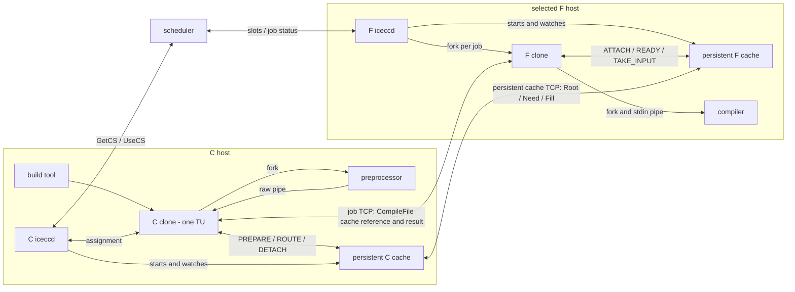

# Protocol-50 transfer architecture in real Icecream

Status: implementation-strategy draft for issue #16, prepared for bigoracle review. This
document distinguishes current Icecream, the M5 capability program, the distribution simulator,
and the smallest product architecture for the interning codec. The central decision is that
compile-job connections carry job references and results, while a persistent cache-to-cache
channel carries DICT, LINES, Need, and Fill.

Nothing waits for a whole build. A complete-TU preparation boundary remains on C for the first
implementation, but many TUs occupy different pipeline stages concurrently.

## Decisions in one page

1. Current Icecream streams preprocessor bytes directly from one C client to one F job child.
   Protocol 50 keeps that job connection for execution metadata, diagnostics, object data, and
   the final result, but replaces source-byte transfer with a cache transaction reference.
2. A persistent C cache lives beside C `iceccd`; a persistent F cache lives beside F `iceccd`.
   They share the interner and definition implementation.
3. Each cache-store incarnation receives a startup GUID. A cache relationship is identified by
   `(C_STORE_GUID, F_STORE_GUID)`. A TU is named `(C_STORE_GUID, TU_SEQ)`; `TU_SEQ` is unique
   within that C-store lifetime and is an identifier, not an arrival-order requirement.
4. A C clone sends `CompileFileMsg` with a cache-reference input descriptor containing
   `(C_STORE_GUID, TU_SEQ)`. The F clone attaches that job to the same key in its local F cache.
   The job connection never carries DICT, LINES, or Fill payload.
5. C cache and F cache exchange `DICT + LINES / NEED / FILL` over one persistent, multiplexed,
   full-duplex channel per active relationship. DICT contains the complete dependency manifest.
   F sends Need at `DICT_END` while C continues sending LINES, and C queues Fill as soon as Need
   is processed. Many TU transactions are in flight at once.
6. Root, Fill, and installed definitions are immutable and idempotent. There is no implicit
   cross-TU decoder history. Any learned item needed later is an explicitly named cache object.
7. Clone lifetime and cache lifetime are independent. A clone ending detaches one compiler
   consumer; it does not cancel cache transfer or delete Root, definitions, or learned blocks.
8. F cache retains a completed Root and its reusable objects under its normal cache policy.
   It creates reconstructed bytes only for an attached job and may discard that materialized
   byte buffer after consumption.
9. The cache channel schedules bounded frames from many TUs. Fill and completion traffic may
   move ahead of new Root frames; complete transactions are never serialized.
10. The scored size is every C-to-F socket byte, including cache-channel framing and job-control
    references. F-to-C Need and acknowledgement bytes are timed and logged separately.
11. The existing transfer remains a complete fallback. Selection occurs before a TU begins its
    remote input transfer; the implementation never splices two input formats into one attempt.
12. Standalone Asio on C++23 is the leading cache-I/O implementation. Whether an F gives each
    active C GUID a process, a dedicated thread/context, or a shared-context strand remains open
    for review and measurement.
13. Simulator topology names distinguish a shared C uplink, each F ingress, and an optional
    per-route ceiling. `C1_F20_CAP200_CBW1G` means one C, twenty Fs, 200 slots on every F, and
    one shared 1-Gbit/s C uplink; it does not create twenty independent 1-Gbit/s C uplinks.
14. The production implementation and simulator are parallel tracks. The simulator compares
    P29, GRZ, routing, and cache distribution; it does not replace implementation of cache
    services, protocol messages, or clone rendezvous in Icecream.

## Review status and unresolved choices

The following are proposed and should be reviewed as one coherent implementation:

- separate job and cache channels;
- complete-TU preparation in the first product version;
- DICT before LINES, with Need launched at `DICT_END` and Fill eligible at the next writer
  quantum;
- clone-independent immutable cache objects;
- standalone Asio confined to the new cache-I/O module;
- explicit automatic fallback to the established transfer;
- bounded per-relationship queues and one shared C-uplink budget.

The following are intentionally not frozen by this document:

- F namespace ownership: worker process, dedicated thread/context, or shared-context strand;
- whether F cache expands to a complete vector or writes bounded chunks directly to the compiler
  pipe;
- whether C prepares before requesting an F assignment;
- final frame quantum and queue ceilings;
- whether the optional Asio `io_uring` backend is ever worth enabling;
- which of P29, GRZ, or a later codec becomes the default Root/body codec.

## Names and lifetimes

| Name | Meaning | Lifetime |
|---|---|---|
| S | Icecream scheduler | cluster service |
| C clone | one `icecc` compiler-wrapper process | one compile invocation |
| C cpp child | preprocessor forked by a C clone | one TU |
| C cache | interner, ID allocator, Root builder, definition store, Fill builder | C `iceccd` lifetime |
| F clone | per-job handler forked by F `iceccd` | one compile invocation |
| F compiler | compiler forked by an F clone | one TU |
| F cache | Root/definition store, Need computation, expansion, job rendezvous | F `iceccd` lifetime |
| job connection | existing C-clone-to-F-clone TCP connection | one compile invocation |
| cache channel | persistent multiplexed C-cache-to-F-cache TCP connection | active C/F relationship |
| transaction | immutable Root and reconstruction recipe for one TU | cache-managed |
| attachment | one F clone consuming one transaction | one compile attempt |
| relationship | cache history for `(C_STORE_GUID, F_STORE_GUID)` | store-incarnation pair |

The letter F denotes a host/cache in the architecture and an F index in the simulator. An F may
offer many compile slots. A slot is not a separate cache.

The primary topology co-locates one producer pool and one C authority, so `C1` is unambiguous.
For later multi-producer experiments, distinguish producer hosts from C-store authorities. Many
producers may connect to one logical C authority and therefore share one C GUID; alternatively,
each producer host may own a separate authority/GUID. Those are different cache and bandwidth
topologies and must not share one label.

## Existing Icecream path

Current Icecream already has useful compiler plumbing:

1. The C client obtains `UseCSMsg` and opens a direct job connection in
   [`client/remote.cpp`](../../client/remote.cpp#L411).
2. It forks the preprocessor, drains its pipe in 100,000-byte pieces, and sends each piece as
   `FileChunkMsg` in [`client/remote.cpp`](../../client/remote.cpp#L271) and
   [`client/remote.cpp`](../../client/remote.cpp#L536).
3. Protocol 44 frames messages with a four-byte length and limits an outer message to 1 MiB in
   [`services/comm.h`](../../services/comm.h#L38) and
   [`services/comm.cpp`](../../services/comm.cpp#L171).
4. Protocol 40 and later compress each `FileChunkMsg` independently with zstd in
   [`services/comm.cpp`](../../services/comm.cpp#L535) and
   [`services/comm.cpp`](../../services/comm.cpp#L2202).
5. F accepts the connection and forks a per-job handler in
   [`daemon/main.cpp`](../../daemon/main.cpp#L1585) and
   [`daemon/serve.cpp`](../../daemon/serve.cpp#L137).
6. The handler forks the compiler and writes incoming chunks into compiler stdin in
   [`daemon/workit.cpp`](../../daemon/workit.cpp#L124),
   [`daemon/workit.cpp`](../../daemon/workit.cpp#L345), and
   [`daemon/workit.cpp`](../../daemon/workit.cpp#L425).

Thus protocol 44 overlaps preprocessing, transfer, and compilation within a TU. Protocol 50's
first implementation deliberately trades that particular overlap for complete-TU interning and
factorization, while retaining concurrency across TUs.

## Current M5 boundary

The M5 capability program currently has this per-TU path:

```text
producer process
    -> pipe reader
    -> complete RawTU byte vector
    -> C interning and whole-TU factorization
    -> PreparedTU
    -> Root / Need / Fill
    -> F reconstruction
    -> compiler-verifier pipe
```

The reader calls `read_all` for the complete manifest length before publishing a `RawTU` in
[`capability/cap_m5_stream_main.cpp`](../cap_m5_stream_main.cpp#L1212). The interner publishes a
`PreparedTU` in [`capability/cap_m5_stream_main.cpp`](../cap_m5_stream_main.cpp#L1297).

The boundary is per TU, not global:

```text
time ------------------------------------------------------------------>

TU0  [preprocess/read] [intern] [Root/Need/Fill] [expand] [compile]
TU1       [preprocess/read] [intern] [Root/Need/Fill] [expand] [compile]
TU2            [preprocess/read] [intern] [Root/Need/Fill] [expand] [compile]
```

M5 reconstructs into a byte vector before its compiler writer begins. That is the initial
product path as well; a bounded expander is a later local optimization.

## Product process map



The job socket and cache channel serve different purposes:

```text
C clone <-> F clone: execute this compiler job; return diagnostics/object/result
C cache <-> F cache: make this immutable input transaction available
F clone <-> F cache: attach this compiler process to that transaction
```

The main `iceccd` event loops do not perform interning, compression, expansion, or bulk copying.
The cache services use bounded worker pools. One I/O thread may own a cache socket initially;
encoding and decoding work need not run on that thread.

## Concrete daemon and client integration

The product implementation should be a sidecar service owned by `iceccd`, not a large codec
subsystem inserted into `daemon/main.cpp`. One installed executable can host the C-authority role,
the F-store role, or both roles on a machine that submits and receives work:

```text
iceccd
  starts/watches icecc-cache-service
  owns the existing public TCP listener
  passes cache-session descriptors to the sidecar

icecc-cache-service
  C role: local PREPARE/ROUTE sessions + outbound channels to F caches
  F role: inbound channels from C caches + local ATTACH sessions from F clones
  shared: interner/codec implementation and immutable object types
```

The C and F roles receive distinct store GUIDs even when they live in one sidecar process. Their
stores and counters are separate. The sidecar exposes one Unix socket under the daemon runtime
directory; the first local command selects C-role preparation or F-role attachment.

### Reuse the existing daemon TCP endpoint

The smallest scheduler change is no scheduler change. `UseCSMsg` already gives the C clone the
selected daemon address and port. The C clone passes that endpoint to its local C cache in
`ROUTE`. C cache opens a second connection to the same F daemon port, performs ordinary protocol
version negotiation, and sends a new `CACHE_SESSION(C_STORE_GUID, profile offer)` as the first
message. `daemon/main.cpp` classifies that connection and passes the connected descriptor plus
the decoded bootstrap fields to the F cache sidecar. The sidecar then owns all subsequent cache
frames on that descriptor.

```text
C clone ---- existing connection ----> F daemon/job child
   |
   +-- ROUTE(F address, port) --> C cache ---- second persistent connection ----> F daemon
                                                                              |
                                                                              +-> F cache
```

This avoids one cache TCP connection per job. C cache reuses the relationship for every later TU
assigned to that F-store incarnation. The F cache answers SESSION with `F_STORE_GUID` and the
selected component-codec profile. If the daemon restarts at the same address, the new F GUID makes
the relationship cold without changing routing keys elsewhere.

Descriptor handoff requires a mandatory bootstrap barrier because current `MsgChannel::read_a_bit`
may read ahead into its private input buffer. C cache sends only `CACHE_SESSION` and does not send
the first cache frame until the F sidecar answers `SESSION_READY(F_STORE_GUID, selected profile)`.
This ensures no post-bootstrap bytes exist for `MsgChannel` to read ahead.

The daemon consumes the complete `CACHE_SESSION`, calls a new
`MsgChannel::release_fd_if_input_empty()`, and passes the descriptor plus bootstrap fields to the
sidecar over its Unix control socket. That method succeeds only when the negotiated message has
been fully consumed and `inofs == intogo`; it transfers descriptor ownership without closing it.
The sidecar assigns the descriptor to an Asio TCP socket and sends `SESSION_READY` using
`CacheChannel` framing. If the old channel reports buffered bytes, the handoff does not proceed
and C reconnects. Tests cover every split of the protocol/version and CACHE_SESSION bytes, and a
deliberately early first cache frame confirms that the clean-boundary check catches the case.

An alternative dedicated cache port would require returning that port through job or scheduler
metadata. Keep it as a later deployment option, not the first implementation.

### Extend `CompileFileMsg`, do not create a second job protocol

For protocol 50, add an input descriptor to `CompileFileMsg`:

```text
InputDescriptor {
    mode: LEGACY_CHUNKS | CACHE_REFERENCE
    if CACHE_REFERENCE:
        C_STORE_GUID
        TU_SEQ
        raw_length
}
```

For negotiated versions below 50, these fields are absent and serialization is byte-for-byte the
established format. For version 50 with `LEGACY_CHUNKS`, the receiver enters its existing
`FileChunkMsg` loop. For `CACHE_REFERENCE`, the F job child creates the compiler exactly as it
does today but obtains stdin bytes from the local F cache attachment instead of the job socket.
Diagnostics, object chunks, statistics, and `CompileResultMsg` remain on the job socket.

The C clone learns `C_STORE_GUID` and `TU_SEQ` from local `PREPARE_ACCEPTED`; it does not need to
know the F GUID. `PREPARED` later confirms immutable publication. The C cache learns F GUID
through SESSION and internally binds the route. This removes a
needless clone round trip and makes daemon restart handling a cache-channel concern.

Do not duplicate the compiler process loop in `daemon/workit.cpp`. Extract its input side behind
a small readiness-oriented source:

```text
CompilerInputSource
  native_fd()                    // included in the existing poll set
  read_ready_chunk()             // bytes, EOF, or input error
  uncompressed_bytes()
  physical_input_bytes()

LegacyChunkSource               // adapts FileChunkMsg from the job MsgChannel
CacheAttachmentSource           // adapts INPUT_DATA/INPUT_END from the local F-cache session
```

The existing stdout, stderr, child-exit, and result logic remains one loop. Only the source of
stdin chunks changes. The later direct-pipe mode is a third source implementation whose stdin
writer lives in F cache; it should not create a third compiler lifecycle.

Likewise, keep one C-side preprocessor pump. Its sink is selected before bytes flow:

```text
LegacyRemoteSink                // existing FileChunkMsg sender
CachePrepareSink                // PREPARE_DATA to local C cache
```

An already prepared retry obtains an exact local byte source from `TAKE_LEGACY_INPUT` and feeds
`LegacyRemoteSink`; it does not invoke the preprocessor pump a second time.

### Local session placement

C clones are external processes, so they connect to the sidecar's Unix listener. F job children
are forked by `iceccd`; they should also use the same local protocol rather than inheriting a
mutable cache connection across fork. Each local session has one owner and one transaction:

```text
C clone session: PREPARE_BEGIN -> DATA* -> PREPARE_END -> PREPARED -> ROUTE/DETACH
F clone session: ATTACH -> WAIT_READY -> TAKE_INPUT/DATA* -> DETACH
```

If later measurement favors direct compiler-pipe writing, F clone passes the pipe descriptor in
`TAKE_INPUT_TO_FD`; the transaction and attachment protocol remain the same. Shared memory is
likewise a local-session optimization and does not change cache-channel messages.

### Sidecar lifecycle

`iceccd` starts the sidecar before accepting protocol-50 cache sessions and retains a small
control socket for status and descriptor handoff. Startup produces C/F GUIDs and publishes the
local Unix endpoint. If startup fails, `auto` mode continues through the established transfer.

The daemon watches the sidecar PID. A replacement sidecar receives new GUIDs and begins cold.
Existing ordinary compile jobs remain governed by the existing daemon child lifecycle. Cache-
reference jobs whose F attachment disappeared end that attempt and may be retried through the
normal client policy.

On orderly daemon exit, it stops new cache sessions, asks the sidecar to drain bounded completion
traffic, and then joins it. The sidecar never becomes the scheduler authority and does not alter
slot counts; it only makes input bytes available to already-assigned jobs.

## Cache-service execution model

This section deliberately separates three choices that were previously mixed together:

1. **I/O API:** how sockets, timers, and cancellation are driven;
2. **namespace ownership:** whether one C GUID lives in a process, a dedicated thread, or a
   strand in a shared process;
3. **CPU execution:** where interning, compression, Fill construction, expansion, and eviction
   run.

The I/O decision can be made now without freezing the namespace decision. The leading I/O choice
is standalone Asio on C++23. The F-cache-per-C-cache process/thread/strand choice remains an
explicit review item and must be decided by measurement before the product runtime is frozen.

### Runtime invariants independent of the threading choice

Every implementation option must preserve the following ownership rules:

- one cache socket has exactly one reader and exactly one writer state machine;
- one `C_STORE_GUID` owns one logically independent F namespace;
- no operation on namespace A waits synchronously for namespace B;
- socket callbacks do bounded bookkeeping and never perform a whole-TU codec operation;
- codec workers publish immutable results back to the socket/namespace owner;
- every outbound relationship has bounded queues and a reserved Fill/control budget;
- all transaction state is addressed by `(C_STORE_GUID, TU_SEQ)` and survives clone detach;
- shutting down one namespace cannot invalidate buffers still referenced by another namespace;
- the protocol and stored representation do not depend on which runtime option is selected.

These rules are the seam between the protocol and the runtime. They allow the simulator, codec,
wire tests, and most cache-state tests to remain unchanged if the runtime choice changes.

### Leading I/O choice: standalone Asio on C++23

Build the new cache services on C++23 and standalone Asio. Asio supplies nonblocking TCP and Unix
sockets, timers, scatter/gather buffers, executor ownership, strands, and coroutine integration
while using `epoll` on ordinary Linux builds. The protocol still owns buffer lifetime, byte
limits, priority, admission, and queue policy; Asio owns only readiness and completion plumbing.

Use the non-Boost distribution with `ASIO_STANDALONE`, `ASIO_NO_DEPRECATED`, and preferably
`ASIO_SEPARATE_COMPILATION` in a new cache-I/O library. Keep Asio types private to that library:
the interner, codec, wire-value types, simulator, scheduler, and existing job path should depend
on plain value interfaces rather than Asio headers. There is no standard `std::asio` socket
library in C++23, so moving the cache module to C++23 does not remove the need for standalone
Asio.

```text
cache responsibility             standalone-Asio primitive
--------------------             -------------------------
one or more I/O executors        asio::io_context
owned relationship state        tcp::socket + strand/executor
framed reader                    awaitable reader loop
single queued writer             awaitable writer loop
codec CPU work                   bounded worker executor/pool
reconnect and retention clocks   steady_timer
clone/cache local sessions       local::stream_protocol::socket
frame scatter/gather             const_buffer sequence
```

There is exactly one outstanding write operation per relationship. Producers enqueue immutable,
reference-counted frame buffers; the writer selects the next bounded quantum and advances a
partial-write cursor until that quantum completes. The reader owns the incremental frame parser.
Neither coroutine touches the codec's mutable state directly: decoded commands are posted to the
namespace executor, and completed encoded buffers are posted back to the relationship executor.

The initial Linux backend is Asio's normal `epoll` implementation. Old kernels therefore remain
usable. Direct `io_uring` code is not part of the first implementation. An Asio `io_uring` build
may be benchmarked later from the same protocol sources, but it is a replaceable backend rather
than an architectural requirement.

C++23 is useful independently of Asio: `std::span`, `std::expected`, `std::jthread`,
`std::stop_token`, endian/byteswap support, and standard coroutines make ownership and shutdown
paths explicit. Do not migrate the scheduler or protocol-44 job loops merely to adopt these
facilities. The new cache modules can use C++23 while the established path remains intact.

### C-cache runtime

One C cache usually talks to tens of Fs. The leading C implementation therefore uses:

```text
C clone local sessions -----------+
preprocessor buffers -------------+--> bounded codec workers
Need/ACK decode ------------------+             |
                                                  v
                                    immutable Root/Fill buffers
                                                  |
                       +--------------------------+--------------------------+
                       v                          v                          v
                 relationship Fa            relationship Fb            relationship Fc
                 priority queues            priority queues            priority queues
                       \__________________________|__________________________/
                                                  v
                                     one Asio I/O context initially
```

Start with one I/O thread because the expected active relationship count is small and socket
work is bounded. The ownership interface must be shardable without changing protocol state:

```text
io_owner = stable_hash(F_STORE_GUID) % io_context_count
```

If one I/O core becomes limiting, two or four contexts may own disjoint relationships. A socket
never migrates while it has pending operations. Codec work is shared across relationships, so a
large Fill for one F can use available CPU workers without allocating a permanent worker thread
to that F.

### F-cache namespace ownership: open implementation decision

An F receives cache channels from many Cs and clone attachments for many concurrent jobs. Data
under different C GUIDs is logically disjoint, but that fact does not by itself determine whether
the boundary should be a process, a thread, or an Asio strand. Keep the following three layouts
buildable behind one `NamespaceRuntime` interface until the complete-path measurements settle it.

| Option | Shape | Advantages | Costs and questions |
|---|---|---|---|
| A: worker process per C GUID | supervisor routes cache and local-attachment descriptors to a lazily started worker process | clearest lifetime; whole namespace reclaimed on exit; a stalled codec worker affects one C | process and IPC overhead; one small worker pool per active C unless CPU work is delegated |
| B: I/O thread/context per C GUID | one F-cache process; each active C GUID owns one thread, `io_context`, channel, clone sessions, timers, and namespace | direct local routing; simple sequential namespace ownership; slow C has a dedicated I/O thread | idle thread/stack per active C; CPU work must still be bounded; namespace teardown must release all heap state explicitly |
| C: shared I/O contexts plus one strand per C GUID | a small process-wide I/O pool; each GUID owns a strand and bounded queues | lowest idle overhead; shared workers; scales to many mostly idle Cs | requires disciplined quotas so one namespace cannot monopolize callbacks or worker completions |

Option B—the threaded F-cache-per-C-cache layout—remains specifically open for bigoracle review.
It may be the simplest first implementation if the normal number of active Cs is around sixteen:
sixteen mostly sleeping I/O threads are inexpensive, every namespace has an obvious sequential
owner, and old-kernel behavior is straightforward. Option A remains attractive when whole-heap
reclamation materially simplifies long-lived cache rotation. Option C is the likely consolidation
target if process/thread overhead becomes visible.

Do not allow these alternatives to produce three protocol implementations. Define:

```text
NamespaceRuntime
  accept_cache_channel(C_STORE_GUID, connected_socket)
  attach_clone(C_STORE_GUID, TU_SEQ, local_socket)
  post_decoded(CacheCommand)
  post_codec_completion(CodecCompletion)
  begin_idle_retention(deadline)
  retire_when_unreferenced()
```

The supervisor or shared service reads only enough local/session metadata to choose a C GUID and
then hands the descriptor and command to the matching runtime. Root, Need, Fill, expansion, and
compiler-input bytes must not be copied through the supervisor after routing.

For Option A, start workers with a separate executable or `posix_spawn`, then initialize Asio and
threads inside the new process. For Option B, create the `io_context` and its thread lazily when
the first channel or attachment arrives. For Option C, create a strand lazily on the shared
executor. In all three cases, a TCP close starts an idle timer rather than immediately discarding
the namespace; a same-GUID reconnect reuses retained state.

### Coroutine and queue structure

Each cache relationship is two long-lived coroutines plus bounded queues:

```text
reader coroutine
  async_read outer header
  validate declared length and frame class
  async_read remaining frame
  decode fixed fields
  post command to NamespaceRuntime
  repeat

writer coroutine
  wait until any priority queue is nonempty
  choose next frame quantum
  async_write_some immutable buffers
  retain partial cursor across suspension
  record exact socket bytes
  complete delivery bookkeeping
  repeat
```

The queue classes are, in order:

1. Fill, acknowledgement, Ready, and reconnect progress;
2. continuation required to reach an already-started `DICT_END`;
3. bounded LINES continuation and new DICT work under deficit round-robin;
4. maintenance traffic that is not required by an attached job.

Once a frame quantum is submitted, it is not interrupted. Fill becomes eligible at the next
quantum. This is the exact implementation counterpart of the simulator's preemption boundary.

Each relationship has independent byte and item ceilings. The process also has a global encoded-
buffer ceiling. Crossing a relationship's normal ceiling pauses new DICT/LINES admission for
that destination but retains reserved capacity for Fill and completion. Crossing the global
ceiling pauses local preparation before allocating another complete output buffer. No callback
waits while holding a namespace or store lock; it suspends or returns to the executor.

### Codec workers and immutable buffer ownership

The I/O runtime must not own codec algorithms. It submits typed work items to a bounded pool:

```text
PrepareRawTU -> PreparedRoot
DecodeDict   -> DependencyManifest
EncodeFill   -> immutable EncodedFrameVector
InstallFill  -> InstalledDefinitionBatch
ExpandInput  -> bounded output chunks or complete RawTU
Evict        -> released object IDs and byte counts
```

Inputs are immutable spans backed by reference-counted slabs. Results become immutable before
they are posted to the namespace owner. A relationship queue holds references, not copied
vectors. The owner releases a frame only after the writer records its complete socket delivery
or after the relationship is retired. Retained replay buffers are charged separately from active
queue bytes.

The first implementation may expand a TU into one complete output vector because the codec
capability already verifies that boundary. The interface should nevertheless expose a chunk sink
so bounded expansion can be substituted later without changing Root/Need/Fill state.

### Shutdown and retention ordering

Runtime shutdown is an ordered state transition, not a thread cancellation shortcut:

1. stop admitting new local prepare/attach requests;
2. stop starting new DICT/LINES work while allowing queued Fill and completion messages to drain
   up to a configured deadline;
3. detach compiler consumers and close their local sessions;
4. close relationship sockets and cancel timers;
5. wait for posted codec completions to return or mark their immutable results unreferenced;
6. release transaction, replay, and namespace objects;
7. stop the I/O context and join owned threads, or exit the worker process.

A cache-channel disconnect does not execute this sequence by itself. It changes the relationship
to `disconnected-retained`, keeps complete objects, and starts reconnect/idle-retention timers.

## Identifiers

| Identifier | Scope | Purpose |
|---|---|---|
| `C_STORE_GUID` | one C-store incarnation | namespaces all C definitions and transactions |
| `F_STORE_GUID` | one F-store incarnation | identifies the actual destination cache incarnation |
| `TU_SEQ` | monotonically unique under one C GUID | names a TU transaction; does not impose delivery order |
| `ID64` | one immutable definition under a C GUID | stable shared-cache key |
| `LOCAL32` | one Root only | dense array index used during expansion |
| `DELIVERY_ID` | one cache relationship | names one Fill batch for acknowledgement/replay |

The proposed definition layout remains `GEN10 | SEQ54`. Sequence bits are never reused during
the C-store lifetime. `LOCAL32` remains dense and private to one TU. The full definition identity
is `(C_STORE_GUID, ID64)`.

The C clone passes the assigned daemon endpoint to its local C cache in `ROUTE`. The persistent
cache-channel SESSION returns `F_STORE_GUID`; the C cache owns that binding and detects a changed
incarnation. Neither clone needs to carry F GUID in the job reference. The job reference is
simply `(C_STORE_GUID, TU_SEQ)`.

## End-to-end interaction

### 1. Allocate and prepare the TU on C

`TU_SEQ` is allocated at `PREPARE_BEGIN`, before raw bytes arrive, so an F clone may attach and
wait while preprocessing proceeds:

1. C clone opens a bounded local session and sends `PREPARE_BEGIN`.
2. C cache allocates `TU_SEQ` and replies `PREPARE_ACCEPTED(C_STORE_GUID, TU_SEQ)`.
3. C clone forks the normal preprocessor and drains its pipe into `PREPARE_DATA` messages.
4. The first version assembles one complete raw TU before interning and factorization.
5. C cache interns lines/regions, assigns immutable ID64 values, selects superblocks, emits
   inline material, and constructs a dense `LOCAL32 -> ID64` map.
6. C cache atomically publishes `PreparedTu` and replies `PREPARED(C_STORE_GUID, TU_SEQ)`.
7. The prepared queue is bounded by both bytes and TU count. Build parallelism and that queue,
   rather than the number of remote slots alone, bound memory.

Allocation does not publish a partial transaction. Before `PREPARED`, the key may exist only as
a local preparation placeholder and an F attachment waiter. DICT transmission begins only after
the immutable PreparedTu is published.

The PreparedTu is independent of its destination. Two client orderings fit the same protocol:

```text
minimal first patch:
  GetCS/UseCS -> establish cache SESSION -> PREPARE_BEGIN/TU_SEQ -> send cache job reference
  -> preprocess/prepare -> ROUTE -> cache transfer

later measured option:
  PREPARE_BEGIN -> preprocess/prepare -> GetCS/UseCS -> establish cache SESSION
  -> ROUTE + cache job reference
```

The first ordering stays closest to `client/remote.cpp`, which currently obtains an assignment
and sends `CompileFileMsg` before starting the preprocessor. It holds an F slot during complete-TU
preparation. The second avoids that slot wait but changes client/scheduler timing. Keep the order
behind one client sequencing seam and measure it rather than encoding it in cache identity.

### 2. Bind the job and cache relationship

After scheduler assignment, C clone establishes the normal job connection and already has the F
daemon endpoint from `UseCSMsg`. Once `TU_SEQ` has been allocated, it performs two independent
operations; `ROUTE` may remain pending until `PREPARED` publishes the Root:

```text
C clone -> C cache: ROUTE(TU_SEQ, F daemon endpoint)
C clone -> F clone: CompileFileMsg(CACHE_REFERENCE, C_STORE_GUID, TU_SEQ, compile metadata)
```

C cache opens or reuses the persistent channel for that endpoint and binds the returned F GUID.
F clone performs:

```text
F clone -> F cache: ATTACH(C_STORE_GUID, TU_SEQ, compiler-job handle)
```

Either the Root or attachment may arrive first. F cache stores one flag for each and proceeds
when the required state exists. No polling between clones is required.

### 3. Send DICT, then stream LINES

Root is one logical transaction split at the earliest useful dependency boundary:

| Component | Meaning |
|---|---|
| DICT header | C GUID, TU sequence, generation, raw length, component counts |
| DICT used map | dense `LOCAL32 -> ID64` vector containing every shared dependency |
| DICT block metadata | immutable identifiers needed to interpret the body token stream |
| LINES body | ordered local32/superblock token stream |
| LINES inline material | one-use text and compact offset/length/value columns |

C cache sends `DICT_BEGIN`, the complete DICT, and `DICT_END`, then continues with LINES frames.
F can determine the exact missing ID64 set at `DICT_END`; it does not wait for `LINES_END`.
Because the cache channel is full duplex, F sends Need in the reverse direction while C continues
transmitting LINES for this and other TUs.

```text
time -------------------------------------------------------------------->

C -> F:  DICT(343) | LINES(343)-1 | LINES(343)-2 | ... | LINES_END(343)
F -> C:                 NEED(343) ------>
C CPU:                                  build FILL(343)
C -> F:                                             FILL at next queue quantum
```

Frames are ordered within each DICT or LINES component; frames from other transactions may
appear between them. `DICT_END` is the Need barrier. `LINES_END`, all dependencies resident, and
a live job attachment are the three conditions for compiler input readiness.

Root is self-describing with explicit IDs. Arrival order between TUs has no semantic meaning.
Any candidate codec that learns across TUs must publish its learned artifacts as immutable,
named definitions or named model checkpoints. It may not rely on an unrecorded decoder history.

### 4. Compute Need

At `DICT_END`, F cache resolves each used ID64 against its persistent store and records the
transaction's full dependency set while LINES continues arriving. Its semantic response is:

```text
NEED(C_STORE_GUID, TU_SEQ, sorted unique missing ID64 set)
```

Multiple concurrently received Roots may report overlapping Need sets. This is harmless: the
persistent cache channel delivers all Need messages to the one C cache that owns the definitions.

### 5. Materialize and send Fill

C cache compares each Need with definitions already assigned to an unacknowledged Fill on this
relationship. Fill construction overlaps the remaining LINES transfer. As soon as an encoded
Fill buffer is ready, it enters the relationship's Fill-priority queue and is submitted at the
next bounded writer quantum; already-submitted bytes cannot be overtaken. C sends each definition
once while that delivery is active and may satisfy many transactions with one cache-scoped Fill:

```text
FILL(DELIVERY_ID,
     sorted/delta-coded ID64 values,
     value/category column,
     offset column,
     length column with long-length escape,
     concatenated text,
     required path/index columns)
```

Fill is not owned by a compiler clone or permanently tied to the transaction whose Need first
mentioned it. F cache installs complete definitions idempotently and sends:

```text
FILL_APPLIED(DELIVERY_ID)
```

C cache retains an unacknowledged Fill buffer. If the cache channel reconnects, it may replay
that batch. A duplicate installation is a no-op. Historical "sent" state never overrides a new
Need because F may have evicted the object; only an active unacknowledged delivery is coalesced.

### 6. Mark input ready and attach the compiler

Every transaction maintains a count of unresolved IDs plus `lines_complete` and attachment
state. Installing a Fill updates all affected transactions. When the dependency count is zero
and `LINES_END` has arrived, F cache marks the immutable transaction cache-ready and notifies
both its local attachment and C cache:

```text
F cache -> F clone: INPUT_READY(C_STORE_GUID, TU_SEQ)
F cache -> C cache: CACHE_READY(C_STORE_GUID, TU_SEQ)
```

F clone requests `TAKE_INPUT`. The initial implementation expands into a complete vector and
passes bounded chunks over the local Unix session to the F clone, which writes compiler stdin.
If measurement shows that local copy costs more than 10% of the complete path, F clone passes
the compiler-pipe descriptor to F cache and F cache writes expansion chunks directly.

The compiler result, diagnostics, and object file continue over the normal job connection.

## Concurrency example

Suppose transactions A, B, and C are launched together and need:

```text
A -> {1,2,3}
B -> {2,3,4}
C -> {3,4,5}
```

Their DICT and LINES frames may be interleaved. F emits each Need as soon as that transaction's
DICT completes, regardless of whether its LINES has completed. If Need arrives at C cache in
order B, C, A:

```text
Need B -> Fill delivery 70: {2,3,4}
Need C -> Fill delivery 71: {5}; {3,4} already in delivery 70
Need A -> Fill delivery 72: {1}; {2,3} already in delivery 70
```

Fill deliveries may also arrive in any order. F installs `{1}`, `{5}`, and `{2,3,4}` into the
same shared store. Each transaction becomes ready when its complete dependency set is resident.
All five definitions cross C-to-F once in the normal path; no clone waits for another clone to
finish its complete transaction.

The cache-channel sender uses a bounded frame scheduler, initially:

1. Fill and completion/control traffic;
2. continuation frames required to reach an already-started `DICT_END`;
3. bounded LINES continuation quanta and new DICT starts under deficit round-robin;
4. unrelated bulk cache work.

A DICT is kept compact and normally completed without interleaving so F can launch Need quickly.
Once DICT ends, LINES is preemptible at the configured frame quantum. A Fill that becomes ready
while LINES is being sent takes the next C-to-F quantum. This overlaps reverse-direction Need and
Fill construction with LINES but does not pretend that two C-to-F payloads occupy the same link
at the same instant.

Round-robin within a class prevents a large TU from occupying the channel indefinitely. Frame
quantum is a measured parameter, not part of codec semantics. Start with the existing roughly
100 KiB scale and compare 64, 128, 256, and near-1-MiB frames.

One persistent full-duplex socket per relationship is the first implementation. The physical
link already emits one byte stream, while multiplexing avoids stop-and-wait at the transaction
level. Multiple transport lanes remain a measured fallback only if one socket/I/O loop fails to
fill the link; they do not alter transaction identity or cache state.

## Clone-independent lifetime

Cache transaction and job attachment are separate state machines:

```text
cache transaction:
    receiving Root -> waiting for definitions -> cache ready -> retained -> normal eviction

job attachment:
    waiting for transaction -> attached -> consuming input -> detached

materialized raw bytes:
    absent -> expanded for consumer -> consumed -> discarded
```

Therefore:

- C clone ending detaches its compile attempt; C cache may complete the cache transfer.
- F clone ending detaches one consumer; F cache retains Root and installed definitions.
- A replacement F clone on the same F can attach to the same `(C_GUID, TU_SEQ)`.
- A retry assigned to another F can route the same prepared transaction to that F's cache.
- A job cancellation does not delete cache content.
- Reconstructed raw bytes and compiler pipes are job-local and disposable.

If a complete Root can become the basis of later coding, it receives an immutable ID64 like any
other reusable object. Later Roots reference it explicitly. F may eventually evict it under the
normal policy, after which a future Need restores it.

## Cache-channel interruption and restart

The cache dialogue is replayable:

1. Every Root transaction and Fill batch has a stable identifier.
2. F acknowledges complete Fill batches with `FILL_APPLIED` and ready transactions with
   `CACHE_READY`.
3. C retains unacknowledged encoded buffers within a bounded resend window.
4. On reconnect under the same GUID pair, peers exchange acknowledged watermarks/sets and C
   resends incomplete frames or whole idempotent batches.
5. A restarted F cache has a new F GUID. C treats it as a cold destination and responds to its
   Needs without trusting state associated with the old GUID.
6. A restarted C cache has a new C GUID. Old F entries remain isolated under the old namespace
   until ordinary eviction.

No compiler clone owns progress for the cache channel.

## Many Fs and many Cs

One C has one authoritative definition store and one relationship channel per active F:

```text
C GUID G
  -> Fa GUID: Root/Need/Fill for TUs 1, 6, 7, 9, ...
  -> Fb GUID: Root/Need/Fill for TUs 2, 4, 10, ...
  -> Fc GUID: Root/Need/Fill for TUs 3, 5, 8, ...
```

Each F retains the subset it has learned. Cold definition bytes are therefore replicated once
per destination F that actually needs them. Scheduler affinity reduces this replication when
load permits, but round-robin placement remains valid.

With sixteen independent C authorities (`P16_C16`), an F cache partitions state by C GUID:

```text
F cache
  C GUID G0 -> Roots and definitions
  C GUID G1 -> Roots and definitions
  ...
  C GUID G15 -> Roots and definitions
```

At most one persistent channel is needed for each active GUID pair, not one per compiler slot.
With sixteen producers sharing one authority (`P16_C1`), F sees one C namespace and one logical
authority relationship even though producer-side admission may be concurrent.

## Topology, bandwidth, and launch semantics

Topology notation must state where every capacity applies. Use these fields in scenario JSON and
human-readable names:

| Field | Meaning |
|---|---|
| `producer_count` | number of C-side producer hosts/pools |
| `c_store_count` | number of independent C cache authorities/GUIDs |
| `producer_to_c_store` | explicit mapping when producer and authority counts differ |
| `f_count` | number of F hosts/caches |
| `slots_per_f` | simultaneous compiler jobs available on each F, not across all Fs |
| `c_uplink_bps` | aggregate C-to-network limit for one C across all of its F relationships |
| `f_ingress_bps` | aggregate receive limit on one F across all Cs |
| `route_bps` | optional ceiling for one `(C,F)` relationship; defaults to no lower than the endpoint limits |
| `fabric_bps` | optional aggregate shared-fabric limit across all active relationships |

The concise name puts the C-shared bandwidth in the field itself. For example:

```text
C1_F20_CAP200_CBW1G
```

means one C, twenty Fs, 200 compile slots on **each** F (4,000 slots total), and one shared
1-Gbit/s outgoing limit at C. It does not grant 1 Gbit/s independently to all twenty routes.
If a test intentionally grants per-route bandwidth, say so explicitly, for example
`C1_F20_CAP200_CBW20G_RBW1G`.

Here `C1` is shorthand for the common one-to-one case `P1_C1`: one producer pool using one C
authority. A multi-producer name must spell out both counts when they differ. For example,
`P16_C1_F20_CAP200` means sixteen producers share one authority/GUID, while
`P16_C16_F20_CAP200` means sixteen independent authorities/GUIDs.

Two large-capacity controls need careful interpretation:

```text
C1_F1_CAP1000000_CBW1G
C1_F10_CAP100000_CBW1G
```

Both expose one million nominal compile slots and the same shared 1-Gbit/s C uplink. The second
is not automatically faster. When compile slots are already non-limiting, it has the same source
bandwidth ceiling and may transmit more cold Fill because definitions are spread across ten F
caches. It becomes network-faster only if the model grants separate route bandwidth that is not
bounded by C's uplink. These controls are useful for separating network and compile limits, but
they are not the primary deployment topology.

### What one C means

One C is one source host and one authoritative cache, not one serial compile process. A build may
run many C clones and preprocessor children concurrently. The scheduler may assign their TUs to
many Fs. The simulator and product implementation must therefore avoid a per-C stop-and-wait
queue:

```text
one C host
  C clone 17 -> preprocess TU17 -> prepare -> route Fa
  C clone 18 -> preprocess TU18 -> prepare -> route Fc
  C clone 19 -> preprocess TU19 -> prepare -> route Fb
  ... all overlap subject to measured local producer capacity and bounded buffers
```

TU release is governed by the measured producer/preprocessor readiness trace and explicit local
capacity, not by an arbitrary launch interval. When a primary C1 scenario starts, it launches all
work the build makes ready; there is no inserted delay between clone launches.

Repeated-build research scenarios also use zero artificial inter-build gap by default. Build
`n+1` begins as soon as the configured build driver permits after build `n`. A gap is present only
when the scenario explicitly tests retention/eviction behavior. Reports show active-generation
elapsed regardless, but removing artificial gaps is still important because time-based cache
rotation and eviction observe wall-clock time.

### Primary topology matrix

The first product/simulator acceptance matrix should include:

| Purpose | Topology |
|---|---|
| single-destination byte/timing reference | `C1_F1_CAP1000000_CBW1G` |
| primary large-F farm | `C1_F20_CAP200_CBW1G` |
| same farm with faster C source | `C1_F20_CAP200_CBW10G` |
| shared-authority multi-producer contention | `P16_C1_F20_CAP200`, with explicit producer/authority link limits |
| independent-authority contention | `P16_C16_F20_CAP200`, with explicit C uplinks, F ingress, and fabric limit |
| cache-distribution comparison | primary topology under round-robin and GUID-sticky placement |

Every result header must print the expanded capacities, not only the concise name. Otherwise a
per-route 1-Gbit run and a shared-uplink 1-Gbit run are too easy to confuse.

## Generation rotation and eviction

The active C generation is append-only. The launch policy remains:

1. consider rotation after roughly eight hours;
2. flip at a quiet TU boundary, preferably after one minute without new intake;
3. retain the old read-only generation for three hours so delayed Need can still be filled;
4. use the new generation for subsequent TUs;
5. reclaim the old generation after retention and after local prepared references are gone.

F uses a bounded LRU or ARC-like policy across C namespaces. An entire source namespace may be
removed after roughly two hours idle. Eviction never changes meaning: a later Root names the
same immutable ID and produces another Need.

Active expansion objects are pinned only while an output chunk uses them. Retained Roots and
definitions are otherwise independently evictable because missing referenced objects can be
requested again.

## Protocol-50 messages

Protocol negotiation already exists. Protocol 50 adds a cache-input mode to `CompileFileMsg`
and a persistent cache-session connection accepted by F `iceccd` and handed to F cache.

### Job connection

```text
CompileFileMsg {
    normal compile/environment metadata
    InputDescriptor {
        mode = CACHE_REFERENCE
        C_STORE_GUID
        TU_SEQ
        advertised raw length
    }
}

COMPILE_RESULT
diagnostics and object data
```

### Cache channel

Keep existing outer framing:

```text
u32 network-order outer_message_length
u32 Msg::CACHE_FRAME
cache-frame payload
```

The compact inner envelope remains compatible with the proposed three-bit type:

```text
u32 type_and_length = (type3 << 29) | payload_length29
message-specific identifiers
payload
```

| type3 | Class | Examples |
|---:|---|---|
| 0 | SESSION | HELLO, GUID pair, codec capabilities, resume summary |
| 1 | ROOT | DICT/DICT_END and LINES/LINES_END frames for multiplexed transactions |
| 2 | NEED | TU key and missing ID64 set |
| 3 | FILL | delivery ID and immutable definitions |
| 4 | ACK | Fill applied and frame/batch progress |
| 5 | READY | cache transaction reconstructable |
| 6 | CONTROL | detach, retire, reconnect/resume controls |
| 7 | reserved | later extension |

The existing 1 MiB outer ceiling remains. Logical DICT, LINES, and Fill objects span as many
frames as needed. Components carry an encoding selector (`raw`, `zstd-1`, or `zstd-3`) and raw/encoded
lengths. Already encoded component bytes are not passed through `FileChunkMsg` compression.

Zstd-6-long and zstd-19-long remain whole-corpus comparison controls, not live per-frame
defaults. P29, GRZ, and later codecs plug into Root/Fill component boundaries; none defines a
different job or cache protocol.

### Local cache APIs

```text
C clone <-> C cache:
    ENSURE_ROUTE(F endpoint) / SESSION_READY(F GUID, profile)
    PREPARE_BEGIN / PREPARE_ACCEPTED(C GUID, TU sequence)
    PREPARE_DATA* / PREPARE_END / PREPARED
    ROUTE(TU sequence, F endpoint)
    TAKE_LEGACY_INPUT / RAW_DATA* / RAW_END
    DETACH

F clone <-> F cache:
    ATTACH
    WAIT_READY / INPUT_READY
    TAKE_INPUT / INPUT_DATA* / INPUT_END
    optional TAKE_INPUT_TO_FD
    DETACH
```

Use Unix sockets first. Shared-memory transport or descriptor passing is a replaceable local
optimization, selected only if the end-to-end measurement justifies it.

## Fallback and feature selection

The existing per-job transfer remains available for the lifetime of protocol 50. The fallback
is not a second cache protocol: it is the established `FileChunkMsg` path, including its current
per-chunk compression and direct compiler-pipe behavior.

### Selection modes

Expose one operator setting on C:

| Mode | Behavior |
|---|---|
| `legacy` | always use the established per-job input transfer |
| `auto` | use cache input only after the assigned F and its cache channel are ready; otherwise use the established transfer |
| `cache` | require cache input; report an attempt failure if it cannot be established; intended for development and acceptance runs |

`auto` is the eventual default. Protocol-version negotiation says whether the F understands a
cache-input job reference. The cache-channel SESSION exchange separately confirms that the
specific F-cache incarnation is reachable and agrees on a codec profile. Both conditions must
hold before C sends `CompileFileMsg` with `CACHE_REFERENCE`.

```text
scheduler assigns F
        |
        v
job connection negotiates protocol -------- no cache-input support ------> established path
        |
        v yes
C cache has/reaches SESSION_READY ---------- no, deadline expires --------> established path
        |
        v yes
allocate/bind TU key to F relationship
send CompileFileMsg(CACHE_REFERENCE)
prepare immutable TU, then send DICT/LINES on cache channel
```

The setup deadline is a configuration value and is charged to attempt time. It should be short
enough that an unavailable cache service does not hold a compile slot for a long interval. A
healthy persistent relationship normally bypasses setup entirely.

### Attempt boundary

One compile attempt uses exactly one input mode. Once a `CACHE_REFERENCE` job has been sent, C
does not send legacy chunks into that same attempt. If the cache attempt cannot reach
`INPUT_READY`, the job attempt ends and normal retry policy creates a new attempt, which may use
the established path on the same or another F. This keeps compiler-input framing and accounting
simple.

All bytes already emitted by the unsuccessful attempt remain in the byte ledger. A result table
must never report only the final attempt. Timing likewise begins at the first attempt's release
and includes retry selection and transfer.

### Supplying fallback bytes after complete-TU preparation

If `auto` selects the established path before preprocessing begins, the normal preprocessor pump
writes directly to `LegacyRemoteSink`; no PreparedTu is created. If a PreparedTu already exists
because prepare-before-assign was selected or a cache attempt ended after preparation, fallback
must not run the preprocessor again. C cache retains that exact PreparedTu until the compile
attempt is resolved and can materialize the original bytes from its immutable definitions/body
recipe through:

```text
C clone -> C cache: TAKE_LEGACY_INPUT(C_STORE_GUID, TU_SEQ)
C cache -> C clone: RAW_DATA* / RAW_END
C clone -> F clone: existing FileChunkMsg* / END
```

When preparation has already occurred, the first implementation may retain the original raw slab
until input mode/routing is resolved, avoiding a local reconstruction. The prepared-queue byte
ceiling charges both that slab and the encoded Root. After routing, a retained raw slab may be
released; a later retry reconstructs from `PreparedTU`. This is an implementation optimization
only—the bytes presented to the established path are exact in either case.

### Simulator representation

The simulator uses the same three selection modes and explicit F capability/channel state. A
fallback row includes:

- cache setup time;
- every cache-attempt C-to-F byte sent before failure;
- retry scheduling time;
- every established-path C-to-F byte;
- final compiler timing.

The present simulator has separate `raw` and `compile-only` controls but does not yet implement
this automatic decision. A result must not be labeled `auto` until the selection state machine,
attempt ledger, and fallback gates above exist.

## Product state machines

```mermaid
stateDiagram-v2
  state CClone {
    [*] --> Preprocessing
    Preprocessing --> HasReference: PREPARED(C_GUID, TU_SEQ)
    HasReference --> Assigned: scheduler selects F
    Assigned --> SelectingInput
    SelectingInput --> SendingLegacy: legacy or auto fallback
    SelectingInput --> WaitingCacheInput: SESSION_READY and cache selected
    SendingLegacy --> WaitingResult: FileChunk END
    WaitingCacheInput --> WaitingResult: cache-reference attempt running
    WaitingCacheInput --> Retry: attempt ends before INPUT_READY
    Retry --> Assigned: normal retry selection
    WaitingResult --> [*]: compile result
  }

  state CCacheTransaction {
    [*] --> Preparing
    Preparing --> Prepared
    Prepared --> Routed
    Routed --> SendingDict
    SendingDict --> SendingLines: DICT_END; Need may return
    SendingLines --> WaitingRemoteReady: LINES_END
    WaitingRemoteReady --> RemoteReady: CACHE_READY
    RemoteReady --> Retained
    Retained --> [*]: normal eviction
  }

  state FCacheTransaction {
    [*] --> ReceivingDict
    ReceivingDict --> ReceivingLinesAndDefinitions: DICT_END; send Need
    ReceivingLinesAndDefinitions --> CacheReady: LINES_END and dependencies resident
    CacheReady --> Retained
    Retained --> [*]: normal eviction
  }

  state FCloneAttachment {
    [*] --> WaitingInput
    WaitingInput --> Consuming: INPUT_READY
    Consuming --> Compiling
    Compiling --> [*]
  }
```



The C-cache transaction state is descriptive rather than stop-and-wait: after emitting one
Root, the cache immediately schedules frames for other transactions while Need/Fill proceeds.

## Executable transition trace and model correspondence

Protocol state must not be scattered across unrelated callbacks. Each state owner exposes named
transition functions, and every socket/local-session callback converts input into one of those
commands. For example:

```text
CRelationship::on_session_ready
CTransaction::on_dict_submitted
CTransaction::on_need_received
CRelationship::on_fill_applied
FTransaction::on_dict_complete
FNamespace::on_definition_installed
FTransaction::on_lines_complete
FTransaction::on_attachment_added
FTransaction::maybe_publish_ready
```

The transition function checks its allowed source state, mutates the minimum fields, and emits
one typed trace event. Codec workers return values but never execute protocol transitions. This
makes the implementation state machine reviewable and gives the formal model a concrete event
alphabet.

The optional full trace mode records:

```text
global local-event sequence
monotonic timestamp
process/store role
C_STORE_GUID and F_STORE_GUID when known
TU_SEQ and DELIVERY_ID when applicable
event/action name
before and after transaction state
frame class, logical payload bytes, and physical socket bytes
dependency count before and after
queue and attachment identifiers
```

Normal operation keeps counters and a bounded recent-event ring. Acceptance runs enable the full
append-only event stream. An offline checker consumes that stream and verifies:

- each recorded transition exists in the protocol action table;
- DICT completes before Need for that TU;
- LINES and Fill may overlap but Ready requires both branches;
- an attachment alone never makes input ready;
- one socket writer never has two simultaneous writes;
- installed definitions never change value;
- a changed F GUID starts a new cold relationship;
- a clone detach changes attachment state but not immutable cache state;
- fallback starts a new attempt rather than changing the input mode of an active attempt;
- every C-to-F physical byte belongs to exactly one ledger frame/attempt.

The formal model should use the same action names and keys, with bounded sets of Cs, Fs, TUs,
definitions, deliveries, reconnects, and clone detachments. The large topology simulator does
not replace that state exploration: the simulator measures realistic counts and time, while the
small-state model enumerates ordering combinations. A retained implementation trace can also be
projected onto the formal action alphabet; if an emitted event or state value has no model
representation, the acceptance checker fails and the model or code must be reconciled.

## Implementation map

The production cache code should be a new library and sidecar target rather than an expansion of
`libicecc`'s existing synchronous channel implementation. Proposed file boundaries are:

| Area | Concrete responsibility |
|---|---|
| `configure.ac`, top-level `Makefile.am` | detect standalone Asio, add `cache/`, expose a build option for protocol-50 cache support |
| new `cache/Makefile.am` | build a C++23 private cache library, sidecar executable, and focused tests |
| new `cache/cache_types.*` | GUID, TU sequence, ID64, delivery ID, component descriptors, plain result/error values |
| new `cache/cache_frame.*` | cache-frame envelope, integer/column codecs, incremental frame parser, exact byte accounting |
| new `cache/cache_channel.*` | Asio relationship, reader/writer coroutines, priority queues, reconnect timers |
| new `cache/local_protocol.*` | C-clone PREPARE/ROUTE and F-clone ATTACH/TAKE_INPUT framing over Unix sockets |
| new `cache/c_store.*` | C interner authority, PreparedTU retention, route binding, Need handling, Fill construction |
| new `cache/f_store.*` | per-C-GUID namespace, DICT/LINES receive, Need calculation, Fill install, dependency wakeup, expansion |
| new `cache/namespace_runtime.*` | runtime seam for process/thread/strand alternatives |
| new `cache/service_main.cpp` | combined-role sidecar startup, local listener, descriptor handoff, lifecycle and metrics |
| `services/comm.h`, `services/comm.cpp` | protocol 50, `CACHE_SESSION` discriminator, `CompileFileMsg::InputDescriptor` serialization |
| new `client/cache_client.*` | local C-cache session and prepared-handle lifetime |
| `client/remote.cpp` | prepare/route, choose cache or legacy input, send cache reference, reconstruct fallback bytes |
| new `daemon/cache_sidecar.*` | start/watch sidecar, control socket, pass accepted cache-session descriptors |
| `daemon/main.cpp` | classify `CACHE_SESSION`; leave normal scheduling/slot accounting unchanged |
| `daemon/serve.cpp`, `daemon/workit.cpp` | branch compiler stdin source by `InputDescriptor`; attach/take input from F cache |
| scheduler | no required first implementation change; later add affinity metadata only after measurement |
| `unittests/`, `tests/` | value/frame/channel/store tests and a real multiprocess acceptance launcher |
| `capability/distribution` | one faithful event engine with physical P29/GRZ adapters and exact topology ledgers |

The precise directory names may follow maintainer preference, but the dependency direction must
remain:

```text
plain cache types and codec
        ^              ^
        |              |
cache store       cache frame codec
        ^              ^
        +------ cache I/O/Asio ------+
                                      |
                   sidecar + thin client/daemon adapters
```

`cache_types` and the codec must not include Asio. `services/comm.*` must not include store
implementation headers. This keeps protocol values reusable in tests and prevents the new I/O
library from spreading into scheduler code.

## Code-level contracts

### Prepared TU contract on C

```text
PreparedTu {
    key: (C_STORE_GUID, TU_SEQ)
    raw_length
    exact_output_digest
    dependency_manifest: immutable LOCAL32 -> ID64
    dict_components: immutable encoded buffers
    lines_components: immutable encoded buffers
    inline_material
    fallback_source: retained raw slab or reconstructable recipe
}
```

Publication is one-way: workers may build a mutable candidate, but `PreparedTu` enters the store
only after every component and exact-output field is complete. Routing holds a reference to that
object. The same PreparedTu may be routed to another F after a failed attempt without reinterning
or assigning new IDs.

### C relationship contract

One `CRelationship` owns:

```text
remote endpoint
current F_STORE_GUID or unknown-before-SESSION
SESSION state and selected codec profile
one CacheChannel
priority queues and partial write cursor
routed TU table
active definition -> DELIVERY_ID coalescing table
unacknowledged immutable Fill batches
reconnect state and byte counters
```

The C store is authoritative for definitions. Relationship state contains delivery knowledge,
not a second mutable definition store. Historical delivery does not suppress a later explicit
Need. Only an active unacknowledged Fill may coalesce repeated requests.

### F namespace contract

One `FNamespace` is keyed by `C_STORE_GUID` and owns:

```text
complete immutable definitions by ID64
in-progress definition reservations and dependent TU waiters
transactions by TU_SEQ
Root/DICT/LINES receive state
local clone attachments
materialized or streaming output state
retention/eviction metadata
current cache-channel attachment and reply queues
```

`F_STORE_GUID` identifies the whole F store incarnation, not each namespace. A reconnect from the
same C GUID reattaches the channel to the existing namespace. Different C GUIDs never address the
same definition table, even if their ID64 numeric values match.

### Transaction rendezvous contract

Root arrival and clone attachment are independent. The F transaction becomes runnable only when:

```text
dict_complete
&& lines_complete
&& unresolved_definition_count == 0
&& at least one live attachment
```

The first three conditions define `cache_ready`; attachment defines whether output should be
materialized. A cache-ready transaction may be retained without an attachment. Multiple clone
attachments are allowed only when retry policy explicitly wants them; otherwise a second active
consumer is refused as duplicate work while the cache object remains valid.

### Dependency waiter structure

Do not scan all live TUs after every Fill. On DICT completion, each missing ID records a waiter
reference to the transaction. Installing an ID removes that one dependency and decrements each
waiter's unresolved count. The final decrement posts a readiness check to the namespace owner.
Reservations are namespace-local:

```text
missing ID64 -> {
    state: unrequested | requested(delivery/Need) | installed
    waiting TU_SEQ list
}
```

This structure coalesces simultaneous cold Roots without coupling compiler-clone lifetimes.

## Implementation sequence and coherent commit boundaries

Each stage below produces a runnable gate. Do not begin by editing every daemon path at once.

### Stage 0: extract reusable codec/state types

Move or wrap the proven capability components behind plain interfaces without changing their
bytes. Land:

- GUID/ID64/LOCAL32/TU sequence strong types;
- immutable definition and PreparedTu representations;
- C prepare, Need-to-Fill, F install, and exact expansion interfaces;
- deterministic state digest and byte-ledger hooks;
- focused round-trip and retry tests using the existing corpus fixtures.

Acceptance: capability outputs remain byte-identical, existing capability gates pass, and the new
library can prepare/reconstruct at least one full real TU without daemon code.

### Stage 1: frame and local-protocol library

Implement cache and local envelopes as pure buffer codecs before opening sockets:

- fixed-width network-order fields;
- three-bit cache frame class and 29-bit payload length;
- component headers and chunk indices;
- incremental parser accepting every split point;
- outbound encoded-length calculation equal to actual bytes;
- local PREPARE/ROUTE/ATTACH/TAKE_INPUT messages;
- unknown extension handling defined by protocol version/profile.

Acceptance: encode/decode round trips, concatenated frames, partial headers, partial bodies,
1-MiB boundary, zero-length legal controls, rejected inconsistent chunk counts, and exact byte
counts.

### Stage 2: Asio `CacheChannel` loopback

Build the new I/O library with one in-process C/F loopback and no Icecream daemon changes:

- standalone-Asio discovery/build integration;
- one reader and one writer coroutine per relationship;
- immutable scatter/gather buffers and partial-write cursors;
- four-class priority scheduler with configurable quantum;
- per-relationship and global queue limits;
- reverse Need traffic concurrent with forward LINES;
- reconnect preserving application-level objects.

Use a raw-root integration codec initially if necessary: empty dependency DICT plus raw LINES.
It is an implementation probe, not a compression result. Acceptance proves that 32 or more TUs
can be multiplexed, Fill takes the next permitted quantum, a slow relationship does not stop a
ready relationship, and measured socket bytes equal the frame ledger.

### Stage 3: sidecar and local clone sessions

Add `icecc-cache-service` under daemon supervision but keep remote jobs on the established path:

- sidecar startup, C/F GUID creation, Unix listener, status command, orderly shutdown;
- C clone PREPARE stream and PREPARED reply;
- route storage without remote send yet;
- F clone ATTACH/WAIT/TAKE_INPUT against an injected local transaction;
- selected NamespaceRuntime layout behind the common interface;
- byte/item memory ceilings and idle retention.

Acceptance: real preprocessor pipe -> C sidecar -> exact PreparedTu -> F sidecar handoff -> real
compiler stdin pipe. Clone disconnect at every local-message boundary must leave the sidecar able
to serve later sessions.

### Stage 4: persistent remote cache channel

Add `CACHE_SESSION` classification and descriptor handoff:

- C sidecar connects to the assigned F daemon endpoint;
- daemon consumes only the discriminator and passes the descriptor;
- F sidecar replies with GUID/profile;
- DICT/LINES/Need/Fill/ACK/READY run across the Asio channel;
- multiple TUs share one relationship;
- reconnect and replay of incomplete Root/Fill batches;
- exact relationship and per-TU ledgers.

Acceptance: two sidecars on separate loopback addresses reconstruct and compile real TUs; restart
the F sidecar to obtain a new GUID and cold Need; reconnect the same incarnation at each retained
boundary; verify no job socket carries Root or Fill.

### Stage 5: cache-reference job input and fallback

Raise the negotiated maximum to protocol 50 and extend `CompileFileMsg` only under that version:

- `LEGACY_CHUNKS` and `CACHE_REFERENCE` input descriptors;
- F job child local attachment and compiler stdin handoff;
- C `legacy`/`auto`/`cache` selection;
- short SESSION-ready deadline before selecting cache input;
- whole-attempt retry through the established path;
- accounting that retains bytes/time from all attempts.

Acceptance: old-C/new-F, new-C/old-F, new-C/new-F legacy, new-C/new-F cache, unavailable sidecar,
and interrupted cache attempt followed by established-path retry. Every case compiles the same
source through the normal compiler path, and protocol versions below 50 preserve their old wire
serialization.

### Stage 6: physical P29/GRZ profiles

Connect the research codecs only after the common transport works:

- a profile registry selects Root DICT, LINES body, and Fill encoders;
- P29 and GRZ emit the same protocol-level dependency manifest and immutable definition objects;
- profile selection is fixed for one relationship SESSION and recorded per transaction;
- codec-specific learned objects are explicit IDs, never hidden channel history;
- fallback reconstruction remains codec-independent.

Acceptance: every physical codec reconstructs and compiles all selected corpora; byte totals match
standalone codec ledgers plus measured framing; simulator physical adapters consume those same
per-TU component ledgers rather than estimated ratios.

### Stage 7: retention, rotation, and measured runtime choice

Implement the C generation and F namespace timers only after the active path is stable. Run the
same workload under process-per-GUID, thread/context-per-GUID, and shared-strand layouts where
practical. Compare:

- active and idle RSS;
- CPU time per GiB and per TU;
- cache-channel utilization and Fill latency;
- setup/teardown time for 1, 16, and 64 active C GUIDs;
- behavior when one C sends slowly or has expensive codec work;
- complete namespace reclamation after the retention deadline.

The selected runtime becomes a configuration default only after this table exists. The losing
layouts may be removed later without changing protocol or store tests.

## Build and acceptance launcher

Add one foreground launcher reachable from the normal build tree:

```text
make integration_tests
```

It should create an explicit temporary root, allocate loopback ports, start the scheduler,
iceccd instances, and cache sidecars in the foreground launcher process group, then execute
scenarios one by one. On any failure it stops launching new scenarios, asks children to exit,
waits for them, and prints the retained root. It never leaves an untracked watcher or daemon.

Minimum scenario order:

1. established-path 1C/1F reference;
2. protocol-50 raw-root 1C/1F;
3. protocol-50 physical codec 1C/1F cold then warm;
4. automatic fallback with old F;
5. automatic fallback after cache-channel attempt interruption;
6. 32 concurrent TUs over one cache relationship;
7. 1C/20F with 200 slots/F and shared C bandwidth enforcement;
8. multi-C/F namespace partition and reconnect;
9. zero-gap repeated builds;
10. retention-specific run with an explicit idle gap.

Each scenario retains:

```text
resolved configuration
process command lines and PIDs
complete stdout/stderr per process
chronological transaction/event ledger
per-TU and cumulative byte ledger
cache state/queue high-water ledger
compiler results and exact reconstructed-input digests
summary with pass/fail and elapsed/resource measurements
```

Unit tests remain under `make check`; `make integration_tests` is the explicit multiprocess gate.
Do not make long corpus performance runs part of every incremental build. Provide a separate
foreground `make protocol50_bench` launcher that consumes named corpus manifests and retains the
same ledger shape.

## Simulator correspondence and next component

The common simulator already owns C count, F count, slots per F, job-selection policy, compile
trace, per-route rate, shared fabric, and placement policy. It does **not** yet model separate
shared C-uplink and F-ingress ceilings. Existing Firefox scenarios therefore allow one C to use
several 1-Gbit routes concurrently up to their configured 10-Gbit fabric ceiling. Those runs are
useful historical controls but are not the primary `C1_F20_CAP200_CBW1G` topology defined above.
Endpoint bandwidth ceilings must land before new codec timing is treated as primary evidence.

Do not silently reinterpret existing `icecream-distribution-scenario-v1` files. In v1,
`network.c_to_f.bits_per_second` is a per-route limit and `shared_fabric_bps` is the only shared
ceiling. Add a v2 schema with explicit producer/store mapping and:

```text
network.c_uplink_bps[]
network.f_ingress_bps[]
network.route_bps (scalar or matrix)
network.shared_fabric_bps
```

A v1-to-v2 converter preserves the old meaning by mapping its link rate to `route_bps`, retaining
its fabric limit, and marking endpoint ceilings unspecified. New primary scenarios must specify
all endpoint ceilings and use v2. Historical v1 ledgers keep their original labels and hashes.

The current raw adapter models one complete raw-TU transfer before compilation; that is a
conservative control, not a cycle-accurate model of protocol 44's within-TU streaming. The
current executable adapters are `compile-only` and `raw`; a report must not imply that physical
P29, GRZ, or automatic fallback timing already exists.

The next simulator component is one stateful cache-channel adapter, not another simulator:

1. shared C-uplink, per-F-ingress, per-route, and optional fabric limits applied simultaneously;
2. C preparation/EOF and a byte-bounded prepared queue;
3. one persistent relationship channel for every active `(C,F)` pair;
4. multiplexed DICT and LINES flows released when their TUs are prepared and routed;
5. F-generated Need at `DICT_END` using actual resident state while LINES continues;
6. C-side active-Fill coalescing across independent Need sets;
7. Fill delivery that installs definitions and wakes every dependent TU;
8. job-reference arrival independent of cache-data arrival;
9. compilation start only when attachment and cache readiness both exist;
10. relationship-channel frame priority without one-TU serialization;
11. `legacy`/`auto`/`cache` selection and whole-attempt fallback accounting;
12. exact C-to-F frame bytes, separate reverse bytes/time, CPU stages, and peak buffers.

For roughly 90% timing fidelity, DICT, LINES, and Fill begin as logical bandwidth-sharing flows.
Frame overhead is charged analytically, and Fill precedence is represented at configurable
quanta. Packet-level events are unnecessary. The simulator must model both dependency branches:

```text
DICT_END -> Need -> required Fill installed --+
                                               +-> input ready
LINES_END ------------------------------------+
job attachment -------------------------------+
```

The primary repeated-build scenarios set the build gap to zero. Retention-specific scenarios may
insert a named gap. The elapsed metric remains the sum of each generation's active interval, and
`generations.tsv` remains the binding interval ledger, but metric compression is not a substitute
for zero-gap inputs because cache timers observe real simulated time.

## Required tests and measurements

### Exactness and lifecycle

- reconstruct every TU byte-for-byte and compile it through a real compiler pipe;
- job reference before Root and Root before job reference;
- at least 32 concurrent Roots multiplexed over one cache channel;
- Need emitted at `DICT_END` while the same transaction's LINES remains in flight;
- Fill inserted at the first permitted writer quantum after Need processing;
- three overlapping Need sets resulting in one transmitted copy of each active missing ID;
- Fill deliveries arriving in different orders;
- repeated Root and Fill frames producing the same retained state;
- C-clone exit, F-clone exit, and replacement attachment to the same transaction;
- cache-channel reconnect with replay of every possible unacknowledged boundary;
- new F GUID after restart producing a cold Need;
- retained Root reused by a later transaction and restored after eviction;
- frame splits at zero, one byte, selected scheduler quantum, and the 1-MiB outer limit;
- established-path fallback from an already prepared raw TU, including a failed cache attempt;
- `C1_F1_CAP1000000_CBW1G` reference and primary `C1_F20_CAP200_CBW1G` scenario;
- `P16_C1_F20` and `P16_C16_F20` contention with explicit endpoint/fabric bandwidth and both
  round-robin/GUID-sticky placement;
- zero artificial launch/build gaps in primary runs and explicit gaps only in retention runs;
- bounded memory with a deliberately large ready queue.

### Byte ledger

For every TU and cumulative boundary, retain:

```text
C->F job-reference bytes
C->F SESSION + DICT + LINES + FILL + completion-control bytes
F->C NEED + ACK/READY/control bytes
DICT and LINES bytes by component
Fill bytes by component
raw reconstructed bytes
resident and evicted cache bytes by C GUID/generation
```

Cold `Y` is every C-to-F byte for the first project build. Warm `Z` is reported for each later
build. A preinstalled package is not charged to per-build transfer. Network timing includes both
directions and the Root/Need/Fill dependency.

### Time and resource ledger

Record separately:

- preprocessor pipe time and TU EOF;
- complete raw-TU wait;
- interning and factorization;
- prepared-queue wait;
- cache-channel queue, DICT encode/send/end, LINES send/end, and frame scheduling;
- Need compute and return time;
- Fill lookup/encode/queue/send/install;
- attachment wait versus cache-data wait;
- expansion, local cache-to-clone transfer, compiler-pipe write, and compiler input EOF;
- compiler start and finish;
- per-generation active elapsed and secondary wall makespan;
- cache-channel utilization, worker utilization, RSS, and each queue high-water mark.

The current compressibility-first launch target accepts approximately 0.5 GB/s for a complete
cold path if byte targets are met. Warm throughput and simulated completion over 1-Gbit and
10-Gbit links remain separate measurements.

## Questions to settle by measurement

1. How much compile overlap is lost by complete-TU preparation compared with protocol 44?
2. Does prepare-before-assign improve remote-slot utilization enough to justify the client-order
   change?
3. Which frame quantum gives Fill low latency without excessive framing and scheduling cost?
4. Can one cache socket and I/O loop fill 1-Gbit and 10-Gbit links while workers encode/decode in
   parallel?
5. Is Unix-socket delivery from F cache within 10% of descriptor-passed/direct pipe output at 1,
   8, 16, and 32 consumers?
6. How much do affinity policies reduce cold replication across 20 and 50 Fs?
7. Can bounded expansion remove the complete reconstructed-TU buffer without changing bytes or
   throughput materially?
8. How large are retained Roots, definitions, active transactions, and materialized outputs at
   realistic concurrency?
9. For 1, 16, and 64 active C GUIDs on one F, which NamespaceRuntime layout gives the simplest
   lifecycle while staying within 10% of the best complete-path throughput?
10. Does one Asio I/O thread per active C GUID materially improve slow-client isolation or
    debuggability over a shared context with strands, and what idle RSS/thread cost does it add?
11. Is passing the accepted cache-session descriptor from `iceccd` to the sidecar measurably
    cheaper and simpler than advertising a dedicated cache port?
12. What SESSION-ready deadline gives `auto` a quick established-path fallback without discarding
    cache mode during ordinary daemon startup?
13. Under `C1_F20_CAP200_CBW1G`, how much completion time changes between round-robin and
    GUID-sticky placement after accounting for shared C uplink, F ingress, and repeated Fill?
14. Which prepared-queue TU/byte ceilings retain producer parallelism without holding multiple
    copies of too many large preprocessed inputs?

These measurements share one scenario launcher and one codec adapter. The interaction protocol
does not change with P29, GRZ, a learned block predictor, or the chosen component entropy coder.

## Requested bigoracle review

Please review the strategy as a product implementation, while treating the distribution
simulator as its measurement companion. The highest-value review questions are:

1. Is the separation between the per-job connection and persistent cache channel the smallest
   coherent change to existing Icecream?
2. Can the same-daemon-port `CACHE_SESSION` handoff be simplified further without adding
   scheduler state or one bulk connection per job?
3. Is `CompileFileMsg::InputDescriptor` the correct and sufficient job/cache rendezvous seam?
4. Does DICT contain everything F needs to emit its one exact Need at `DICT_END`, independently
   of LINES arrival and cross-TU decoder history?
5. Are active Fill coalescing and the F dependency-waiter structure sufficient for many
   simultaneous cold TUs without serializing transactions?
6. Which F NamespaceRuntime should be the first implementation: process per C GUID, dedicated
   thread/Asio context per C GUID, or shared contexts with a strand per GUID? In particular,
   please evaluate the dedicated-thread option rather than assuming it must eventually be the
   shared-strand design.
7. Does the fallback attempt boundary preserve a simple established path while avoiding repeated
   preprocessing?
8. Are any Stage 0–5 boundaries ceremony that can be collapsed without losing an independently
   runnable gate?
9. Which retained objects can be removed from the first version while still permitting retry,
   reconnect, and cache reuse?
10. Are the primary topology semantics and zero-gap launch rules sufficient to prevent a
    per-route-bandwidth result from being mistaken for a shared-C-uplink result?
11. Confirm the deployment mapping for multiple producers: `P16_C1` (one shared C authority/GUID)
    or `P16_C16` (one authority/GUID per producer host). The primary `P1_C1` path is identical,
    but F namespace count, C uplink placement, and sidecar deployment differ at scale.

Prefer simplifications that remove objects, states, messages, copies, or commit stages. Preserve
the essential snap-together boundaries:

```text
codec/state library
    <-> cache store
    <-> cache channel
    <-> thin C/F clone adapters
```

The first accepted implementation does not need every later optimization. It does need one exact
full-TU round trip, real compiler-pipe execution, automatic fallback, multiple in-flight TUs, one
persistent cache relationship, bounded memory, and a byte/time ledger that agrees with the
physical socket path.
