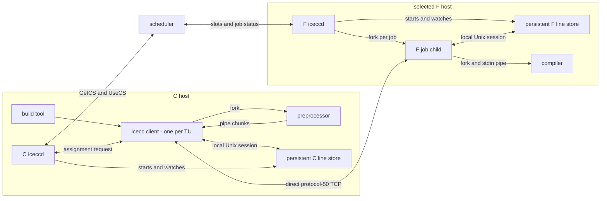
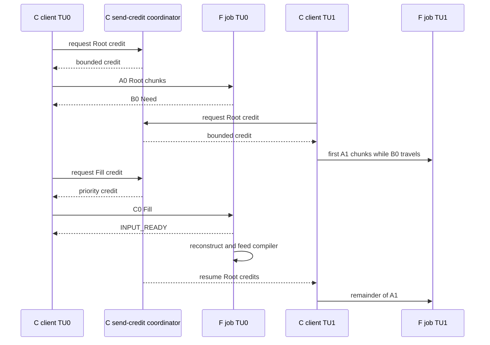
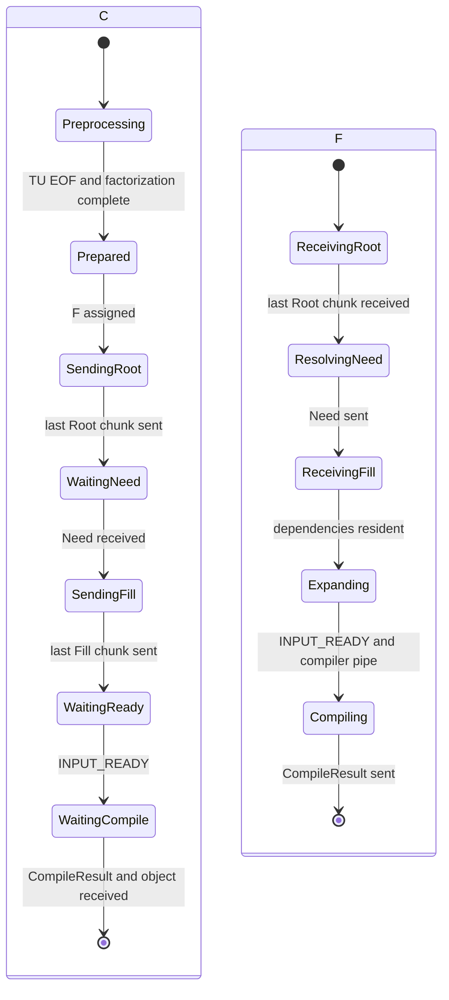

# Protocol-50 transfer architecture in real Icecream

Status: implementation design for issue #16.  This document separates what Icecream does
today, what the M5 capability program actually measures, and the smallest practical product
path for the interning codec.  It is deliberately a per-TU design.  Nothing waits for a whole
build.

## Decisions in one page

1. Existing Icecream is an end-to-end streaming system within one TU.  The preprocessor,
   client socket, F job handler, and compiler stdin are connected by bounded buffers.
2. The current M5 capability program is different: its pipe reader buffers a complete TU,
   then the C interner and factorizer process that TU, then Root/Need/Fill begins.  Its
   concurrency is across TUs, not through the interior of one TU.
3. The first product implementation should retain that complete-TU C barrier.  It is the
   simplest way to preserve the current whole-TU factorization result and makes the measured
   compression result reproducible.
4. As soon as one TU is prepared, it may be assigned and sent.  Other TUs can be preprocessing,
   interning, transferring, reconstructing, and compiling at the same time.  There is no
   build-sized buffer or build-sized transfer.
5. Each compile remains one direct C-client-to-F-daemon TCP connection.  Persistent C and F
   line stores live beside their respective `iceccd` processes and are reached over local Unix
   sockets.  They survive individual compile connections.
6. A C-side transfer coordinator grants small send credits to the existing client processes.
   It coordinates priority but never proxies the bulk C-to-F data through one thread.
7. For one TU, the order is strict: C sends all of **A (Root)**, F then sends **B (Need)**, and
   C then sends **C (Fill)**.  Across TUs, `A1` may use the C-to-F link while `B0` returns in the
   other direction.  When `B0` arrives, `C0` has priority over more initial Root data.
8. F reconstructs in original byte order and writes directly into the already-forked compiler
   stdin pipe.  No `.ii` temporary file is required.  The first version may assemble the
   reconstructed TU before the write; the wire and store interfaces must also permit a bounded
   streaming expander later.
9. Immutable definitions make the product dialogue simpler than M5's acceptance harness.
   Successfully installed definitions may remain in F even if that TU later stops.  The product
   does not need a distributed prepare/commit sequence for cache contents.
10. The scored size is every C-to-F socket byte.  F-to-C Need bytes are timed and logged but do
    not enter the size score.

## Names and process boundaries

| Name | Meaning | Lifetime |
|---|---|---|
| S | Icecream scheduler | cluster service |
| C host | machine on which the build command and preprocessor run | machine |
| C `iceccd` | local daemon that asks S for a compile host | daemon process |
| C client | one `icecc` compiler-wrapper process for one TU | one compile invocation |
| C cpp child | preprocessor forked by that C client | one TU |
| C store | persistent interner, ID allocator, definition store, and send-credit coordinator | C `iceccd` lifetime |
| F host | machine selected to run the compiler | machine |
| F `iceccd` | daemon accepting remote compile connections | daemon process |
| F job child | per-connection handler forked by F `iceccd` | one compile invocation |
| F compiler | compiler forked by the F job child | one TU |
| F store | persistent definition store partitioned by C source GUID | F `iceccd` lifetime |
| transaction | one prepared TU on one C-client/F-job connection | one TU |
| relationship | one `(C source GUID, F store)` cache history | many connections and builds |

The letter F denotes a host/store in the architecture and a particular F index in the
simulator.  An F may offer many compile slots.  A slot is not a separate cache.

## What Icecream does today

The current code already has the correct streaming compiler plumbing:

1. The C client asks its local daemon for a destination and receives `UseCSMsg`.  It opens a
   direct TCP connection to that F in
   [`client/remote.cpp`](../../client/remote.cpp#L411).
2. It forks the preprocessor with a pipe.  The parent drains that pipe in 100,000-byte pieces
   and immediately sends each piece as `FileChunkMsg` in
   [`client/remote.cpp`](../../client/remote.cpp#L271) and
   [`client/remote.cpp`](../../client/remote.cpp#L536).
3. The current protocol is version 44, negotiates the smaller endpoint version, frames every
   message with a four-byte length, and limits an outer message to 1 MiB in
   [`services/comm.h`](../../services/comm.h#L38) and
   [`services/comm.cpp`](../../services/comm.cpp#L171).
4. A `FileChunkMsg` independently compresses each source chunk with zstd for protocol 40 and
   later in [`services/comm.cpp`](../../services/comm.cpp#L535) and
   [`services/comm.cpp`](../../services/comm.cpp#L2202).
5. F `iceccd` accepts the connection, records `CompileFileMsg`, and forks a per-job handler in
   [`daemon/main.cpp`](../../daemon/main.cpp#L1585) and
   [`daemon/serve.cpp`](../../daemon/serve.cpp#L137).
6. The job handler forks the compiler, makes `sock_in` the compiler's stdin, reads each incoming
   `FileChunkMsg`, and writes it immediately to that pipe in
   [`daemon/workit.cpp`](../../daemon/workit.cpp#L124),
   [`daemon/workit.cpp`](../../daemon/workit.cpp#L345), and
   [`daemon/workit.cpp`](../../daemon/workit.cpp#L425).

Consequently, the compiler can consume the beginning of a TU before C has produced or sent the
end.  Current Icecream does **not** wait for a complete `.ii` file on F.

Each C client owns its own TCP connection.  If twenty jobs target one F, the machine has twenty
sockets whose packets are interleaved by the networking stack.  The physical link still emits
bytes serially, but there is no existing application-level whole-TU FIFO shared by those
connections.

The local preprocessing lock is also not one global slot.  `dcc_lock_host()` exposes one lock
slot per detected C CPU in [`client/util.cpp`](../../client/util.cpp#L166).  Normal build
parallelism therefore bounds how many preprocessors and senders are active; a list of 1,000 TUs
does not ordinarily mean 1,000 simultaneous preprocessors.

## What the M5 one-pass program does

M5 proves a useful process topology but currently has a complete-TU boundary on C:

```text
producer process
    -> pipe reader
    -> complete RawTU byte vector
    -> C interning
    -> whole-TU online factorization
    -> PreparedTU queue
    -> Root / Need / Fill
    -> F reconstruction
    -> compiler-verifier pipe
```

The exact boundary is visible in
[`capability/cap_m5_stream_main.cpp`](../cap_m5_stream_main.cpp#L1212): the reader sizes a
`RawTU` to the complete manifest length and calls `read_all`; only after that succeeds does it
push the object to the interner queue.  The interner then processes the complete byte vector and
publishes a `PreparedTU` in
[`capability/cap_m5_stream_main.cpp`](../cap_m5_stream_main.cpp#L1297).

The source reader, interner/factorizer, protocol coordinator, F workers, and compiler writers do
run concurrently.  Thus the barrier is per TU, not global:

```text
time -------------------------------------------------------------->

TU0  [preprocess/read] [intern+factor] [A][B][C] [reconstruct][compile]
TU1       [preprocess/read] [intern+factor] [A][B][C] [reconstruct][compile]
TU2            [preprocess/read] [intern+factor] [A][B][C] [reconstruct][compile]
```

M5 reconstructs into a byte vector before its compiler writer begins.  It then overlaps the
compiler-pipe write with F cache bookkeeping.  That is an accepted capability result, not yet
the final low-memory product path.

## Proposed real process map



The final F arrow can initially be implemented as `F store -> Unix socket -> F job child ->
compiler pipe`.  If that local copy accounts for more than 10% of complete codec time, the F job
child passes the compiler-pipe descriptor to the F store and the store writes reconstruction
chunks directly.  The protocol and cache format do not depend on which local transport wins.

The C and F stores should use the same interner/definition library.  Their service roles differ:

- C store assigns IDs, retains immutable definitions, prepares TU Root data, materializes Fill,
  and grants network send credits.
- F store owns the per-source cache, computes Need, installs Fill, expands Root, and accounts
  cache residence.

Both services need multiple sessions and a bounded worker pool.  The main `iceccd` event loop
must not perform interning, compression, expansion, or bulk copying.

## Per-TU algorithm

### 1. Prepare on C

1. The C client acquires a bounded local producer/encoder slot.
2. It forks the normal preprocessor and drains the pipe in bounded chunks.
3. The first implementation assembles one complete raw TU at C.  Pipe backpressure bounds the
   producer if the raw-TU queue is full.
4. At EOF the C store interns lines/regions, assigns any new immutable ID64 values, finds
   superblocks, emits inline single-use material, and builds a dense local32 mapping for this TU.
5. The prepared object owns or references an immutable dictionary snapshot until the remote
   input is ready.  It is now independent of any particular F.
6. The client asks S for an F if it has not already done so.  Preparing before reserving an F
   slot is preferable for the complete-TU codec because it avoids holding a remote slot while C
   is still preprocessing.  The first patch may retain the current request-first ordering if a
   smaller change is required; both variants must be measured.

The prepared queue is bounded by bytes as well as TU count.  A reasonable initial bound is two
raw TUs per local producer plus four prepared TUs per active route, with a global byte ceiling.
Those are launch values, not constants; retained peak-RSS measurements decide them.

### 2. Send A: complete Root for this TU

`A` is the complete information F needs before it can determine the missing definitions.  It is
one logical object split into preemptible transport chunks:

| Root component | Meaning |
|---|---|
| TU header | transaction ID, source GUID, generation, raw byte count, component counts |
| used map | dense `local32 -> ID64` vector for shared definitions referenced by this TU |
| body | ordered local32/superblock token stream needed to reproduce the TU |
| block definitions | definitions of body-level blocks required to interpret the body |
| inline material | one-use text plus compact offset/length/value columns |

The local32 vector is a direct-index vector on F.  Expansion uses array indexing in the hot path;
the ID64 hash lookup is needed when the Root is admitted and when missing definitions are
installed, not for every emitted line.

Root chunks for one transaction are ordered.  F may decode and stage them incrementally, but it
does not send Need until the last Root chunk has arrived.  This preserves the owner's stated
rule:

```text
complete A -> send B -> receive complete C
```

### 3. Send B: F computes Need

F resolves every ID64 in the TU's used map against the persistent cache for the Root's source
GUID and generation.  Its semantic reply is:

```text
Need = (transaction ID, source GUID, sorted unique set<ID64>)
```

The ID64 set can be delta-coded before its selected component codec.  A local32 bitmap may be
added only if measurement shows it smaller; it is an encoding of the same ID64 request, not a
different cache identity.

Concurrent jobs on one F consult the same store.  To avoid twenty simultaneous cold jobs asking
for the same common definition, the F store owns short-lived missing-ID reservations:

1. the first transaction to observe an absent ID becomes its fill owner;
2. a later transaction whose Root refers to that pending ID waits locally before sending its
   single Need;
3. when the owner installs a complete definition, waiters recompute their missing sets, reserve
   any still-absent IDs, and send one Need;
4. if the owner connection ends before installation, its reservations are released and one
   waiter reserves the still-absent ID in its own Need.

This is local coalescing inside one F.  It preserves one Need/Fill exchange per TU at the cost of
briefly delaying a Root that overlaps an in-progress Fill.  A first implementation may
temporarily allow duplicate requests to establish a baseline, but that row must be labelled
because it can overstate cold fan-out bytes substantially.

### 4. Send C: C materializes Fill

C looks up the requested ID64 values in the immutable snapshot/generation and sends only those
definitions.  Fill is columnar so integer arrays and text bytes remain individually compressible:

```text
sorted or delta-coded ID64 values
32-bit value/category column
32-bit byte-offset column
16-bit length column, with an explicit long-length escape
concatenated text bytes
path/index columns needed by the accepted interner representation
```

The exact inner columns are codec-versioned.  P29, GRZ, and later candidates plug into this
component boundary; they do not define another scheduler or another socket protocol.

Definitions are immutable.  F can install each complete definition as it arrives.  Reinstalling
the same `(source GUID, ID64)` is idempotent.  Therefore product cache state does not need M5's
full prepare/commit/rollback sequence: installed definitions remain useful even if the job later
ends.  F sends one `INPUT_READY` when every Root dependency is resident and the Root expands to
the advertised raw length.  C may then release the prepared snapshot for this transaction.

### 5. Reconstruct and compile on F

F expands Root in original order using the dense local32 vector.  The compiler has already been
forked or is forked at this point with stdin connected to a pipe.

The first implementation can retain M5's complete reconstructed vector because it is already
measured and exact.  The preferred follow-on expander emits bounded chunks after all missing
definitions have arrived:

```text
Root token -> local32 vector -> immutable definition pointer -> output chunk
                                                   output chunk -> compiler stdin
```

There is no filesystem `.ii` stage.  Compiler startup, expansion, and pipe writes may overlap.
Normal compile-result and object-file handling remain unchanged.

## A, B, and C across many simultaneous TUs

For a single transaction, B cannot begin until A is complete.  That does not make the whole
C-to-F relationship stop-and-wait.  With independent transactions and full-duplex links:



The coordinator uses small grants, initially the existing approximately-100 KiB source chunk
size.  A client requests a grant, writes at most that many encoded bytes on its own TCP socket,
then reports completion.  The coordinator handles only grant messages and counters, so aggregate
payload bytes are not copied through a central network thread.

Initial priority classes are:

1. Fill and transaction-completion data;
2. continuation chunks for a Root that has already started;
3. first chunks for a newly prepared Root;
4. diagnostic/bulk work unrelated to compiler input.

Round-robin within a class prevents one large TU from occupying the route indefinitely.  A small
continuation burst, for example four chunks, reduces partial-Root latency without starving Fill.
Credits are hierarchical: a per-`(C,F)` route budget sits under a total C egress budget, matching
the simulator's route and shared-fabric capacities.

## The 1,000-TU, one-C, one-large-F example

Assume C has 1,000 ready TUs and F advertises 5,000 compile slots.  The conceptual sequence is:

1. Build parallelism creates C client processes.  The C producer/encoder admission limit, not
   F's slot count, bounds active preprocessing and buffered TUs.
2. As each TU reaches EOF, C store prepares it and places it in a bounded ready queue.
3. S assigns each admitted job to F.  Each job has its own direct TCP connection and F job child.
4. The route coordinator grants Root chunks across ready jobs.  The physical C-to-F link carries
   one packet sequence, but chunks from multiple connections may alternate.
5. When F completes `A0`, it sends `B0` on the reverse direction.  C can transmit an `A1` chunk
   while `B0` is travelling.
6. When `B0` reaches C, `C0` Fill moves ahead of further initial Roots.  TU0 becomes
   reconstructable and its compiler consumes input while TU1, TU2, and later transfers proceed.
7. At steady state, the link carries short Root/Fill bursts while many already-fed compilers run.
8. A completed compiler frees its F slot; the normal scheduler accounting continues.

There is no sensible operation in which C concatenates all 1,000 `.ii` files, transfers that
blob, and then starts 1,000 compilers.  There is also no requirement that the complete Root for
TU0 monopolize the machine's entire C-to-F link if several sockets are active.

Actual current Icecream asks S for an F before preprocessing.  With ordinary `-j` values that
already bounds reservations.  A deliberately huge `-j1000` can reserve many remote slots while
clients wait for local preprocessing locks.  Protocol 50 should measure a prepare-before-assign
variant; if selected, it is a client sequencing change, not a cache-format change.

## Twenty Fs and many Cs

With `Fa`, `Fb`, and `Fc`, the scheduler creates three independent relationships for one C:

```text
C source GUID G
  -> Fa cache for G: TU 1, 6, 7, 9, ...
  -> Fb cache for G: TU 2, 4, 10, ...
  -> Fc cache for G: TU 3, 5, 8, ...
```

C owns one authoritative definition store, not one copy per F.  Each F owns the subset it has
learned.  Root always names authoritative ID64 values; each F independently reports Need.  A
C-side per-F mirror may be kept as a scheduling estimate, but it cannot replace F's Need because
F may have evicted entries or restarted.

With sixteen Cs, each C has its own source GUID and namespace.  An F store therefore partitions
state by source GUID:

```text
F store
  source G0 -> generations and resident definitions for C0
  source G1 -> generations and resident definitions for C1
  ...
  source G15 -> generations and resident definitions for C15
```

Cold bytes are inherently replicated once per destination F that receives work.  Scheduler
affinity reduces that replication: when load permits, later jobs for the same source GUID,
toolchain environment, and project should return to Fs that already hold useful state.  Load and
available slots remain the first constraint.  The first protocol-50 implementation works under
round-robin placement; affinity is an independent scheduler improvement measured by the same
simulator.

## Identity, generation, and cache lifetime

### Identity

- `source_guid` identifies one persistent C store incarnation.  A new store process gets a new
  GUID.
- `id64` identifies one immutable C definition inside that namespace.
- The proposed layout is `GEN10 | SEQ54`.  `SEQ54` advances and is never reused during that
  source GUID's lifetime.  `GEN10` identifies the active cache generation.
- `local32` is a dense per-TU vector index.  It has no meaning outside that TU and needs no hash
  lookup during expansion.
- The full cache identity is `(source_guid, id64)`.  A Need is semantically a source GUID plus an
  ID64 set.

Superblock and Root encoders may remove the generation bits and delta from the generation's
starting sequence number before entropy coding.  That is a reversible wire transform; the store
always indexes the reconstructed full ID64.

### C generation rotation

The active C generation is append-only.  The launch policy is:

1. target a new generation after approximately eight hours;
2. flip only after at least one minute without new TU intake, so no active preparation straddles
   the writable generation;
3. make the old generation read-only and keep it for three hours so delayed Need replies can
   still be materialized;
4. new TUs use the new generation immediately after the flip;
5. discard the retired generation after its retention interval when no local prepared object
   refers to it.

If a build remains continuously active, rotation waits for a quiet boundary; a separately
measured hard memory ceiling may force a boundary between completed TUs.  IDs are never rebound
to different bytes.

### F cache residence

F keeps per-source/generation state across TCP connections.  It applies a bounded LRU or ARC-like
policy to immutable definitions and a global byte budget across sources.  Eviction has a simple
meaning: the next Root that needs that ID causes another Need.  An entire source relationship may
be removed after two hours idle.  Retired C generations naturally disappear from F as they age
out.

Active expansion pointers must remain valid until their output chunks are emitted.  The store
can achieve this with immutable generation pages/snapshots; eviction removes an index entry and
reclaims a page only after active readers leave it.

## Protocol-50 envelope

Protocol negotiation already exists.  Raising `PROTOCOL_VERSION` from 44 to 50 permits one new
top-level `Msg::CACHE_FRAME`.  A protocol-50 client requests a protocol-50 F; when no such F is
available it can replay the prepared raw TU through the existing `FileChunkMsg` path.

Keep the existing outer framing:

```text
u32 network-order outer_message_length
u32 Msg::CACHE_FRAME
cache-frame payload
```

The cache-frame payload begins with the compact header proposed for this work:

```text
u32 type_and_length = (type3 << 29) | payload_length29
u64 transaction_id
u32 chunk_index
u32 chunk_count
payload bytes
```

The existing 1 MiB `MsgChannel` ceiling remains.  Logical blocks are cut into approximately
100 KiB cache frames so the send-credit coordinator can preempt between chunks.  `chunk_count`
makes completion of A or C explicit.

| type3 | Frame | Direction | Purpose |
|---:|---|---|---|
| 0 | SESSION | C to F | source GUID, generation, codec format, raw size, counts |
| 1 | ROOT | C to F | chunked A components |
| 2 | NEED | F to C | B: missing ID64 set |
| 3 | FILL | C to F | chunked C definitions |
| 4 | INPUT_READY | F to C | exact input length is reconstructable |
| 5 | CANCEL | either | stop this TU transaction |
| 6 | SESSION_DONE | either | orderly per-TU close before normal compile result |
| 7 | reserved | either | future format without another top-level message |

`CompileFileMsg` remains the job metadata message and gains protocol-50 fields selecting this
input mode.  The cache components carry their own one-byte encoding selector (`raw`, `zstd-1`, or
`zstd-3`) plus raw and encoded lengths.  The selected encoder chooses the smallest complete
representation for each component.  The outer `CACHE_FRAME` payload must not be passed through
`FileChunkMsg::writecompressed`, because that would recompress already encoded bytes and obscure
per-component accounting.

Zstd-6-long and zstd-19-long remain comparison controls over complete corpus streams.  They are
not live per-frame defaults.  Msgpack can be retained as an experiment behind a component codec,
but the primary arrays should use direct varint/delta/column encodings to avoid generic object
overhead.

## Product state machines



Any connection end discards that TU's Root/body state.  Complete immutable definitions already
installed in F remain.  A retry gets a new transaction ID and recomputes Need; it may therefore
send fewer Fill bytes than the interrupted attempt.  If C no longer retains a requested
generation, that job uses the raw fallback path.

## Where the implementation lands

| Area | Minimal change |
|---|---|
| `services/comm.h`, `services/comm.cpp` | protocol 50, `CACHE_FRAME`, packing limits, dispatch |
| new `services/cache_protocol.*` | type3 envelope, component headers, SESSION/ROOT/NEED/FILL/READY codecs |
| shared interner library | stable GUID/ID64/local32 types, Root preparation, Fill materialization, expansion |
| new cache-service module | persistent C/F stores, Unix sessions, generation lifecycle, cache accounting |
| `client/remote.cpp` | protocol-50 preprocessing/preparation path, direct remote frames, raw fallback |
| new client coordinator module | bounded producer/ready admission and hierarchical chunk credits |
| `daemon/main.cpp` | start/watch F store helper; hand per-job sessions to child handlers |
| `daemon/serve.cpp`, `daemon/workit.cpp` | select cache input mode, Root/Need/Fill loop, compiler-pipe feed |
| scheduler messages | no required first-step change; optional source-GUID affinity hint later |
| `capability/distribution` | dynamic cache adapter, chunk priorities, preparation events, retained ledgers |

The cache service should initially use Unix sockets everywhere.  A shared-memory ring is a
replaceable local transport optimization, not part of the cache identity or network protocol.
Add it only if the Unix-socket run loses more than 10% of complete throughput or copies dominate
CPU profiles.

## Simulator correspondence and missing work

The common simulator already owns C count, F count, slots per F, job-selection policy, compile
trace, per-route link rate, shared fabric, and placement policy.  It correctly keeps codec policy
under one scheduling core.

Its current `raw` adapter is intentionally simpler than real Icecream: it models one complete
raw-TU C-to-F phase and starts compilation only after that phase finishes.  Real protocol-44
Icecream starts the compiler earlier and feeds arriving chunks.  The raw row is therefore a
conservative transfer-before-compile control, not a cycle-accurate model of current streaming.

Before GRZ/P29 topology numbers are called product predictions, the simulator needs:

1. a C preparation/EOF event and bounded prepared queue;
2. 100-KiB Root/Fill chunks rather than one indivisible whole-TU flow;
3. F-generated Need based on cache state at Root completion, not codec state guessed at dispatch;
4. shared F cache state keyed by `(source GUID, F)` across job connections;
5. concurrent-miss reservation/coalescing;
6. priority send queues with Fill ahead of new Root data;
7. an optional compiler-input streaming mode and the current complete-input control;
8. affinity policies using the same core and trace;
9. exact C-to-F frame-byte accounting and separate F-to-C time/accounting;
10. peak buffered raw, prepared, Root, Fill, and reconstructed bytes.

The corrected five-build elapsed metric is the sum of per-generation active intervals, not wall
time including the four deliberate 600-second gaps.  `generations.tsv` is the binding interval
ledger.

## Required tests and measurements

### Exactness and lifecycle

- encode and reconstruct every TU byte-for-byte;
- compile the reconstructed input through a real compiler pipe and compare object/diagnostic
  results with the existing path;
- split every frame at zero, one byte, the 100-KiB grant boundary, and the 1-MiB outer limit;
- cold store, retained store, one-line root-header change, and changed include near the dependency
  root;
- duplicate concurrent Need for one ID and coalesced Need for the same workload;
- C generation flip with old-generation Fill during the retention interval;
- F definition and whole-source eviction followed by exact re-request;
- connection interruption after each Root and Fill chunk followed by a fresh transaction;
- protocol-44 peer fallback from an already prepared raw TU;
- 1C/1F, 1C/20F, 1C/50F, and 10C/50F scenarios;
- a deliberately large ready queue, including the 1,000-TU/5,000-slot thought experiment.

### Byte ledger

For every TU and cumulative boundary, retain:

```text
C->F SESSION + ROOT + FILL + completion-control bytes
F->C NEED + READY/control bytes
Root bytes by component
Fill bytes by component
raw reconstructed bytes
resident and evicted cache bytes by source/generation
```

Cold `Y` is the sum of C-to-F bytes for the first project build.  Warm `Z` is reported for each
subsequent build.  A preinstalled package is not charged to per-build transfer.  Network timing
still includes both directions and the strict `A -> B -> C` dependency.

### Time and resource ledger

Record separately:

- preprocessor pipe read and time to TU EOF;
- complete raw-TU wait;
- interning and factorization;
- prepared-queue wait;
- Root encode, route wait, send, and delivery;
- Need compute and round-trip;
- Fill lookup, encode, priority wait, send, and delivery;
- F decode, cache lookup/install, expansion, and compiler-pipe write;
- compiler start, first input byte, input EOF, and compile finish;
- per-generation active elapsed time and secondary wall makespan;
- peak RSS and each bounded-queue high-water mark.

The current compressibility-first launch target accepts about 0.5 GB/s for a cold complete path,
provided byte targets are met.  Local-transport alternatives are compared on complete producer-
to-compiler throughput, not only an already-prepared relationship.  Warm throughput, 1-Gbit and
10-Gbit simulated completion time, and C-to-F bytes remain separate columns.

## Questions to settle by measurement

1. How much compile overlap is lost by the complete-TU C barrier versus protocol 44's current
   within-TU streaming?  This is the first architecture cost to quantify.
2. Does prepare-before-assign reduce remote-slot occupancy enough to outweigh lost overlap with
   scheduler wait?
3. Does the credit coordinator improve completion time over natural multi-socket TCP sharing,
   especially when a short Fill competes with many large Roots?
4. How much cold fan-out duplication disappears with F-local missing-ID coalescing?
5. Is a Unix-socket F store within 10% of a direct in-process/shared-memory path at 1, 8, 16, and
   32 concurrent compiler consumers?
6. Should F begin the compiler at `CompileFileMsg`, at Root completion, or at `INPUT_READY`?
7. How much does source-GUID affinity improve five-build bytes and elapsed time under realistic
   load?
8. Can a bounded streaming expander remove the complete reconstructed-TU buffer without changing
   bytes or reducing throughput?

The first implementation should answer these with one common scenario launcher.  None requires
another protocol shape: C preparation, A/B/C, the persistent stores, and the compiler pipe remain
separable blocks.
