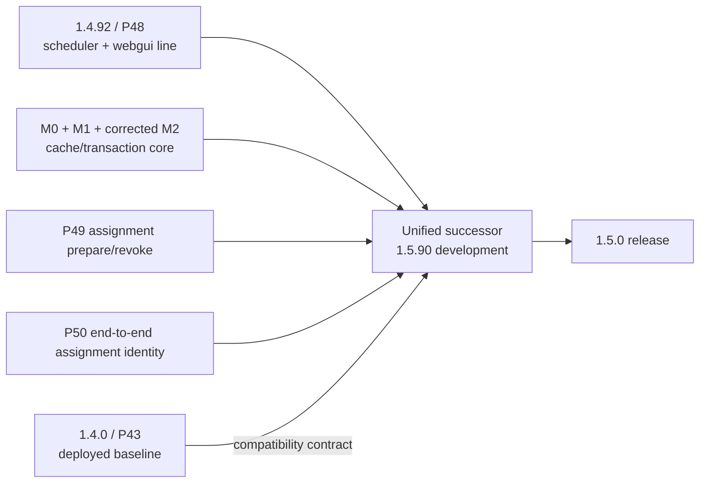
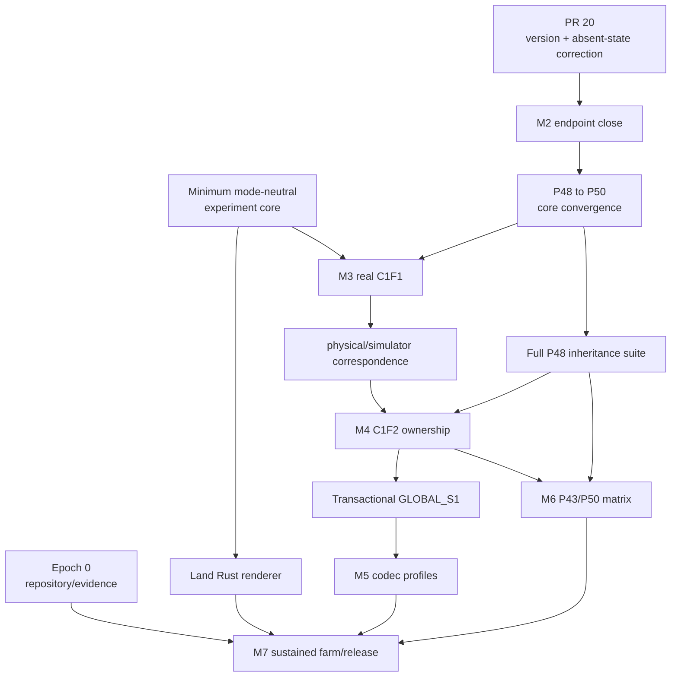

# Issue 16 strategic delivery plan

Status: reviewed plan with BigOracle and Deep Reviewer corrections incorporated

Scope: unified P50 product, P43 compatibility, simulation, physical farm, codec research, and experiment reporting

Canonical tracker: <https://github.com/mickg10/icecream/issues/16>

## 1. Executive decision

The product should converge onto one successor that combines:

1. the complete scheduler and webgui correction line currently represented by
   Icecream 1.4.92 / main protocol 48;
2. the P49 scheduler-to-worker assignment vocabulary;
3. the P50 end-to-end assignment identity;
4. the persistent C-cache to F-cache transport and its codec profiles; and
5. an unchanged P43-compatible legacy compile path.

The deployed compatibility generations are therefore P43 and the unified P50
successor. P48 is an inheritance and regression checkpoint, not a permanent
deployment axis. P44 remains an upstream-development reference only.

The current M0/M1/M2 work began on the 1.4.90 / P44 development base. It must be
converged onto the complete P48 line before daemon, scheduler, and wrapper
integration begins. No M3 product integration should be written on the P44 base.



## 2. Version and protocol vocabulary

Version labels, the ordinary Icecream protocol, the cache wire, and the codec
profile are independent fields. Reports and test manifests must never collapse
them into one number.

| Release or line | Ordinary protocol | Purpose |
|---|---:|---|
| 1.4.0 | 43 | deployed compatibility baseline |
| 1.4.90 | 44 | upstream development reference and original P50 implementation base |
| 1.4.91 / 1.4.92 | 48 | webgui, telemetry, preprocessing, and scheduler-correction inheritance line |
| unified development successor | 50 | P48-derived product with P49/P50 assignment and cache capability |
| intended release | 50 | 1.5.0, after all release gates |

The existing design uses these prime marks:

- `S'`: scheduler-to-worker link supports P49 assignment preparation and
  revocation;
- `F'`: worker's scheduler link negotiated P49;
- `C'`: the full scheduler, submitter-daemon, wrapper, and worker client chain
  negotiated P50 end-to-end assignment identity.

The new cache implementation also currently uses the number 50 for its separate
cache-wire grammar. To remove ambiguity in plans and reports, this document calls
that channel **CacheWire v1**:

```text
main_protocol = 43 | 50
cache_wire    = off | v1
codec_profile = legacy | zstd_tu | stream_a | stream_b | p29 | grz
```

Historical source files may retain the `protocol50` name. Renaming them does not
justify an epoch or delay product work. Emitted manifests, logs, traces, and
reports must never contain an unqualified `protocol=50`; they must use
`main_protocol=50` or `cache_wire=v1` as appropriate.

## 3. Product ownership model

The implementation and simulator must share the same ownership boundaries.

```mermaid
flowchart LR
    PP[icecc wrapper\npreprocessor pipe]
    CA[C authority\nC GUID + TU sequence\ncanonical admission]
    RF[per-F C route\nrelationship cursor + route learner]
    FC[F cache service\nper-C namespace + O_c_f object arena]
    IR[leased InputRecord\ntransaction keyed]
    CC[compiler child\nstdin pipe]
    OUT[result/object path]

    PP -->|local Prepare| CA
    CA -->|immutable PreparedTU| RF
    RF -->|CacheWire v1| FC
    FC -->|publish exact input| IR
    IR -->|read cursor| CC
    CC --> OUT
```



The model has three clocks and one non-clock residency plane:

```text
A          shared-C canonical admission
O_{c,f}    F-resident immutable objects for C_STORE_GUID c
R_f        committed state for one C/F relationship
J          logical compile attempts and one accepted result
```

`A`, `R_f`, and `J` advance. `O_{c,f}` is durable content residency, not a
cursor: objects may survive transaction/session failure and history reset, and
capacity eviction changes residency without changing relationship history.

Rules:

1. A local Prepare request receives one immutable `PreparedTU` and advances `A`
   exactly once. A lost local reply, reconnect, reroute, or compiler retry does
   not teach the global learner again.
2. `OBJECT_APPLIED` installs immutable content into `O_{c,f}`. Pins temporarily
   connect that content to an `R_f` transaction; `Need` repairs missing objects
   after eviction.
3. Each F has an independent `CRoute`; rerouting to F1 never moves or erases the
   outstanding state for F0.
4. When enabled, `GLOBAL_S1` belongs to the C-wide authority and is identical for
   every route attempt of one PreparedTU. It is not required to close M2.
5. `ROUTE_S1` and GRZ history belong to `R_f` and advance only after exact F
   input commit and C reconciliation.
6. Logical result selection never retires unresolved cache-route state.
7. For an open logical job, exact input commit atomically publishes a restartable,
   immutable InputRecord lease. Compiler attachment may occur before or after
   publication.

The compact ownership theory is therefore `A + O_{c,f} + R_f + J`, with only
`A`, `R_f`, and `J` acting as clocks.

## 4. Three synchronized workstreams

The project proceeds through three workstreams driven by one experiment contract.

| Workstream | Responsibility | Primary output |
|---|---|---|
| Product and farm | endpoints, sidecars, daemon/wrapper/scheduler integration, real compilation | physical JSONL and retained artifacts |
| Simulator and codec research | exact codec ledgers, topology scheduling, calibrated stage models | simulated JSONL and codec reports |
| Report GUI | validation, catalog, comparison, timeline, matrices, artifact navigation | standalone HTML reports and experiment index |

These are not sequential projects. Every milestone extends all three against the
same scenario definition and normalized output schema.

## 5. Common experiment contract

One immutable, mode-neutral scenario manifest must drive either a simulation or
a physical Docker/LAN run. Execution mode belongs in the execution header, so
both runners consume the same scenario digest.

```yaml
schema: icecream-experiment-v2
components:
  scheduler: {release: 1.4.0|1.5.90, main_protocol: 43|50, commit: SHA}
  wrapper:   {release: 1.4.0|1.5.90, main_protocol: 43|50, commit: SHA}
  c_daemon:  {release: 1.4.0|1.5.90, main_protocol: 43|50, commit: SHA}
  f_daemon:  {release: 1.4.0|1.5.90, main_protocol: 43|50, commit: SHA}
capabilities:
  cache_wire: off|v1
  codec_profile: legacy|zstd_tu|stream_a|stream_b|p29|grz
topology:
  c_count: N
  f_count: N
  f_slots: N
  bandwidth: per-link and shared-fabric values
  scheduler_policy: round_robin|rendezvous|dense_frontier|home_spill
  assignment_source: policy|route_trace
workload:
  corpus: name and immutable manifest digest
  build_epochs: N
  release_policy: all_at_once
environment:
  initial_state: resident|absent
  image_digest: SHA
  transfer_bytes: N
  install_verify_ns: N
cache:
  initial_state: cold|warm|snapshot
  capacity_bytes: N
  lifecycle_events: []
expected:
  selected_main_protocol: 43|50
  selected_cache_wire: off|v1
  selected_codec_profile: name
  compile_result: exact outcome
```

The execution header adds facts about one realization without changing the
scenario identity:

```yaml
schema: icecream-execution-v2
scenario_digest: SHA
mode: simulated|physical
runner_commit: SHA
host_manifest: SHA
started_at: timestamp
```

The execution descriptor must additionally retain image identifiers, compiler
and library versions, host identities, source commit, simulator commit, codec
executable digest, and every input manifest digest.

Both execution modes emit the same JSONL structure:

```text
execution header + scenario digest    first row
events / snapshots / inactive gaps    chronological rows
summary                               final row
```

Every transaction/event row in the minimum M3 schema carries the applicable
subset of these identity and accounting fields:

```text
logical_job_id, attempt_id
C_STORE_GUID, physical_endpoint, RouteLaneId, F_STORE_GUID, session_serial
HISTORY_NONCE, REL_SEQ, TU_SEQ, transaction_digest, raw_digest
negotiated_profiles, route_state_profiles, InputRecord_identity
actor, start_ns/end_ns or duration_ns
observed|modeled|derived provenance
per-link C-to-F and F-to-C byte delta
resource and queue byte delta
```

Canonical event stages and lifecycle transitions are:

```text
job_release
scheduler_select
canonical_prepare
route_prepare
session_open / session_replaced / session_disconnected
c_queue
dict_or_manifest
need
fill
object_applied / pin_acquire / pin_release
f_decode_install
materialize_verify
input_commit_visible
input_record_retain / input_record_release
compiler_pipe
compiler_authorized / attempt_cancel
compile
result_return
result_accept
route_reconcile / history_reset / incarnation_replaced
job_finish
```

For scored source-transfer and makespan rows, all preprocessed TUs are available
at time zero. Physical traces may retain an unscored diagnostic timestamp for
preprocessor output, but preprocessing is outside the simulator score. Primary
rows begin with the compiler environment resident. One explicit stress row may
emit `env_transfer`, `env_install_verify`, and `environment_ready`; its compile
may begin only when both `ENV_READY` and `INPUT_VERIFIED_READY` hold. Environment
bytes enter the total network ledger, never the source-codec compression ratio.

A scheduler assignment/route trace can be recorded by the physical run and
replayed by the simulator. Under route-trace replay, route-by-route and
directional byte closure is exact. Under a load-driven policy replay without an
assignment trace, only aggregate directional byte closure is required because
small timing changes may legitimately select different workers.

Exact gates for every run:

- input reconstruction and digest;
- compiled output and result outcome;
- C-to-F and F-to-C directional byte closure;
- TU, route, relationship, job, and build counts;
- event ordering and final-state closure;
- no unreturned queue, lease, pin, or byte credit;
- immutable artifact manifest and checksums.

Physical outgoing C-to-F bytes remain the source-transfer score. F-to-C bytes are
reported separately and included in makespan and fabric utilization.

## 6. Epoch 0: repository and evidence normalization

### Scope

- Canonical repository: `/tanksmall/MICKG2/mickg/src/mickg10/icecream`.
- Active worktrees: sibling `icecream-worktrees/` directory.
- Retained build and experiment output: sibling `icecream-artifacts/` directory
  during the current migration; future large corpora may remain in a separately
  declared dataset.
- Preserve compatibility symlinks for already-published artifact paths.

Repository hygiene and artifact cataloguing run in parallel with endpoint work.
They do not block M2 or M3 unless required source exists only in a disposable
checkout; that condition must be corrected immediately.

### Exit gate

- every active branch and dirty file has an owner and recorded path;
- no required source exists only in a disposable build tree;
- every Git worktree resolves through the canonical repository;
- large result paths have retained checksums;
- no new work uses the old scratch checkout as its source repository.

## 7. Epoch 1 / M2: close the bounded loopback endpoint

M2 remains a standalone C1F1 endpoint/library boundary. It does not attach to the
Icecream daemons yet.

### Blocking M2 boundary

1. Introduce one C-wide preparation authority with opaque admitted handles.
   `P50ClientEndpoint::run` may accept only handles issued by that authority.
2. Make local Prepare replay bounded and idempotent, and give every admitted
   entry an explicit release rule tied to the logical job/retry window.
3. Enforce exactly one self-contained Zstd frame for `ZSTD_TU`; reject trailing
   bytes and appended empty or nonempty frames, and verify exact output size and
   digest.
4. Negotiate only implemented versions and a profile mask. An overlap containing
   versions 50 and 51 selects 50, never an unimplemented 51.
5. Stage a candidate session until HELLO and state validation succeed; an
   incompatible candidate must not replace a live relationship.
6. Require history-reset acknowledgement to match negotiated version, profile
   mask, limits, GUID provenance, and route state.
7. Allow one active dialogue per relationship, with explicit local caps and
   terminal session-error behavior.
8. Classify same-endpoint reconnect outcomes without performing scheduler
   reroute. Whole-transaction replay retains its exact reconciliation identity.
9. Emit and check an exact action trace for every state-changing operation, and
   mark the older M1 reconnect table as historical capability behavior where the
   checked M2 decision table supersedes it.

### Required tests

- lost local Prepare reply returns the same admitted handle and TU sequence;
- arbitrary Prepared pointer or duplicate TU sequence is rejected;
- Prepare release returns retained bytes and item counts to zero;
- exact frame consumption negatives;
- inconsistent reset acknowledgement;
- unsupported future version never becomes selected;
- incompatible HELLO leaves the established relationship unchanged;
- same-session duplicate begin;
- same-GUID missing namespace after establishment;
- F incarnation replacement before commit and after commit-before-ack;
- all dialogue boundary disconnect/reconnect cases;
- terminal outcome and whole-attempt classification.

### Blocking acceptance gates

- clean GCC and Clang build/check;
- strict warnings;
- ASan and UBSan focused suites;
- exact trace checker closure.

The Zstd prefix build, distribution archive check, and retained quietbox
single-thread `ZSTD_TU` rate measurement continue in parallel and must be green
before M2 is merged. They are evidence/package gates, not reasons to expand M2's
state-machine scope.

### Explicitly deferred from M2

- the transactional shared-C `GLOBAL_S1` learner/candidate, required before P29
  is enabled;
- actual scheduler reroute and C1F2 behavior, introduced in M4;
- codec selection beyond `ZSTD_TU`, introduced behind the M5 codec boundary.

### Exit gate

M2 is committed, independently reviewed, reproducible from retained commands, and
contains no daemon, scheduler, wrapper, or farm integration.

## 8. Epoch 2 / M2.5: converge P50 work onto P48

This is a separate, reviewable sequence of commits before M3. A dry-run
convergence branch may expose conflicts while M2 is closing, but no M3 work may
start on it until corrected M2 and the core inheritance gate are present.

### Ordered integration

1. Start from the complete 1.4.92 / P48 scheduler branch.
2. Apply the C++23 and mandatory Boost baseline.
3. Apply accepted M0 and M1 commits.
4. Apply the corrected M2 endpoint commits.
5. Apply P49 scheduler-to-worker assignment preparation/revocation as its own
   commit.
6. Apply P50 end-to-end assignment identity as its own commit.
7. Add inert cache-endpoint capability advertisement as its own commit, without
   enabling cache input.
8. Set the development release identity to 1.5.90 only after the merged branch
   builds and reports its intended protocol accurately.

### Core inheritance gate before M3

With every new capability disabled, the unified branch must build cleanly,
exercise the corrected scheduler/daemon assignment core, and pass the focused
P43 legacy compatibility path. This is the gate that blocks the first M3
vertical.

### Full P48 inheritance gate

With every new capability disabled, the unified branch must reproduce the P48
behavior and pass its complete scheduler, daemon, webgui, stress, and integration
suite. This suite runs in parallel after the core inheritance gate and must close
before distributed M4 and compatibility/release M6 work. Every link to a P43 peer
negotiates and executes the legacy path.

### Exit gate

- no product integration is based on P44;
- all P48 behavior is present;
- P49/P50 messages are emitted only on links that negotiated them;
- cache endpoint information is inert unless the complete cache capability is
  selected;
- the P43 path remains byte-compatible and behaviorally unchanged.

## 9. Epoch 3 / M3: first real P50 C1F1 compile

M3 is the smallest actual product vertical.

### C side

- long-lived C cache service owns C GUID, global TU sequence, idempotent local
  Prepare requests, immutable candidates, object arena, and PreparedTU retention;
- wrapper keeps its existing preprocessor pipe and selects a legacy sink or local
  cache Prepare sink before bytes flow;
- per-F endpoint owns only relationship/session/route state;
- the authority exposes the future transactional `GLOBAL_S1` extension point but
  M3 does not require a learner;
- local protocol carries opaque handles and references only after the relevant
  InputRecord/PreparedTU identity is frozen.

### F side

- one long-lived F cache service keys storage by C GUID; the M3 gate exercises
  exactly one C namespace;
- exact materialization atomically publishes a transaction-keyed, immutable,
  leased InputRecord;
- job child opens its own local attachment session after fork;
- `CacheAttachmentSource` writes the leased record into the existing compiler
  stdin pipe;
- compiler lifecycle, diagnostics, object transfer, and result return remain on
  the ordinary job path.

### Scheduler and job protocol

- F advertises a dedicated cache endpoint only after its cache service is ready;
- scheduler forwards capability and endpoint under the P50 version gate;
- `CompileFile` selects exactly one input mode for an attempt;
- after a cache reference is sent, legacy chunks are never inserted into that
  same attempt;
- a later legacy retry is a distinct attempt using retained exact input.

### Required physical scenarios

```text
legacy reference compile
P50 cold compile
same-TU warm compile
input arrives before job descriptor
job descriptor arrives before input
cache-required with unavailable endpoint
auto mode with unavailable endpoint -> legacy attempt
bounded allocation failure before input-mode commitment
compiler restart from retained InputRecord
same-F reconnect and lost final acknowledgement
```

### Minimum experiment-core gate

Before the first M3 run, freeze only the mode-neutral manifest digest, execution
header, identity/accounting fields, lifecycle transitions, exact byte ledger, and
route-trace replay described in Section 5. The full catalog schema and GUI are
additive follow-ups and do not block this vertical.

### Exit gate

`make integration_tests` launches a real scheduler, one C daemon/service, one F
daemon/service, wrapper, preprocessor, compiler, linker, and executable. It retains
complete logs, action trace, byte ledger, input digests, object digest, and program
output. The same scenario manifest runs in the simulator and physical launcher.

## 10. Epoch 4 / M4: distributed operation

Expand the same design without changing M3 ownership.

### Topologies

The blocking ownership gate is C1F2: one C authority, two independent route
relationships, and competing/retried attempts. All local producers in one
submitter cohort share one authority and one C GUID.

After that evidence closes, M4.5 adds one focused row in which one F hosts
separate namespaces from two independent submitter cohorts. Broad multi-C
throughput is deliberately later. C1F20 with 200 slots per F and the local-80
profile (research6 16, research7 16, quietbox2 24, quietbox3 24) are scale tiers,
not prerequisites for proving the C1F2 ownership model.

### Required product behavior

- independent per-F route queues and relationship cursors;
- one PreparedTU shared across retries and routes;
- multiple committed InputRecords retained before compiler attachment;
- at most one accepted compiler result per logical job;
- late F0 commit/result reconciliation after F1 wins;
- byte-bounded prepared, encoded, fill-reserve, F transaction, materialized-input,
  object, and pin accounting;
- `O_{c,f}` object reuse across session/history reset, exact `Need` repair after
  forced eviction, and balanced pin acquire/release;
- F cache generation replacement, C reconnect, forced eviction, and lease
  release;
- one focused F multi-namespace row after the C1F2 gate;
- environment transfer and result-return traffic measured explicitly.

ARC policy tuning and sustained cache rotation are scale/release work. M4 must
prove bounded accounting and forced-eviction behavior, not select the final
eviction policy.

### Simulator additions

- all TUs immediately available at time zero for scored runs;
- scheduled C preparation/codec CPU;
- F decode/install/materialize/copy/pipe CPU;
- compiler result bytes and return path;
- resident compiler environments for primary rows, plus one explicit
  transfer/install/verify stress row in which environment work overlaps P50 input
  and compile waits for `ENV_READY && INPUT_VERIFIED_READY`;
- byte capacities and backlogs, not only slot counts;
- lifecycle events for join, restart, disconnect, cache rotation, and eviction;
- physical assignment-trace replay for exact route closure; policy-only replays
  compare aggregate directional bytes when timing changes routing.

### Exit gate

C1F2 completes with exact reconstruction, ownership, bounded-resource, restart,
result, and byte closure. Physical ledgers replay through the simulator with
identical route/TU counts and directional bytes when an assignment trace is
provided; policy-only runs close aggregate bytes. Timing error is published per
stage and topology; no global timing claim is made outside calibrated regimes.

## 11. Epoch 5 / M5: codec profile integration and research

All codecs use one transport, transaction, experiment, and reporting interface.
Before P29 is enabled, the C authority gains a transactional shared-C
`GLOBAL_S1` learner/candidate: prepare exact candidate state, reuse it across
routes, commit it exactly once from exact committed input, and abort prepared
state on failed work. This may land during M3 preparation or as the first M5
slice; it is not an M2 requirement.

| Profile | State model | Initial role |
|---|---|---|
| legacy | current independent per-TU transfer | P43 and fallback control |
| `ZSTD_TU` | independent complete frame per TU | first product baseline |
| Stream A | one retained large-window/LDM frame per C/F relationship, TU flushes | low fanout and concentrated history |
| Stream B1 | shared cohort prefix plus thin per-F window | prebuilt cohort control |
| Stream B2 | online first-K cohort prefix plus thin per-F window | likely wide-farm default |
| P29 | RAW, shared-C GLOBAL_S1, per-route ROUTE_S1 | structural candidate and byte leader |
| GRZ | route-history structural coding | long reuse-distance candidate |

The simple streaming models follow `simple_compression_models.md`:

- Stream A uses a retained frame, large window, long-distance matching, and
  per-TU flushes.
- Stream B uses raw-content `refPrefix`, not a dictionary attachment that silently
  reduces the effective window.
- B2 learns online; no universal `.ii` package is assumed.
- Independent `ZSTD_TU` remains the simple first product profile even though it
  intentionally gives up cross-TU entropy history.

Every profile snaps into the same narrow codec boundary:

1. prepare an exact immutable candidate;
2. emit declared DICT, BODY, and Fill components;
3. reconstruct and verify the exact input;
4. deterministically derive the next route state;
5. commit every enabled state component from exact committed input; or
6. abort all prepared state on failure.

`route_state_profiles` is frozen when a `HISTORY_NONCE` branch is created and is
included in the initial transaction digest. The selected codec profile must be a
member of both `negotiated_profiles` and `route_state_profiles`. P29 alone uses
the C-wide `GLOBAL_S1`; P29 route state and GRZ history remain
relationship-local. No codec may redefine endpoint or logical-job lifecycle.

### Research gates

- exact round trip for every TU and complete build;
- cumulative outgoing bytes at TU 50, 100, 150, 200, 250, 300, full build, and
  four repeated builds;
- cold target compared with whole-corpus Zstd-19 long-window for raw source and
  preprocessed input;
- TU-100 and TU-200 cumulative target no larger than the corresponding
  whole-corpus Zstd-6 long-window allowance;
- encode/decode CPU, wall time, RSS, retained state, and per-stage byte breakdown;
- empty-start and shared-cohort-start learning curves;
- 16-plus corpora and multiple build environments;
- exact behavior under reordered builds, header perturbation, new worker, and
  holed per-F history.

### Selector output

The experiment evidence, not a fixed assumption, selects among:

```text
low fanout / concentrated reuse       Stream A
wide farm / new-worker sensitivity    Stream B2
structural long-range reuse           P29 or GRZ
unsupported or constrained peer       legacy or ZSTD_TU
```

## 12. Epoch 6 / M6: complete P43-to-P50 compatibility

The routine deployment matrix contains P43 and target P50 only.

### Logical matrix

For scheduler `S`, complete client chain `C`, and worker `F`, execute all eight
tuples in `{43,50}^3`.

### Physical matrix

Split the client chain into wrapper `W` and local daemon `D`. Execute all sixteen
tuples in `{43,50}^4`:

```text
(S, W, D, F)
```

Every tuple must have an explicit expected negotiated protocol, assignment mode,
cache-wire selection, codec, and compile outcome. An unsupported cache path must
select legacy before input-mode commitment or produce the scenario's explicit
cache-required outcome.

The permanent matrix has sixteen component-version rows; it is not multiplied by
every research codec. Each row declares its expected cache/profile outcome, and
focused companion rows cover cache unavailable and cache-required behavior.

### Mixed-fleet and rolling sequences

- P43 and P50 workers registered simultaneously;
- P43 and P50 client chains submitting simultaneously;
- scheduler upgraded first;
- scheduler upgraded last;
- workers replaced one at a time;
- submitter daemon and wrapper upgraded in either order;
- P50 node restarted while P43 work remains active;
- P48-to-P50 one-time inheritance suite;
- P44 build/reference row only, not a deployment combination.

Simulation runs the exhaustive matrix for every selected workload. Physical farm
acceptance runs all sixteen binary tuples for a compact corpus, then the critical
all-old, all-new, and mixed-fleet rows for large corpora.

### Exit gate

Every tuple compiles, links, and runs the expected program; every negotiated path
matches the manifest; no row silently selects a capability absent from one of its
required links.

## 13. Epoch 7 / M7: sustained farm and release

### Physical environments

- Debian GCC;
- Conan GCC;
- Fedora Clang with libc++;
- Linuxbrew compiler environment.

Build sources and outputs remain bind-mounted outside containers. Images are
content-addressed and scenario manifests record their exact identifiers.

### Farm tiers

1. C1F1 smoke on nas642 to quietbox2.
2. C1F2 correctness and concurrency.
3. C1F20_200B1G controlled scale.
4. Local-80 capacity across research6, research7, quietbox2, and quietbox3.
5. Optional WAN experiments on research4/nas64tail, always labeled separately.

### Workloads

- identical cold and warm rebuilds;
- one-line leaf change;
- shared-header change near the dependency root;
- reordered TU stream;
- partial incremental rebuilds;
- compiler environment cold/warm transitions;
- C and F cache generation rotation;
- sustained multi-project use and capacity eviction.

### Release gate

- all P43/P50 compatibility rows pass;
- selected codec/routing profiles meet their declared byte, speed, and memory
  thresholds;
- simulator and physical traces reconcile at exact-byte/event boundaries;
- GUI catalog contains every release experiment and retained artifact;
- rolling upgrade and rollback scenarios pass;
- no open M2-M6 ownership or lifecycle item remains.

After this gate, publish 1.5.0 and retire P48 as a standalone development line.

## 14. Report GUI plan

The existing Rust renderer is a useful single-run prototype. It can land after
the minimum M3 experiment core is frozen and then grow additively into three
operations:

```text
icecream-dashboard render  experiment.jsonl --out report.html
icecream-dashboard compare simulated.jsonl physical.jsonl --out comparison.html
icecream-dashboard index   results-root --out index.html
```

### Required views

1. Experiment catalog filtered by physical/simulated, corpus, build environment,
   topology, component versions, negotiated protocols, cache wire, codec, and
   result.
2. P43/P50 matrix heatmap showing expected and observed path selection.
3. Simulated-versus-physical overlays for cumulative bytes, makespan, and every
   modeled stage.
4. C, scheduler, network, and per-F timeline lanes.
5. TU-index learning curves and cumulative byte matrices.
6. Cold/warm/repeated-build comparison.
7. Codec component breakdown: manifests, definitions, lines/regions, fills,
   framing, and results.
8. Cache occupancy, pins, leases, evictions, route cursors, and generation changes.
9. Critical-path identification when dependency information is present.
10. Direct links to manifests, JSONL, logs, binaries, checksums, and source commits.

The first release remains standalone HTML generated from immutable result trees.
No long-running report service is required. GUI progress never blocks the first
M3 compile; only the mode-neutral manifest, exact ledger, trace, and retained
artifact contract do.

## 15. Parallel execution and dependencies



Codec research and GUI work may proceed while M2/P48 convergence is active because
they operate behind the common manifest/ledger boundaries. M3 daemon integration
waits only for PR #20, corrected bounded M2, the core P48/P43 inheritance gate,
and the minimum experiment core. The full P48 stress/webgui/integration suite
runs in parallel and blocks M4/M6, not the first M3 compile. M6 requires an
actual M3 path, but its simulator matrix and Docker image preparation can begin
earlier. Repository/evidence cleanup remains parallel subject to the hard
required-source rule in Epoch 0.

## 16. Current evidence and immediate ordered work

Current evidence:

- accepted M1 product head: `6c6c6f3fccd3863aeda35c5636fd1d9e06f36da7`;
- formal lane merged as `8247176df8fc4835db2929cc52a5a79299382762`:
  five safety bases, two scoped progress rows, and thirteen discriminating
  mutants are signed off; new formal work is triggered only by a new ownership
  seam;
- PR #20 merged as `bdbdc23dfe2df86888fd26e257679250ae1980d9`
  (final head `f73942636e2b26db700e75aea4466341f8b01f61`), correcting
  implemented-version selection and canonical absent route/namespace state;
- M2: broad functional and performance gates pass, with the review corrections in
  Epoch 1 still required before acceptance;
- simulator: exact Firefox static-routing sweep complete; P29 k8 is the best P29
  static frontier measured in that sweep;
- physical farm: legacy C1F1 compile/link/run passed from nas642 to quietbox2;
- GUI: Rust single-run report prototype exists and needs schema integration.

Immediate order:

```text
0. Continue repository/artifact normalization in parallel.
1. DONE: build, test, and land PR #20.
2. Close and independently accept the small C1F1 ZSTD_TU M2 boundary.
3. Converge corrected M2 onto P48 with P49, P50 identity, and inert cache
   advertisement kept as separate commits; pass the core inheritance gate.
4. Land the minimum mode-neutral experiment core.
5. Run the first real and simulated M3 C1F1 P50 compile.
6. Add transactional shared-C GLOBAL_S1 before enabling P29.
7. Close C1F2 ownership, restart, eviction/accounting, and one-result behavior.
8. Add further codec profiles, eviction policy, F20/local-80 scale,
   P43/P50 compatibility, GUI catalog completion, and release gates.
```

## 17. Review resolution

BigOracle and Deep Reviewer accepted the strategic spine and reconciled their
comments into the plan above. The incorporated rulings are:

1. bounded M2 precedes P48 convergence; M3 starts only after the core inheritance
   gate, while the full P48 suite runs in parallel and blocks M4/M6;
2. P49 preparation/revocation, P50 assignment identity, and inert cache endpoint
   advertisement remain separate convergence commits;
3. historical source names stay, while all emitted vocabulary qualifies
   `main_protocol` and `cache_wire`;
4. ownership is `A + O_{c,f} + R_f + J`, with the object arena modeled as
   residency rather than a fourth clock;
5. M2 excludes GLOBAL_S1, actual second-F reroute, and codec selection beyond
   ZSTD_TU;
6. scored simulation makes all TUs available at time zero and treats environment
   setup as resident except for one explicit network/accounting stress row;
7. C1F2 is the distributed ownership gate; multi-C and large-farm throughput are
   later tiers;
8. all sixteen `(S,W,D,F)` P43/P50 rows remain permanent, without multiplying the
   matrix by every research codec;
9. the scenario is mode-neutral, execution mode moves to the execution header,
   and assignment-trace replay provides exact route correspondence;
10. the minimum M3 schema is frozen first; the full GUI/catalog schema grows
    additively and does not block M3;
11. transactional GLOBAL_S1 is required before P29, behind the common codec
    prepare/reconstruct/commit-or-abort boundary.

Review trail:

- initial review request: <https://github.com/mickg10/icecream/issues/16#issuecomment-5377627855>;
- BigOracle strategic verdict: <https://github.com/mickg10/icecream/issues/16#issuecomment-5377672905>;
- Deep Reviewer detailed review: <https://github.com/mickg10/icecream/issues/16#issuecomment-5377667775>;
- reconciled Deep Reviewer response: <https://github.com/mickg10/icecream/issues/16#issuecomment-5377683654>.
