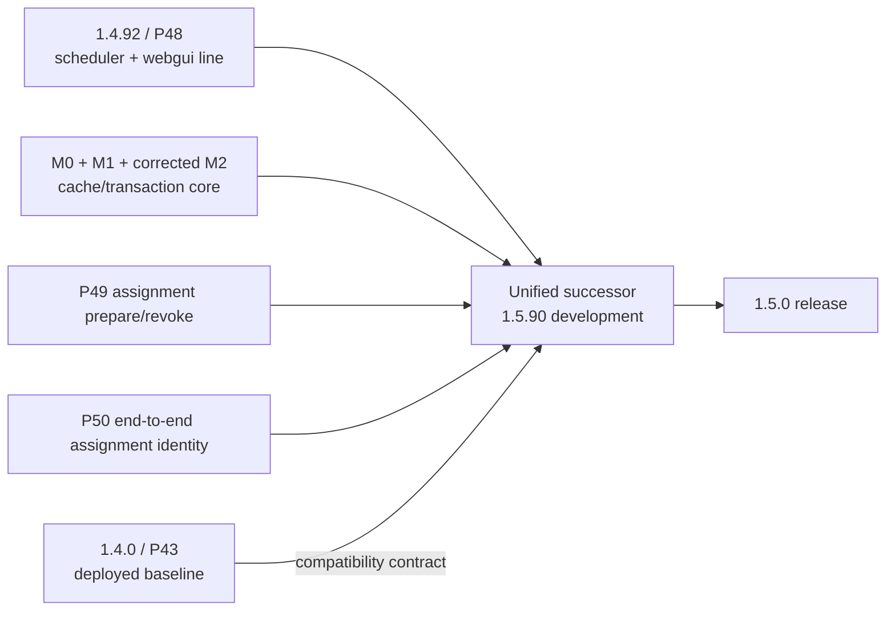
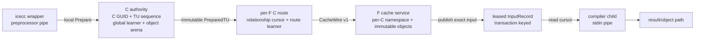
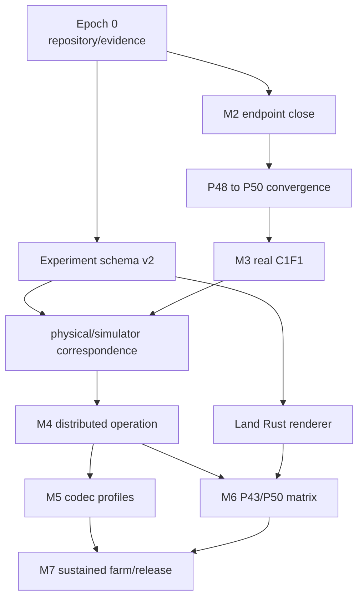

# Issue 16 strategic delivery plan

Status: proposed plan for BigOracle and Deep Reviewer review

Scope: unified P50 product, P43 compatibility, simulation, physical farm, codec research, and experiment reporting

Canonical tracker: <https://github.com/mickg10/icecream/issues/16>

## 1. Executive decision

The product should converge onto one successor that combines:

1. the complete scheduler and webgui correction line currently represented by
   Icecream 1.4.92 / main protocol 48;
2. the P49 scheduler-to-worker assignment vocabulary;
3. the P50 end-to-end assignment identity;
4. the persistent C-cache to F-cache transport and its codec profiles; and
5. an unchanged P43-compatible legacy compile path.

The deployed compatibility generations are therefore P43 and the unified P50
successor. P48 is an inheritance and regression checkpoint, not a permanent
deployment axis. P44 remains an upstream-development reference only.

The current M0/M1/M2 work began on the 1.4.90 / P44 development base. It must be
converged onto the complete P48 line before daemon, scheduler, and wrapper
integration begins. No M3 product integration should be written on the P44 base.



## 2. Version and protocol vocabulary

Version labels, the ordinary Icecream protocol, the cache wire, and the codec
profile are independent fields. Reports and test manifests must never collapse
them into one number.

| Release or line | Ordinary protocol | Purpose |
|---|---:|---|
| 1.4.0 | 43 | deployed compatibility baseline |
| 1.4.90 | 44 | upstream development reference and original P50 implementation base |
| 1.4.91 / 1.4.92 | 48 | webgui, telemetry, preprocessing, and scheduler-correction inheritance line |
| unified development successor | 50 | P48-derived product with P49/P50 assignment and cache capability |
| intended release | 50 | 1.5.0, after all release gates |

The existing design uses these prime marks:

- `S'`: scheduler-to-worker link supports P49 assignment preparation and
  revocation;
- `F'`: worker's scheduler link negotiated P49;
- `C'`: the full scheduler, submitter-daemon, wrapper, and worker client chain
  negotiated P50 end-to-end assignment identity.

The new cache implementation also currently uses the number 50 for its separate
cache-wire grammar. To remove ambiguity in plans and reports, this document calls
that channel **CacheWire v1**:

```text
main_protocol = 43 | 50
cache_wire    = off | v1
codec_profile = legacy | zstd_tu | stream_a | stream_b | p29 | grz
```

Whether source files retain the historical `protocol50` name is a mechanical
decision. The externally visible experiment vocabulary must use the namespaced
fields above.

## 3. Product ownership model

The implementation and simulator must share the same ownership boundaries.



Three clocks remain distinct:

```text
A      shared-C canonical admission
R_f    committed state for one C/F relationship
J      logical compile attempts and one accepted result
```

Rules:

1. A local Prepare request receives one immutable `PreparedTU` and advances `A`
   exactly once. A lost local reply, reconnect, reroute, or compiler retry does
   not teach the global learner again.
2. Each F has an independent `CRoute`; rerouting to F1 never moves or erases the
   outstanding state for F0.
3. `GLOBAL_S1` belongs to the C-wide authority and is identical for every route
   attempt of one PreparedTU.
4. `ROUTE_S1` and GRZ history belong to `R_f` and advance only after exact F
   input commit and C reconciliation.
5. Logical result selection never retires unresolved cache-route state.
6. For an open logical job, exact input commit atomically publishes a restartable,
   immutable InputRecord lease. Compiler attachment may occur before or after
   publication.

## 4. Three synchronized workstreams

The project proceeds through three workstreams driven by one experiment contract.

| Workstream | Responsibility | Primary output |
|---|---|---|
| Product and farm | endpoints, sidecars, daemon/wrapper/scheduler integration, real compilation | physical JSONL and retained artifacts |
| Simulator and codec research | exact codec ledgers, topology scheduling, calibrated stage models | simulated JSONL and codec reports |
| Report GUI | validation, catalog, comparison, timeline, matrices, artifact navigation | standalone HTML reports and experiment index |

These are not sequential projects. Every milestone extends all three against the
same scenario definition and normalized output schema.

## 5. Common experiment contract

One immutable experiment manifest must drive either a simulation or a physical
Docker/LAN run.

```yaml
schema: icecream-experiment-v2
mode: simulated | physical
components:
  scheduler: {release: 1.4.0|1.5.90, main_protocol: 43|50, commit: SHA}
  wrapper:   {release: 1.4.0|1.5.90, main_protocol: 43|50, commit: SHA}
  c_daemon:  {release: 1.4.0|1.5.90, main_protocol: 43|50, commit: SHA}
  f_daemon:  {release: 1.4.0|1.5.90, main_protocol: 43|50, commit: SHA}
capabilities:
  cache_wire: off|v1
  codec_profile: legacy|zstd_tu|stream_a|stream_b|p29|grz
topology:
  c_count: N
  f_count: N
  f_slots: N
  bandwidth: per-link and shared-fabric values
  scheduler_policy: round_robin|rendezvous|dense_frontier|home_spill
workload:
  corpus: name and immutable manifest digest
  build_epochs: N
  release_policy: trace|all_at_once|measured_preprocessor
cache:
  initial_state: cold|warm|snapshot
  capacity_bytes: N
  lifecycle_events: []
expected:
  selected_main_protocol: 43|50
  selected_cache_wire: off|v1
  selected_codec_profile: name
  compile_result: exact outcome
```

The descriptor must additionally retain image identifiers, compiler and library
versions, host identities, source commit, simulator commit, codec executable
digest, and every input manifest digest.

Both execution modes emit the same JSONL structure:

```text
experiment descriptor                 first row
events / snapshots / inactive gaps    chronological rows
summary                               final row
```

Canonical event stages are:

```text
job_release
scheduler_select
preprocess
canonical_prepare
route_prepare
c_queue
dict_or_manifest
need
fill
f_decode_install
materialize_verify
input_publish
compiler_pipe
compile
result_return
result_accept
route_reconcile
job_finish
```

Exact gates for every run:

- input reconstruction and digest;
- compiled output and result outcome;
- C-to-F and F-to-C directional byte closure;
- TU, route, relationship, job, and build counts;
- event ordering and final-state closure;
- no unreturned queue, lease, pin, or byte credit;
- immutable artifact manifest and checksums.

Physical outgoing C-to-F bytes remain the source-transfer score. F-to-C bytes are
reported separately and included in makespan and fabric utilization.

## 6. Epoch 0: repository and evidence normalization

### Scope

- Canonical repository: `/tanksmall/MICKG2/mickg/src/mickg10/icecream`.
- Active worktrees: sibling `icecream-worktrees/` directory.
- Retained build and experiment output: sibling `icecream-artifacts/` directory
  during the current migration; future large corpora may remain in a separately
  declared dataset.
- Preserve compatibility symlinks for already-published artifact paths.

### Exit gate

- every active branch and dirty file has an owner and recorded path;
- no required source exists only in a disposable build tree;
- every Git worktree resolves through the canonical repository;
- large result paths have retained checksums;
- no new work uses the old scratch checkout as its source repository.

## 7. Epoch 1 / M2: close the bounded loopback endpoint

M2 remains a standalone C1F1 endpoint/library boundary. It does not attach to the
Icecream daemons yet.

### Required corrections from the current independent review

1. Introduce one C-wide preparation authority with opaque admitted handles.
   `P50ClientEndpoint::run` may accept only handles issued by that authority.
2. Give Prepare entries an explicit release rule tied to the logical job/retry
   window so compressed bodies do not live until endpoint destruction.
3. Enforce exactly one self-contained Zstd frame for `ZSTD_TU`; reject trailing
   bytes and appended empty or nonempty frames.
4. Require a history-reset acknowledgement to match the complete negotiated
   protocol, profile mask, and limits.
5. Route every client-detected terminal dialogue outcome through one result path
   that retains reconciliation identity and classifies the next whole-attempt
   decision.
6. Select only the protocol version actually implemented. An overlap containing
   versions 50 and 51 selects 50, not an unimplemented 51.
7. Split same-endpoint reconciliation from scheduler reroute. Reroute creates or
   uses the destination F's independent route.
8. Add the C-wide `GLOBAL_S1` learner and immutable global plan, admitted exactly
   once per PreparedTU. Route-local plans remain independent.
9. Mark M1 reconnect tables as historical capability behavior where the checked
   M2 decision table supersedes them.

### Required tests

- lost local Prepare reply returns the same TU sequence and global plan;
- arbitrary Prepared pointer or duplicate TU sequence is rejected;
- Prepare release returns retained bytes and item counts to zero;
- one PreparedTU can be routed to F0 and F1 with one global admission;
- F0 route failure does not remove the global plan or F1 route;
- exact frame consumption negatives;
- inconsistent reset acknowledgement;
- same-session duplicate begin;
- same-GUID missing namespace after establishment;
- F incarnation replacement before commit and after commit-before-ack;
- all dialogue boundary disconnect/reconnect cases;
- terminal outcome and whole-attempt classification.

### Gates

- clean GCC and Clang build/check;
- strict warnings;
- ASan and UBSan focused suites;
- Zstd prefix override build;
- complete distribution archive check;
- quietbox single-thread `ZSTD_TU` encode rate at least 0.5 GB/s;
- exact trace checker closure.

### Exit gate

M2 is committed, independently reviewed, reproducible from retained commands, and
contains no daemon, scheduler, wrapper, or farm integration.

## 8. Epoch 2 / M2.5: converge P50 work onto P48

This is a separate, reviewable sequence of commits before M3.

### Ordered integration

1. Start from the complete 1.4.92 / P48 scheduler branch.
2. Apply the C++23 and mandatory Boost baseline.
3. Apply accepted M0 and M1 commits.
4. Apply the corrected M2 endpoint commits.
5. Apply P49 scheduler-to-worker assignment preparation/revocation.
6. Apply P50 end-to-end assignment identity.
7. Add cache-endpoint capability advertisement without enabling cache input.
8. Set the development release identity to 1.5.90 only after the merged branch
   builds and reports its intended protocol accurately.

### Inheritance gate

With every new capability disabled, the unified branch must reproduce the P48
behavior and pass its complete scheduler, daemon, webgui, stress, and integration
suite. Every link to a P43 peer negotiates and executes the legacy path.

### Exit gate

- no product integration is based on P44;
- all P48 behavior is present;
- P49/P50 messages are emitted only on links that negotiated them;
- cache endpoint information is inert unless the complete cache capability is
  selected;
- the P43 path remains byte-compatible and behaviorally unchanged.

## 9. Epoch 3 / M3: first real P50 C1F1 compile

M3 is the smallest actual product vertical.

### C side

- long-lived C cache service owns C GUID, global TU sequence, idempotent local
  Prepare requests, global learner, object arena, and PreparedTU retention;
- wrapper keeps its existing preprocessor pipe and selects a legacy sink or local
  cache Prepare sink before bytes flow;
- per-F endpoint owns only relationship/session/route state;
- local protocol carries opaque handles and references only after the relevant
  InputRecord/PreparedTU identity is frozen.

### F side

- one long-lived F cache service accepts multiple C namespaces;
- exact materialization atomically publishes a transaction-keyed, immutable,
  leased InputRecord;
- job child opens its own local attachment session after fork;
- `CacheAttachmentSource` writes the leased record into the existing compiler
  stdin pipe;
- compiler lifecycle, diagnostics, object transfer, and result return remain on
  the ordinary job path.

### Scheduler and job protocol

- F advertises a dedicated cache endpoint only after its cache service is ready;
- scheduler forwards capability and endpoint under the P50 version gate;
- `CompileFile` selects exactly one input mode for an attempt;
- after a cache reference is sent, legacy chunks are never inserted into that
  same attempt;
- a later legacy retry is a distinct attempt using retained exact input.

### Required physical scenarios

```text
legacy reference compile
P50 cold compile
same-TU warm compile
input arrives before job descriptor
job descriptor arrives before input
cache-required with unavailable endpoint
auto mode with unavailable endpoint -> legacy attempt
compiler restart from retained InputRecord
same-F reconnect and lost final acknowledgement
```

### Exit gate

`make integration_tests` launches a real scheduler, one C daemon/service, one F
daemon/service, wrapper, preprocessor, compiler, linker, and executable. It retains
complete logs, action trace, byte ledger, input digests, object digest, and program
output. The same scenario manifest runs in the simulator and physical launcher.

## 10. Epoch 4 / M4: distributed operation

Expand the same design without changing M3 ownership.

### Topologies

- C1F2;
- C1F20 with 200 slots per F;
- multiple simultaneous C authorities;
- local-80 profile: research6 16, research7 16, quietbox2 24, quietbox3 24;
- submit from nas642 and quietbox2 with submitter-local worker capacity excluded or
  reduced as declared by the scenario.

### Required product behavior

- independent per-F route queues and relationship cursors;
- one PreparedTU shared across retries and routes;
- multiple committed InputRecords retained before compiler attachment;
- at most one accepted compiler result per logical job;
- late F0 commit/result reconciliation after F1 wins;
- byte-bounded prepared, encoded, fill-reserve, F transaction, materialized-input,
  object, and pin accounting;
- F cache generation replacement, C reconnect, eviction, and lease release;
- one F accepting multiple independent C namespaces;
- environment transfer and result-return traffic measured explicitly.

### Simulator additions

- measured preprocessor release distribution rather than all TUs at time zero;
- scheduled C preparation/codec CPU;
- F decode/install/materialize/copy/pipe CPU;
- compiler result bytes and return path;
- compiler environment residency/transfer;
- byte capacities and backlogs, not only slot counts;
- lifecycle events for join, restart, disconnect, cache rotation, and eviction.

### Exit gate

Exact physical ledgers replay through the simulator with identical directional
bytes, route/TU counts, and event closure. Timing error is published per stage and
topology; no global timing claim is made outside calibrated regimes.

## 11. Epoch 5 / M5: codec profile integration and research

All codecs use one transport, transaction, experiment, and reporting interface.

| Profile | State model | Initial role |
|---|---|---|
| legacy | current independent per-TU transfer | P43 and fallback control |
| `ZSTD_TU` | independent complete frame per TU | first product baseline |
| Stream A | one retained large-window/LDM frame per C/F relationship, TU flushes | low fanout and concentrated history |
| Stream B1 | shared cohort prefix plus thin per-F window | prebuilt cohort control |
| Stream B2 | online first-K cohort prefix plus thin per-F window | likely wide-farm default |
| P29 | RAW, shared-C GLOBAL_S1, per-route ROUTE_S1 | structural candidate and byte leader |
| GRZ | route-history structural coding | long reuse-distance candidate |

The simple streaming models follow `simple_compression_models.md`:

- Stream A uses a retained frame, large window, long-distance matching, and
  per-TU flushes.
- Stream B uses raw-content `refPrefix`, not a dictionary attachment that silently
  reduces the effective window.
- B2 learns online; no universal `.ii` package is assumed.
- Independent `ZSTD_TU` remains the simple first product profile even though it
  intentionally gives up cross-TU entropy history.

### Research gates

- exact round trip for every TU and complete build;
- cumulative outgoing bytes at TU 50, 100, 150, 200, 250, 300, full build, and
  four repeated builds;
- cold target compared with whole-corpus Zstd-19 long-window for raw source and
  preprocessed input;
- TU-100 and TU-200 cumulative target no larger than the corresponding
  whole-corpus Zstd-6 long-window allowance;
- encode/decode CPU, wall time, RSS, retained state, and per-stage byte breakdown;
- empty-start and shared-cohort-start learning curves;
- 16-plus corpora and multiple build environments;
- exact behavior under reordered builds, header perturbation, new worker, and
  holed per-F history.

### Selector output

The experiment evidence, not a fixed assumption, selects among:

```text
low fanout / concentrated reuse       Stream A
wide farm / new-worker sensitivity    Stream B2
structural long-range reuse           P29 or GRZ
unsupported or constrained peer       legacy or ZSTD_TU
```

## 12. Epoch 6 / M6: complete P43-to-P50 compatibility

The routine deployment matrix contains P43 and target P50 only.

### Logical matrix

For scheduler `S`, complete client chain `C`, and worker `F`, execute all eight
tuples in `{43,50}^3`.

### Physical matrix

Split the client chain into wrapper `W` and local daemon `D`. Execute all sixteen
tuples in `{43,50}^4`:

```text
(S, W, D, F)
```

Every tuple must have an explicit expected negotiated protocol, assignment mode,
cache-wire selection, codec, and compile outcome. An unsupported cache path must
select legacy before input-mode commitment or produce the scenario's explicit
cache-required outcome.

### Mixed-fleet and rolling sequences

- P43 and P50 workers registered simultaneously;
- P43 and P50 client chains submitting simultaneously;
- scheduler upgraded first;
- scheduler upgraded last;
- workers replaced one at a time;
- submitter daemon and wrapper upgraded in either order;
- P50 node restarted while P43 work remains active;
- P48-to-P50 one-time inheritance suite;
- P44 build/reference row only, not a deployment combination.

Simulation runs the exhaustive matrix for every selected workload. Physical farm
acceptance runs all sixteen binary tuples for a compact corpus, then the critical
all-old, all-new, and mixed-fleet rows for large corpora.

### Exit gate

Every tuple compiles, links, and runs the expected program; every negotiated path
matches the manifest; no row silently selects a capability absent from one of its
required links.

## 13. Epoch 7 / M7: sustained farm and release

### Physical environments

- Debian GCC;
- Conan GCC;
- Fedora Clang with libc++;
- Linuxbrew compiler environment.

Build sources and outputs remain bind-mounted outside containers. Images are
content-addressed and scenario manifests record their exact identifiers.

### Farm tiers

1. C1F1 smoke on nas642 to quietbox2.
2. C1F2 correctness and concurrency.
3. C1F20_200B1G controlled scale.
4. Local-80 capacity across research6, research7, quietbox2, and quietbox3.
5. Optional WAN experiments on research4/nas64tail, always labeled separately.

### Workloads

- identical cold and warm rebuilds;
- one-line leaf change;
- shared-header change near the dependency root;
- reordered TU stream;
- partial incremental rebuilds;
- compiler environment cold/warm transitions;
- C and F cache generation rotation;
- sustained multi-project use and capacity eviction.

### Release gate

- all P43/P50 compatibility rows pass;
- selected codec/routing profiles meet their declared byte, speed, and memory
  thresholds;
- simulator and physical traces reconcile at exact-byte/event boundaries;
- GUI catalog contains every release experiment and retained artifact;
- rolling upgrade and rollback scenarios pass;
- no open M2-M6 ownership or lifecycle item remains.

After this gate, publish 1.5.0 and retire P48 as a standalone development line.

## 14. Report GUI plan

The existing Rust renderer is a useful single-run prototype. It should be landed
after the v2 experiment schema is frozen and extended into three operations:

```text
icecream-dashboard render  experiment.jsonl --out report.html
icecream-dashboard compare simulated.jsonl physical.jsonl --out comparison.html
icecream-dashboard index   results-root --out index.html
```

### Required views

1. Experiment catalog filtered by physical/simulated, corpus, build environment,
   topology, component versions, negotiated protocols, cache wire, codec, and
   result.
2. P43/P50 matrix heatmap showing expected and observed path selection.
3. Simulated-versus-physical overlays for cumulative bytes, makespan, and every
   modeled stage.
4. C, scheduler, network, and per-F timeline lanes.
5. TU-index learning curves and cumulative byte matrices.
6. Cold/warm/repeated-build comparison.
7. Codec component breakdown: manifests, definitions, lines/regions, fills,
   framing, and results.
8. Cache occupancy, pins, leases, evictions, route cursors, and generation changes.
9. Critical-path identification when dependency information is present.
10. Direct links to manifests, JSONL, logs, binaries, checksums, and source commits.

The first release remains standalone HTML generated from immutable result trees.
No long-running report service is required.

## 15. Parallel execution and dependencies



Codec research and GUI work may proceed while M2/P48 convergence is active because
they operate behind the common manifest/ledger boundaries. M3 daemon integration
must wait for corrected M2 and P48 convergence. M6 compatibility requires an
actual M3 path, but its simulator matrix and Docker image preparation can begin
earlier.

## 16. Current evidence and immediate ordered work

Current evidence:

- accepted M1 product head: `6c6c6f3fccd3863aeda35c5636fd1d9e06f36da7`;
- formal lane: Deep Reviewer signed off five safety bases, two scoped progress
  rows, and thirteen discriminating mutants at `8eec6e43`;
- M2: broad functional and performance gates pass, with the review corrections in
  Epoch 1 still required before acceptance;
- simulator: exact Firefox static-routing sweep complete; P29 k8 is the best P29
  static frontier measured in that sweep;
- physical farm: legacy C1F1 compile/link/run passed from nas642 to quietbox2;
- GUI: Rust single-run report prototype exists and needs schema integration.

Immediate order:

```text
1. Finish repository/artifact normalization.
2. Merge the signed-off formal lane after exact-head branch verification.
3. Implement and independently review the remaining M2 corrections.
4. Commit M2 as coherent library/endpoint slices.
5. Freeze experiment schema v2 and land the Rust single-run renderer.
6. Create the P48-to-P50 convergence branch and run the inheritance gate.
7. Begin M3 only on that unified branch.
8. Run the first paired simulated/physical C1F1 P50 scenario.
9. Expand to M4 topologies while codec profiles run through the same interface.
10. Complete M6 compatibility before release-scale M7 runs.
```

## 17. Questions for BigOracle and Deep Reviewer

Please review this plan with emphasis on simplification and dependency ordering:

1. Is P48-to-P50 convergence placed at the correct boundary—after bounded M2, but
   before all daemon/scheduler/wrapper M3 work?
2. Should P49 assignment preparation/revocation and P50 end-to-end assignment
   identity land before cache-endpoint advertisement, or may those independent
   commits share one convergence epoch?
3. Is `main_protocol=50` plus `cache_wire=v1` the clearest resolution of the two
   existing uses of “Protocol 50,” or should source-level names change before M3?
4. Are the A / R_f / J clocks and the shared-C `GLOBAL_S1` exactly-once rule
   sufficient to keep M3-M5 components independent?
5. Is any M4 lifecycle mechanism unnecessarily early and better deferred until a
   measured C1F2/F20 need appears?
6. Is the exhaustive sixteen-row physical P43/P50 `(S,W,D,F)` matrix the right
   permanent compatibility gate, with P48 retained only as a one-time inheritance
   suite?
7. Does the common experiment contract omit any state needed to compare simulator
   output with physical farm output without adding packet-level detail?
8. Are the M5 codec boundaries sufficiently modular that Stream A/B, P29, and GRZ
   can compete without changing endpoint or job lifecycle semantics?
9. Which exit gate should be strengthened, removed, or moved to keep the path to a
   testable M3 vertical short?

The requested review outcome is one corrected ordered plan, not additional layers:

```text
accept as written
or
return a minimal set of reordered/removed/strengthened items with reasons
```
