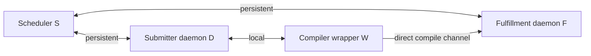
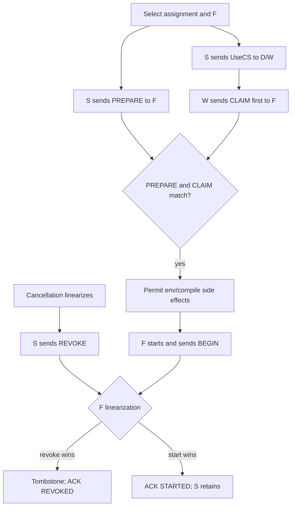

# Fenced Temporal Ownership Hypergraph audit

**Date:** 2026-08-08  
**Audited line:** `fix/stage3-scheduler-policy` (protocol 48)  
**Compatibility baseline:** `1.4-branch` (protocol 43)  
**Issue:** #2

This document separates the narrow issue-#2 repair from the protocol-level ownership work that remains. The existing staged-plus-live cancellation fix is correct for the original ghost-job leak. It does not establish that cancellation, submitter teardown, scheduler restart, fulfillment teardown, or mixed-version execution are safe in all phases.

## Executive conclusion

After `UseCS` is observable to a compiler wrapper, the scheduler cannot tell whether that wrapper is dead, delayed, transferring an environment, queued at F, or already executing. Protocol 43/48 gives F no scheduler-issued fence with which to answer that question.

Therefore a scheduler-only timeout has an unavoidable fork:

* release the reservation, and a delayed wrapper can still start after the slot is reassigned;
* retain it, and a dead wrapper can hold it forever.

The proposed path is:

1. no-wire P0 repairs to ownership, terminal authority, F child/session fencing, batching, and event-loop cost;
2. protocol 49 S↔F `PREPARE/REVOKE/ACK`, pipelined with `UseCS` and with no mandatory normal-path RTT;
3. protocol 50 exact `(scheduler_epoch, assignment_sequence, token)` propagated through S→D→W and sent as W's first message to F;
4. an eligibility-graph scheduler based on Hall cuts/transversal polymatroids rather than aggregate slot credit.

A “client” must be modeled as `C = D ⊗ W`: the local daemon D and compiler wrapper W are separate actors and negotiate separate links.

## Confirmed defects and gaps

### P0 — started work is deleted when its submitter session dies

Scheduler `handle_end()` deletes a job when either its F or submitter matches the dead connection, without preserving `Job::COMPILING` work owned by a different live F. F keeps executing, S loses the job/reservation, and a later F `JobDone` is unknown. The same path is reachable when a duplicate same-IP/same-name daemon login evicts the old session.

Teardown must be phase- and owner-sensitive. A started job survives submitter loss; its submitter is detached. Job bookkeeping cannot dereference a destroyed raw submitter pointer, so preserve a stable session tombstone or immutable submitter snapshot.

### P0 — submitter and F terminal reports are not interchangeable

The client source explicitly notes that a submitter failure may reach S before F's success. D emits `JobDone(FROM_SUBMITTER)` on abnormal wrapper disconnect/fallback. S currently treats that as terminal even after F has claimed or started.

Authority must be phase-sensitive:

* before an offer is observable: submitter cancellation may be terminal;
* after offer, before F start: it is a cancellation request;
* after F claim/start: submitter `JobDone` is abandonment information, not completion;
* F `JobDone` or exact F-session loss is authoritative;
* duplicates and reordered terminals are idempotent.

### P0 — scheduler restart/32-bit wrap creates ABA

Protocol 48 sends only a 32-bit `job_id` in `UseCS` and `CompileFile`. No scheduler epoch, F session, or exact assignment token reaches F. The allocator restarts at zero and relies on an assertion rather than a release-build uniqueness check.

A delayed old W holding `UseCS(id=1)` from epoch A can be accepted as epoch-B assignment `id=1` after restart. Ordinary wrap has the same shape. Use a release-safe allocator immediately; exact protection requires a new token on W→F.

### P0 — bounded legacy revocation is impossible at S alone

Freeze W after `UseCS`, before F, with all daemon sessions healthy. S cannot distinguish a dead W from an arbitrarily delayed one. Release violates safety; retain violates bounded liveness. Encode this limitation explicitly. Do not market an S-only timeout as a proof.

### P0 — F can reap the wrong child during scheduler-loss cleanup

`clear_children()` deletes clients and then calls `waitpid(-1)` `current_kids` times. F also has environment children and a state-writer child; the state-writer source acknowledges generic `waitpid(-1)` can reap it. One legal execution reaps the writer, decrements `current_kids` to zero, leaves an old compiler alive, and lets F reconnect/advertise capacity.

Maintain:

```text
pid -> {kind, f_session_generation, assignment_token, process_group}
```

Kill/wait exact compiler process groups from the lost F session, and do not advertise a new session until the old one is quiescent.

### P1 — sliced expansion still has unbounded activation and cleanup

Large `GetCS.count` is staged in chunks, but final activation enqueues the entire vector in one turn; cancellation/teardown can delete it in one sweep. Introduce a first-class logical Batch with a bounded materialization window. Cancellation is an O(1) generation cut; physical cleanup is amortized by a fixed quantum.

### P1 — accept work is unbounded

The scheduler's accept loop runs until `EAGAIN`, outside the message/dispatch budget. Add an accept quantum and one shared per-turn work budget covering accept, parse, expansion, dispatch, cleanup, monitor fanout, and deferred flush.

### P1 — global dispatch credit ignores eligibility

`farm_slots - 1` cannot see platform, environment, features, protocol minimum, chroot, blacklists, preferred host, or `noremote`. Flexible jobs can consume rare F capacity needed by constrained jobs. Use the graph formulation below.

### P1 — selected environment identity is reconstructed from the wrong platform

`envs_match()`/`can_install()` return the environment source platform. Later sibling pinning searches/writes `use_cs->hostPlatform()`. Those differ in valid cross-architecture cases. Carry the selected `(source_platform, environment_name)` as a first-class value.

### P1 — inbound-connect backoff indexes beyond its table

`table_size = sizeof(time_offset_table)` is bytes, not elements. After index 11, `m_inConnAttempt` reads out of bounds. Use `std::size(time_offset_table)` and validate socket/DNS errors.

### P1 — FASTEST stale-host sampling is dead

With `STATS_UPDATE_WEIGHT=120`, `(255-120)/255` is integer zero, so the intended stale-host refresh branch never runs. Use fixed-point/cross-multiplication and a negative-control test.

### P1 — `StatsMsg.client_count` is declared but not serialized

The field initializes to zero and S consumes it, but `fill_from_channel()`/`send_to_channel()` serialize only load averages and memory. Version-gate the field or remove the false signal.

### P1 — documentation and tests overstate guarantees

The deployment matrix says the unconfirmed timeout evicts; current code retains and reports. The fairness harness can declare its interval unobservable and skip assertions. A concurrency gate may not pass by losing the race to observe its own premise. Use durable production barriers/events, never poll-and-skip.

## Formal object: Fenced Temporal Ownership Hypergraph (FTOH)

### Actors and channels



S→F, S→D, D→W, and W→F negotiate independently. Exact semantics are per assignment, not fleet-wide.

### Identity and scope

```text
Token(a) = (scheduler_boot_epoch, assignment_sequence, assignment_token)
Scope(a) = (f_session_generation, Token(a))
```

The legacy 32-bit id remains a compatibility/observability field, not the new identity.

### Phases

```text
Unmaterialized -> StagedWindow -> Queued -> PreparingF -> OfferedToD
-> ClaimedAtF -> SideEffectsAtF -> StartedAtF -> FinishingAtF -> Terminal
                                         \-> CancelledGarbage
```

Each assignment has one logical phase. Linear resources include one S record, one F reservation, one dispatch-debt token, one F authorization, one batch membership, and at most one exact compiler-child token.

### Causal protocol



S sends PREPARE and UseCS concurrently. If CLAIM arrives first, F stores bounded metadata and applies transport backpressure until PREPARE arrives. No READY round trip is mandatory.

## Temporal properties

Schematic quantified LTL/MTL:

```text
G(StartEvt(a,f,t) -> Prepared(f,t) && ClaimMatched(f,t) && !Tombstoned(f,t))

G(Started(a,f) ->
  (ReservedS(a,f) W (DoneF(a,f) || FSessionLost(f,session))))

G(RevokeAck(f,t,REVOKED) -> G(!StartEvt(_,f,t)))

G((ClaimedAtF(a,f) || Started(a,f)) && SubmitterDone(a)
  -> X(!Terminal(a)))

G(CancelCut(b) -> G(!(DispatchEvt(a) && MemberAtCut(a,b))))

G(ClaimAccepted(origin,t) -> origin == AssignmentOf(t))

G(sum_a ReservedS(a,f) <= Capacity(f) + ExplicitPreload(f))

G(ChildAlive(pid) -> exists exactly one (a,session): ChildOwns(pid,a,session))
```

Under fair F execution and eventually reliable S↔F delivery:

```text
G(RevokeSent(f,t) -> F(
  Ack(f,t,REVOKED) || Ack(f,t,STARTED) || FSessionLost(f,session)))
```

Metric/cost obligations need MTL/TCTL or observer counters:

```text
G(FSessionLost(session) -> F_[0,K_quiesce] Quiesced(session))
G(CancelCut(batch) -> F_[0,K_index] NotSelectable(batch))
G(TurnEnd -> WorkSinceTurnStart <= B_control)
```

Backward compatibility is a divergence-sensitive weak refinement/HyperLTL obligation over two traces, not merely a serialization check:

```text
forall new_trace, exists old_trace:
  Assumptions_v(new_trace) ->
  G(OldProjection_v(new_trace) == Visible_v(old_trace))
```

## p49 and p50

### p49 S↔F fencing

Negotiated messages:

```text
ASSIGN_PREPARE {scheduler_epoch, f_session, legacy_job_id, assignment_sequence}
REVOKE_BEFORE_START {same scope}
REVOKE_RESULT {same scope, REVOKED | STARTED | UNKNOWN_SESSION}
```

PREPARE is idempotent. REVOKE and START compete at one F linearization point. `REVOKED` is sent only after a tombstone prevents later start. `STARTED` means S retains to F completion/session loss. Old C first exposes its id at `CompileFile`; p49 can stop compiler start in the current freshness/epoch regime but cannot make arbitrary cross-epoch id-only delay exact, and may not stop an earlier anonymous environment transfer.

### p50 exact early claim

Extend `UseCS` through S→D→W and require W's first F message:

```text
ASSIGN_CLAIM {scheduler_epoch, assignment_sequence, assignment_token, legacy_job_id}
```

F processes neither `EnvTransfer` nor `CompileFile` before a matching PREPARE and CLAIM. This closes restart/wrap ABA for new W and makes pre-start revocation cover environment side effects.

For old C, publish a bounded freshness contract: persist/skip ids during the supported claim window, expire id-only prepares, reject later claims/fallback locally, and never describe the result as exact under unbounded delay.

## Eligibility graph and polymatroid scheduler

Collapse work into classes

```text
q = (submitter, eligibility_signature, niceness/deadline class)
```

where the signature contains every hard eligibility predicate. Build a bipartite graph from classes to F, with residual capacities `c_f`.

For classes `A`:

```text
r(A) = sum_{f in N(A)} c_f
P(r) = {x >= 0 : x(A) <= r(A) for every A}
```

`r` is a monotone submodular coverage rank. Matchable candidate-job subsets form a capacitated transversal matroid.

Weighted max-min progressive filling begins with

```text
alpha_1 = min_{A:w(A)>0} r(A) / w(A)
```

A minimizing cut identifies the first eligibility bottleneck. Freeze it, contract capacity, and recurse. Online, accrue deficits from these shares; choose overdue then positive-deficit jobs; test feasibility with an augmenting matching; choose among matchings with min-cost flow for expected completion/environment cost.

For protected frontier demand `d`:

```text
Phi(c,d) = min_{A != empty} [r_c(A) - d(A)]
```

Prefer placements maximizing post-decision Hall slack, then minimizing completion time. `d` is a bounded fairness horizon, not the entire backlog.

At 10–50 F / about 792 slots, a cached incremental flow oracle over one or two farmfuls of candidates is practical. Start observe-only and emit current choice, oracle choice, bottleneck cut, and post-choice slack.

## Mixed-version guarantee table

| Topology | Contract |
|---|---|
| `S' F C` | Existing p43/48 wire. Compatible no-wire fixes; legacy reservations are not boundedly revocable. |
| `S' F' C` | p49 prepare/revoke. Bounded compiler-start revocation within old-id freshness/epoch assumptions; not exact for arbitrary old-C delay. |
| `S' F' C'` | p49+p50 exact early claim; exact fenced ownership under model assumptions; no mandatory normal-path RTT. |
| `S' F [C,C']` | Old F projects both to legacy behavior; C' downgrades cleanly. |
| `S' F' [C,C']` | Per-job mode: old jobs get p49 bounded/assumption semantics, new jobs get p50 exact semantics. |

A C is exact only if S→D, D→W, and W→F all carry the token.

## Work split

### mickg10 implementer 1 — mechanism

1. Instrument durable monotonic transitions.
2. Fix phase-sensitive teardown, F-authoritative terminal handling, stable session references, exact child registry/quiescence, allocator uniqueness, and the deterministic defects above.
3. Introduce logical Batch, bounded materialization/cleanup, direct indexes, and a shared turn budget.
4. Implement p49, then p50.
5. Add the eligibility oracle observe-only, then policy.

### mickg10 implementer 2 — adversary/checker

1. Independently model per-D/per-F maps and all independent FIFO channels.
2. Add TLA+/PlusCal or Promela with explicit fairness assumptions.
3. Compile every counterexample to deterministic `schedbp` barriers.
4. Implement a JSONL runtime invariant monitor.
5. For every production fix, add a negative control: reverting only that fix must fail the new gate.
6. Attack downgrade, duplicate delivery, fd reuse, duplicate login, restart, partial send, and child-exit order.

### mickgvirtu — final acceptance

Receive immutable production/model/trace-compiler/baseline SHAs plus the farm manifest. Reject skipped/vacuous properties, p49 advertised as arbitrary-delay exact, mock-only comparator tests, throughput without control-tail/invariant data, or documentation that disagrees with the executable matrix.

## Farm program

The issue thread reports 13 remote-capable F hosts, roughly 792 usable slots, about 741 developer C machines, old/current containers, deterministic socket/freeze/restart injection, sanitizers, perf, and eBPF.

Small exhaustive cutoffs:

* 2 jobs, 2 submitter sessions, 1 F for cancel/terminal authority;
* 2 S epochs, one reused id, 1 F for ABA;
* all FIFO-consistent PREPARE/CLAIM/REVOKE/START orders;
* 2 child kinds plus one compiler;
* 3 F and 2–3 eligibility signatures;
* duplicate delivery of every idempotent message.

Use partial-order reduction over independent sessions.

Deterministic barriers must exist after/before UseCS serialization/flush, W→F connect, CLAIM, PREPARE, EnvTransfer, CompileFile, fork, REVOKE linearization, F Done, submitter teardown, and F relogin. No sleeps as proof and no skip-to-green.

Farm scale should include the already demonstrated 24k GetCS, 40k backlog, 48k fairness, 2k cancellation, and 30k sibling-completion shapes, plus mixed old/new clients, constrained eligibility islands, rolling S restarts, F reconnect, tiny test-only legacy-id width, duplicate login/fd reuse, and adversarial child exit order.

Measure invariant failures, stale-claim rejection, S turn work/p50/p99/max control latency, throughput by eligibility class, fairness bottleneck cuts, reservation/physical-child equality, memory versus logical batch size, and downgrade mode counts. Run ASan/UBSan broadly, TSan on reduced topology, and perf/eBPF at farm scale.

## Release gates

1. Original issue-#2 staged/live cancellation regressions stay green.
2. Started F work survives submitter teardown and duplicate submitter login.
3. Submitter failure after F start cannot release the reservation.
4. F session loss quiesces the exact old compiler children before relogin.
5. Legacy release/retain counterexamples remain expected negative controls.
6. p49 passes every pre-start revoke race under its stated assumptions.
7. p50 rejects cross-epoch stale claims in model and farm replay.
8. No concurrency property passes by skipping its premise.
9. Every scheduler turn stays within the declared work budget.
10. `S'FC`, `S'F'C`, `S'F'C'`, `S'F[C,C']`, and `S'F'[C,C']` pass at the advertised guarantee level.
11. Documentation is checked/generated from the executable capability matrix.

The governing rule is:

> S may forget an assignment only after the actor that can still create physical work has surrendered that right, or after that actor's exact session has been fenced and quiesced.
