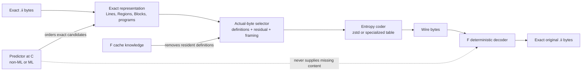
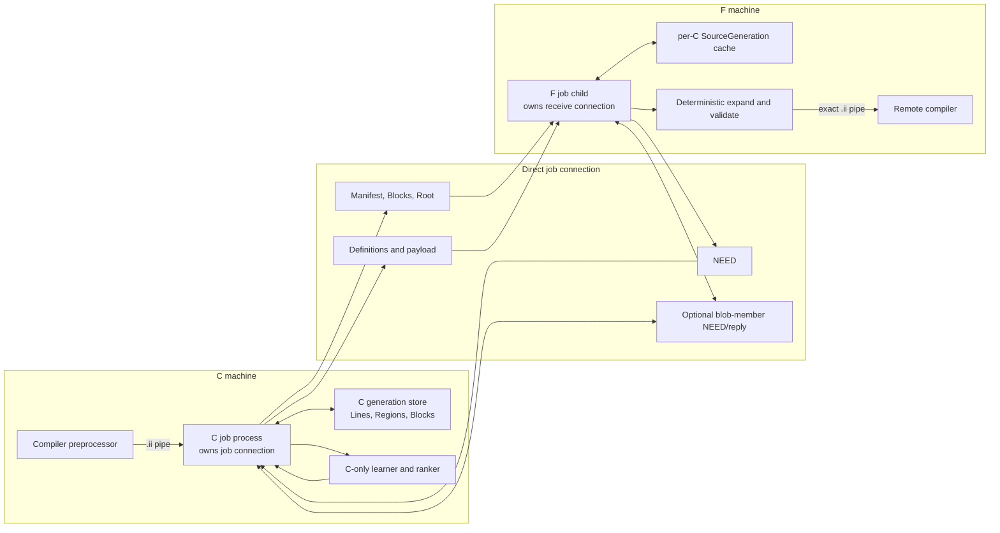
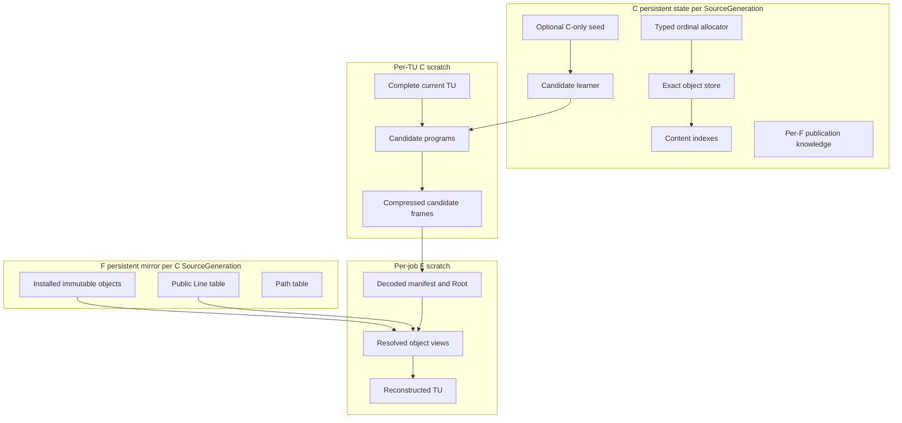
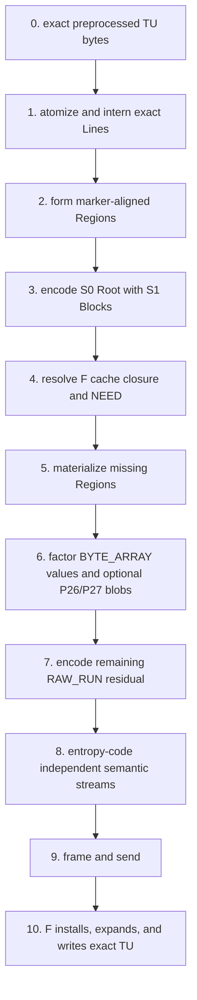
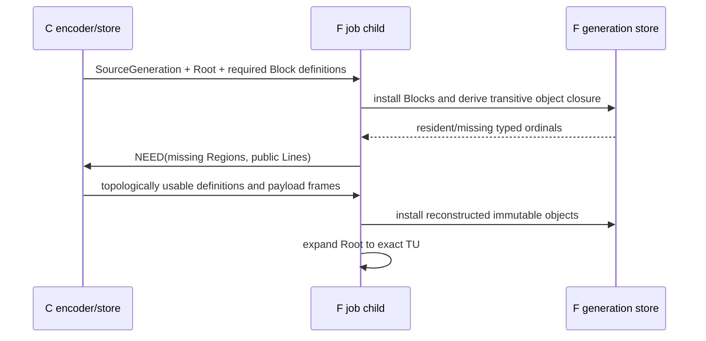
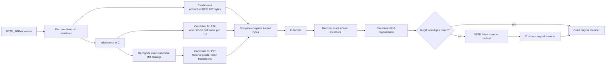
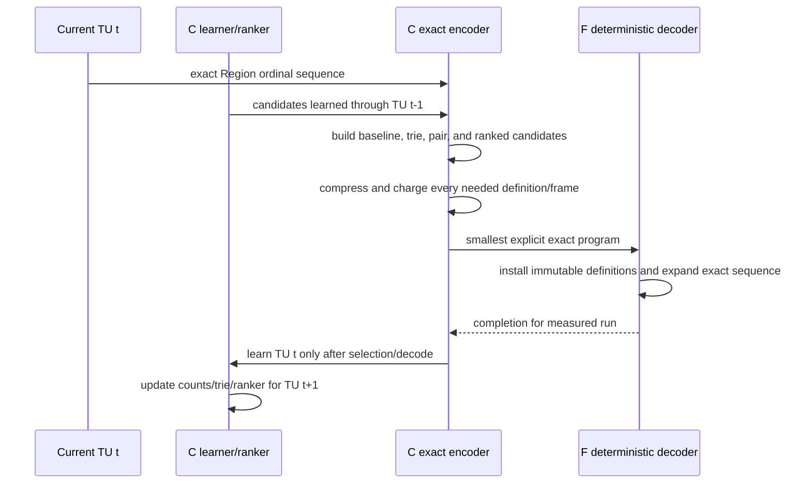
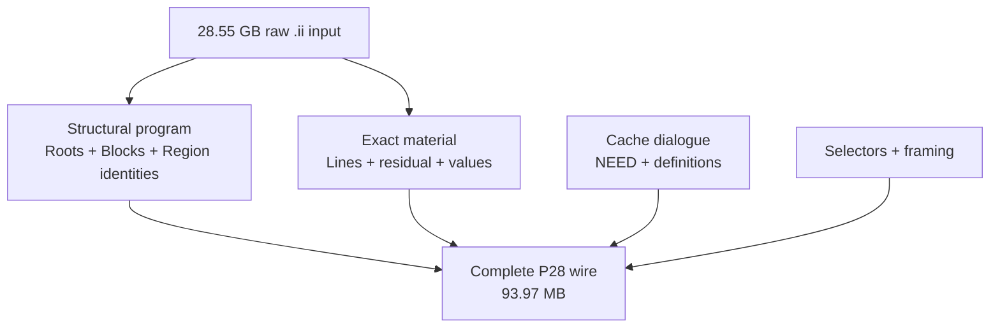
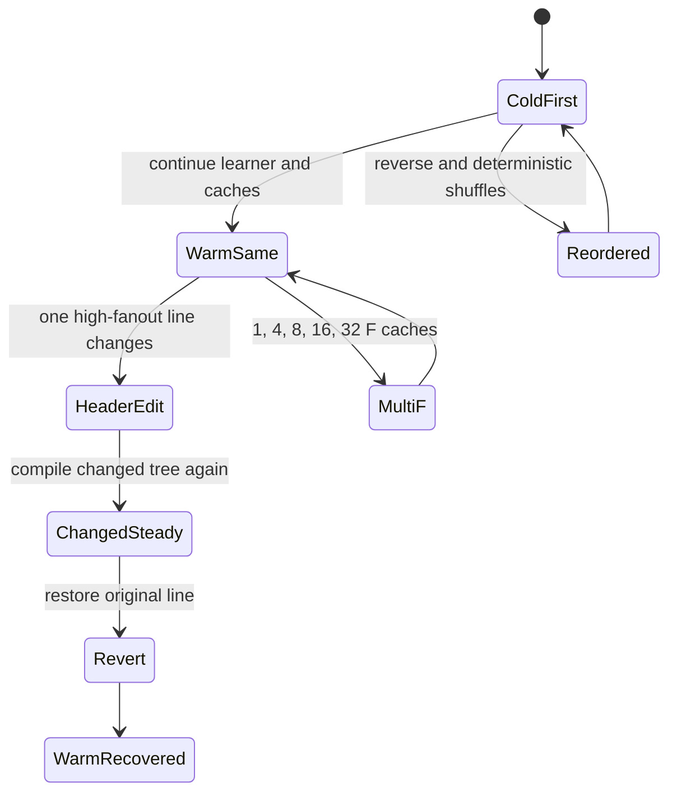

# Exact `.ii` transport: representation, prediction, caching, and entropy-coding reference

Issue: [`mickg10/icecream#16`](https://github.com/mickg10/icecream/issues/16)

Reference date: 2026-08-16

Primary evidence set: 16 corpora, 9,292 translation units, 28,554,671,510 raw bytes

## Purpose

This document is the map of the codec work: what each layer knows, what it predicts, what it
compresses, what crosses the C-to-F link, what persists, and what has actually been measured. It
separates four mechanisms that are easy to conflate:

1. **Exact representation** changes the symbols used to describe the same `.ii` bytes.
2. **Prediction** chooses which exact representation is likely to be cheapest.
3. **Caching** avoids sending an exact object that F already has.
4. **Entropy coding** maps the selected byte streams to fewer wire bytes.

Only the combination is a complete codec. A structural-only ratio, a model recall number, a zstd
substream size, or a cache-hit result must not be reported as complete transfer performance.

The current product direction is deliberately asymmetric: C may learn, search, and rank; F installs
immutable definitions and executes the explicit program it receives. F does not need an ML model or
the C candidate learner.

## Current decision snapshot

| Component | Current decision | Evidence boundary |
|---|---|---|
| S0 semantic Root | retain | exact complete codec |
| S1 immutable exact Blocks | retain | exact complete codec |
| direct generation-local typed ordinals | retain | exact cold and two cache complements |
| P21 `BYTE_ARRAY` | retain as one materialization form | exact complete codec |
| reduced P24 Region materializer | retain | exact complete codec |
| F-owned cache lookup and F-generated `NEED` | retain | exact capability execution |
| P26 embedded-zlib factor | retain as underlying member codec; reviewer ruling on member-only recovery pending | exact 48/48 complete executions |
| P27 canonical-MO factor | measured incremental winner; reviewer ruling pending | exact 48/48 complete executions, 3.04 MB same-input cold saving |
| P28 S1 chain-1,024 cleanup | retain as the S1 default | exact complete cold execution on all 16; monotonic 11,474-byte saving |
| P4 alpha-Line residual codec | reject | exact all-16 integration loses bytes and speed |
| P22 prior-Root slice | reject from the product path | integrated complete codec loses to S1 |
| P18 statements, P19 flat phrases, local raw backreferences, project-source packages | do not port | integrated or causal screens lose |
| C-only online superblock learner | next research lane | structural capability exists; complete integration pending |
| small C-only FTRL/GBDT ranker | optional after the non-ML exact baseline | ranker bakeoff only |
| neural sequence models and large code models | teacher/ceiling only | too slow or too large for the live path |
| receiver-side predictor | do not add | no measured need; explicit programs are sufficient |

The best current complete measured row is P28.  All 48 cold and complementary
cache executions are exact:

| receiver state | wire bytes | ratio | exact | minimum measured encode/decode subphase |
|---|---:|---:|---:|---:|
| cold | **93,968,728** | **303.87x** | 16/16 corpora | **1.067 GB/s** designated Zen 4 replay |
| cache complement bit 0 | **62,140,320** | **459.52x** | 16/16 corpora | **1.098 GB/s** local-host replay |
| cache complement bit 1 | **43,852,134** | **651.16x** | 16/16 corpora | **2.085 GB/s** local-host replay |

Cold 400x permits 71,386,679 bytes, so P28's measured cold gap is **22,582,049 bytes**. Both
aggregate half-cache 200x rows pass. These deterministic cache complements are not the same claim
as chronological online H200; that learning-curve test remains required.

The throughput column times the already-ingested C encode and F decode/expand subphases. It does
not include C's initial read/parse/intern pass. The complete product-shaped C pipeline speed gate
therefore remains open even though the codec subphases exceed 1 GB/s.

## Evidence-set rule: 16 versus the broader corpus inventory

The fixed binding suite currently contains these 16 corpora:

`LLVM`, `RocksDB`, `DuckDB`, `Abseil`, `OpenCV`, `Godot`, `fmt`, `spdlog`, `Catch2`,
`nlohmann-json`, `range-v3`, `Eigen`, `RE2`, `LevelDB`, `simdjson`, and `cereal`.

Every complete-codec headline in this reference uses all 16, all 9,292 TUs, and exact full-file
reconstruction. DuckDB is one row, not the objective function.

The repository also refers to an implementer-owned **25-corpus** generalization set. Use that
broader set for model portability and cross-project screening now. Promote it to a binding complete
codec suite only when each additional corpus has a reproducible `.ii` manifest, chronological TU
order, exact end-to-end decode, complete byte ledger, and retained logs. There is no checked-in
evidence here for a 26th corpus, so results must not be labelled “26-corpus” until that named input
and manifest exist.

This creates two test rings:

| Ring | Purpose | Required accounting |
|---|---|---|
| fixed 16 | binding codec, ratio, speed, cache, and change acceptance | complete wire and byte-exact `.ii` replay |
| broader 25 | predictor generalization and pretraining portability | at least exact structural replay; complete wire as manifests mature |

## Vocabulary and object model

| Term | Meaning |
|---|---|
| C | submitting side for a compile job |
| F | assigned compile worker |
| TU | one preprocessed translation unit, normally a `.ii` byte stream |
| `SourceGeneration` | one 128-bit identity naming C's current object namespace |
| typed ordinal | generation-local nonzero `u32` plus object kind; the direct wire/cache name |
| Line | one exact source line or exact retained byte span |
| Region | an exact marker-aligned sequence reconstructed from Region operations |
| Block | an immutable ordered sequence of Region or child-Block ordinals |
| Root | the ordered object program for one complete TU |
| public Line | a generation-lived Line object published after profitable cross-Region reuse |
| candidate learner | C-only state that proposes possible Blocks/programs |
| ranker | optional C-only rule or model that orders candidates for exact evaluation |
| entropy coder | zstd or a smaller specialized coder applied after representation selection |
| complete wire | every definition, control stream, residual, request, reply, selector, and frame |

An object identity is immutable. Learning a better or longer Block allocates a new ordinal; it does
not change the children of an ordinal F may already hold. A Root can freely choose the newer Block
on later TUs.

## The four orthogonal mechanisms



The boundaries are intentional:

- The predictor may be wrong without changing output bytes; the exact fallback simply wins.
- The entropy coder cannot invent a better semantic representation; it only shortens its bytes.
- A cache hit eliminates a definition; it does not change the Root's meaning.
- F reconstructs from explicit definitions, program, and residual. It never guesses content.

For a TU sent to one F, the comparison target is:

```text
complete_wire = generation_and_manifest
              + new_Block_definitions
              + Root
              + object_NEED_request
              + missing_Region_and_public_Line_fills
              + path_definitions
              + Region_control
              + ordinary_residual
              + BYTE_ARRAY_control_and_values
              + optional_blob_recovery
              + selectors_and_all_framing
```

The candidate selector minimizes this actual total for the current TU and current F state. It does
not minimize token count, model loss, raw intermediate bytes, or a future-use estimate by itself.

## End-to-end system map

The compiler preprocessor produces bytes into C. The final decoder writes reconstructed bytes into
the compiler pipe at F. The scheduler chooses F but is not in the bulk source-data path.



The long-lived stores survive individual connections and jobs. Per-job processes retain enough
current-TU bytes and metadata to answer a `NEED` and to finish reconstruction. The exact process
integration is being exercised on the implementer's two-process capability branch; the codec
semantics in this document do not require one permanent C-to-F connection.

## State ownership and lifetime



| State | Owner | Scope | Required property |
|---|---|---|---|
| object ordinal allocator | C | one `SourceGeneration` | monotonic; no ordinal reuse |
| exact object bytes/children | C | generation | retained while C can emit references |
| candidate learner/trie/counts/model | C only | generation or bounded project context | encode-before-learn |
| optional portable seed | C only | process/package version | creates candidates, not decoder obligations |
| installed object mirror | F | one C generation | partial, bounded, and directly indexed by typed ordinal |
| public-Line table | F | one C generation | every retained view has its required source bytes |
| Root and decode arena | F job | one TU | discarded after compiler input is complete |
| blob transform buffers | C and F job | one TU | discarded after exact member reconstruction |

Cache replacement changes future byte cost, not object meaning. If F no longer has a referenced
object, it asks C for that object again. The current product contract uses one latched 128-bit
`SourceGeneration` and direct typed ordinals. Fixed eight-hour rotation, shadow generations, and
three-hour overlap were design sketches, not accepted constants. Rotation policy should be chosen
from measured memory and straggler traces; an old generation remains addressable only while C can
still provide all of its definitions.

Public-Line views require one explicit lifetime rule in M2: either retain the source Region while a
view exists or copy the Line bytes into an independently retained object. A dangling view is not an
allowed cache state. The smaller measured choice should be used after replacement tests.

### Shared codec module versus endpoint-specific stores

C and F should use one shared codec module for the parts whose behavior must match:

- object-kind and ordinal encoding;
- Root and Block serialization/expansion;
- P24 operation decoding/rendering;
- public-Line and path definition formats;
- P21 array rendering and P26 descriptors;
- entropy-frame configuration and version identifiers;
- exact reconstruction checks used by tests.

They do not need the same lookup data structure. C needs content-to-object indexes, candidate
generation, and ranking. F's frequent path is ordinal-to-object resolution through dense or paged
vectors; it should not perform a content hash lookup for every Root occurrence. Sharing the format
and renderer avoids duplicate semantics while allowing each endpoint to use the layout suited to
its work.

### Local process boundary and bulk-data ownership

The long-lived helper/store owns persistent generation state and serialized ordinal allocation.
The per-job C process owns the complete current TU and the direct job connection; the F job child
owns the receive connection and its reconstruction arena. Initial integration should use batched
Unix-socket helper calls with copied responses because that is simple to measure and provides a
fallback on every host.

Do not route every raw or compressed payload byte through one single helper thread by default. The
helper should return object decisions and stable views/handles in batches; per-job encoding,
network I/O, and compiler-pipe writes can remain parallel. A shared mapped arena may replace large
local copies only if the measured socket/copy path consumes more than 10% of the complete codec
budget under 1/4/8/16/32 simultaneous jobs. The Unix-socket path remains the operational fallback;
shared memory is an optional local acceleration, not another wire protocol.

## Exact stage-by-stage pipeline



### Stage 0 — preprocessor output

**Input:** the compiler preprocessor's exact byte stream.

**Work at C:** consume the complete TU, or a bounded spool with equivalent random access, before
final candidate selection.

**Wire:** no raw `.ii` baseline is sent when the new representation wins.

**Fallback:** a plain whole-TU or current chunked zstd path remains the comparison candidate during
product rollout.

The codec works on expanded `.ii`, but a portable offline bootstrap must not assume that expanded
output is universal. Expanded bytes depend on source, compiler, headers, flags, generated files,
and configuration.

### Stage 1 — exact Lines and typed ordinals

C scans exact line boundaries and interns exact bytes. The production identity is:

```text
(SourceGeneration, object_kind, ordinal_u32)
```

Only the typed ordinal normally travels inside a latched generation conversation. Content hashes
may accelerate C lookup, but are not the Root occurrence representation and are followed by exact
byte comparison in the interner.

**Compressed here:** first-use Line/public-Line definition bytes and their definition metadata.

**Not compressed here:** the in-memory hash/index itself.

**Cache effect:** resident public Lines need no repeated definition.

**Predictor role:** none is required for exact interning.

### Stage 2 — marker-aligned Regions

A Region is an exact span between semantic preprocessor markers. It converts a huge Line occurrence
stream into a much shorter sequence of stable Region identities. Every Region can still expand to
exact bytes.

**Compressed here:** Region definition programs and parameters.

**Cache effect:** an F-resident Region needs only its ordinal in a Root/Block.

**Predictor role:** a learner may propose repeated sequences of Region ordinals as Blocks; it does
not change the Region itself.

### Stage 3 — S0 Root and S1 exact Blocks

S0 describes one TU as an ordered Root. S1 introduces immutable Blocks whose children are typed
Region or earlier Block ordinals. Children precede their parent. Roots then reference a mixture of
Regions and Blocks.

The retained baseline uses exact online Blocks. The next research contender deepens this layer with
causal superblocks learned from earlier TUs.

**Compressed here:**

- Root token kind and ordinal stream;
- Block definition child-count and child-ordinal streams;
- any small definition selector/control stream.

**Useful preconditioning before zstd:** typed ordinals, delta/varint or packed integer candidates,
and repeated immutable Block references. Per-TU dense renaming is not used on this path because it
destroys stable cross-TU symbol meaning and makes learned Blocks harder to reuse.

### Stage 4 — manifest, cache closure, and object `NEED`

Required Blocks are sent or declared before F computes closure. F decodes the Root and Block
manifest, walks Block children, checks its own generation cache, and emits the exact set of missing
Region and public-Line ordinals.



**Compressed here:** packed missing typed ordinals, counts, and framing if compression is profitable.

**Not sent:** a dense-to-persistent association map; direct typed ordinals removed that 5.46 MB cold
plane.

**Required open work:** public-Line `NEED/FILL` through arbitrary F restart/replacement is M2 of the
two-process capability branch.

### Stage 5 — reduced P24 Region materializer

The ruled product grammar is smaller than the seven-operation research P24 grammar.

Region operations:

```text
RAW_RUN(length)
PUBLIC_LINE_REF(public_line_ordinal)
BYTE_ARRAY(style_id, value_count)
PP_MARKER(path_ordinal, logical_line, flags)
```

Public-Line definitions:

```text
PUBLIC_LINE_FROM_REGION(ordinal, source_region, offset, length)
PUBLIC_LINE_BYTES(ordinal, exact bytes or the P21 BYTE_ARRAY form)
```

The first private occurrence is materialized normally. A later Region may publish a view of a
completed earlier Region. Subsequent occurrences use the public ordinal. Marker paths are factored
into an exact path table.

The research P24 streams and cold wire were:

| Stream | Bytes | Meaning |
|---|---:|---|
| Region control | 19,749,171 | operation tags, lengths, ordinals, marker fields |
| ordinary literal/patch bytes | 41,162,351 | exact material for `RAW_RUN` and old source-patch gaps |
| byte-array control | 553,002 | style, radix, width, count, array boundaries |
| byte-array values | 38,399,809 | exact `u8` values before P26 factoring |
| selectors | 8,409 | representation choices |

P24's old `SOURCE_COPY`, `SOURCE_PATCH`, and `LOCAL_REF` variants are not in the product grammar.
Project-source packages also remain out. The source-copy experiments are retained as history, not
as implementation instructions.

### Stage 6 — P21 `BYTE_ARRAY`, P26 embedded-zlib, and P27 canonical-MO factors

P21 recognizes exact generated C/C++ byte-array syntax. It separates repetitive syntax/control
from the actual `u8` values, then renders the exact original Line at F.

P26 operates only when a complete zlib member is present in those values:

1. C identifies member boundaries and records exact descriptors.
2. C inflates each member once.
3. For the TU, C concatenates inflated member payloads and encodes one zstd-3/LDM frame.
4. C compares the complete transformed candidate with untouched original DEFLATE member bytes.
5. F either uses untouched bytes or decodes the inflated frame and performs fixed canonical zlib-9
   reconstruction.
6. F checks each member's original length and 128-bit digest.
7. If a member differs, F requests that member ordinal and C returns only its original bytes.



The ordinary candidate is not zstd-compressed again; those bytes are already DEFLATE. Independent
per-TU transformed frames are the measured choice. A persistent flushed stream saved only 8,418
bytes over four TUs, while per-member frames lost 9.55 MB.

P26 cold selected 112 members, converting 31,189,526 original DEFLATE bytes into 19,756,636 selected
blob wire bytes. It saved 11,348,230 complete-wire bytes, all in Godot. Member-only recovery is the
recommended mode because the eager C+F canonical work measured 0.710 GB/s, while member-only mode
measured 1.095–1.109 GB/s at C.

P27 is a smaller factor inside that P26 boundary. It accepts a member as a canonical little-endian
GNU MO catalog only when parsing and rebuilding reproduce every inflated byte. Across 107 accepted
catalogs, 471,784 source/original-string occurrences collapse to 34,542 append-only generation
IDs and 4,877,391 unique string bytes. Translations are carried explicitly because 445,179 of
471,784 are unique. Non-catalog members remain explicit.

One selected P27 frame contains four length-delimited raw parts before zstd-3/LDM:

```text
CONTROL || NEW_ORIGINAL_DEFINITIONS || TRANSLATIONS || ORDINARY_MEMBERS
```

C encodes against a snapshot and commits new original IDs only if P27 wins. F installs definitions
in a direct `u32 -> string` vector, rebuilds exact MO catalogs, and then uses the unchanged P26
canonical-zlib and member-recovery path. A format-based admission rule compresses P27 only when at
least one canonical catalog exists and factored raw bytes are at most 75% of inflated bytes. This
avoids compressing both P26 and P27 candidates on the live path.

On the same executable and inputs, P27 reduces selected blob payload from 19,756,636 to 16,721,527
bytes and complete cold wire by 3,035,066 bytes. Reverse order changes complete wire by -0.13%; a
fixed shuffle changes it by +1.96%; P27's own factor frame changes by at most 730 bytes and ends
with the same dictionary contents. A one-byte edit and revert also reconstruct exactly without an
unselected candidate advancing state.

### Stage 7 — remaining `RAW_RUN` residual

After public-Line reuse, markers, byte arrays, and P26/P27 blobs are removed, the remaining exact
ordinary literal bytes are concatenated into the `RAW_RUN` residual.

The retained path is an ordinary zstd frame. P4 tested a TU-local alpha-normalized definition
codec at precisely this integration boundary. It reconstructed all 16 corpora exactly but:

- saved only 457,673 bytes against independent ordinary residual frames;
- made the complete P26 result 3,524,464 bytes larger;
- selected alpha on only 154 of 8,065 residual-bearing TUs;
- measured only 0.423 GB/s C throughput on full Godot.

Therefore the residual remains ordinary zstd and alpha normalization is closed for this product
path. The cold gap is not hiding in this family.

### Stage 8 — entropy coding

Entropy coding is applied after semantic streams are separated. The initial product-shaped rule is
independent per-TU frames at levels 1 and 3, with actual complete-byte selection where the extra
candidate work remains above the throughput floor.

| Stream | Initial coder candidates | Reason |
|---|---|---|
| Root typed ordinals | packed/delta integers + zstd-1 or zstd-3 | small, repetitive structural stream |
| Block child ordinals | packed/delta integers + zstd-1 or zstd-3 | stable exact sequences |
| object `NEED` ordinals | sorted/delta integers; raw or zstd | often very small |
| path definitions | exact bytes + zstd | repeated path prefixes |
| Region control | packed fields + zstd-1/3 | opcode/parameter regularity |
| ordinary `RAW_RUN` | zstd-1/3 | syntax/text residual |
| byte-array control | packed fields + zstd-1/3 | tiny typed values |
| ordinary DEFLATE members | raw framed bytes | another zstd pass wastes work |
| inflated P26 member plane | one zstd-3/LDM frame per TU | large-window cross-member repetition |
| P27 MO factor plane | one four-part zstd-3/LDM frame per TU | repeated source strings across catalogs |
| selectors and frame lengths | raw fixed fields | too small to justify a separate coder |

The historical P24 aggregate used persistent flushed zstd-3 contexts. Product M4 requires
independently decodable per-TU zstd-1/zstd-3 frames. A persistent stream must win materially after
restart/reorder behavior is charged before it can return.

### Stage 9 — framing

Framing is not a compression algorithm. Use packed binary arrays rather than one MessagePack
integer per ordinal. The existing message channel already supplies an outer four-byte message
length, so a second generic size prefix is unnecessary. Large logical blocks can use bounded
numbered fragments if required by the existing message limit.

Every reported candidate must charge:

- frame lengths and message tags;
- generation and TU metadata;
- selectors;
- compressed and deliberately raw payloads;
- request and reply bytes;
- any static model or dictionary at the point it is made available to an endpoint.

### Stage 10 — F reconstruction and compiler feed

F decodes definitions into its generation store, expands the Root into exact Regions, renders each
Region operation, reconstructs P26/P27 members if selected, and checks the complete output against the
declared exact TU identity in the capability harness. The resulting bytes go directly into the
remote compiler's stdin pipe.

F can fork/exec the compiler early so startup overlaps transfer, but it should begin writing source
only when the complete selected object closure is available and the reconstructed TU has passed
the exact checks. Source-transfer/compiler-parse streaming is a later performance option, not
required for the first product-shaped codec.

## Concrete logical wire map

The exact message names may change during daemon integration, but the semantic blocks and ordering
must remain recognizable:

```text
TU_MANIFEST
  protocol version
  SourceGeneration
  TU identity and raw length
  Root frame
  required Block definition frame(s), topological order

F -> C: OBJECT_NEED
  missing typed Region ordinals
  missing typed public-Line ordinals

C -> F: OBJECT_FILL
  public-Line definition frame(s)
  path definition frame
  Region control frame
  RAW_RUN residual frame
  BYTE_ARRAY control frame
  BYTE_ARRAY payload:
    ordinary value bytes, or
    P26 descriptors + per-TU zstd-3/LDM expanded payload, or
    P27 descriptors + four raw lengths + per-TU zstd-3/LDM
      (control || new originals || translations || ordinary members)

optional F -> C: BLOB_MEMBER_NEED
  failed P26 member ordinals

optional C -> F: BLOB_MEMBER_FILL
  exact original bytes for those members
```

Blocks precede `OBJECT_NEED` so F derives the transitive closure itself. Public-Line definitions
must be topologically usable: a `FROM_REGION` view names a Region already resident or included in
the same closure. The optional blob exchange occurs later because only F's attempted reconstruction
reveals whether a member needs original bytes.

## Online superblock predictor: exact algorithm under study

The next useful factor is back at the Root/Region occurrence sequence. The predictor is a growing
C-side search structure over exact stable Region sequences. It is online because people repeatedly
compile an evolving tree and C knows the current TU but not the next TU assignment/order.



### Required causal transition

For TU `t`:

1. Build the exact Region ordinal sequence.
2. Snapshot learner and per-F publication state committed through `t-1`.
3. Always build the retained S1 baseline.
4. Query currently known exact phrases/Blocks using longest-match and, as a control, a bounded
   minimum-wire dynamic program.
5. Optionally use a cheap ranker to reduce expensive exact candidate evaluation to top K.
6. Include every definition F lacks, multiplied by this destination F's actual state.
7. Entropy-code every complete candidate and choose the smallest actual current-TU wire.
8. Send explicit immutable Block definitions and the selected Root.
9. F installs and expands; the exact Region and full `.ii` sequences must match.
10. Only now update pair counts, trie statistics, and any online ranker from TU `t`.
11. Promote a new phrase into C candidate state when it meets the bounded cost policy.
12. Publish it to a particular F only on the first TU where definition plus uses is already cheaper
    than that TU's fallback candidate.

This “first profitable use” policy separates learning from publication. A phrase can exist in C's
candidate vocabulary without spending any wire. In the 16-corpus structural experiment, 222,750
phrases were promoted and only 114,847 were published; every publication was repaid by its carrying
TU.

### Candidate representations

Start with the smallest set that shares the existing Block store:

1. **S1 baseline:** current exact online Blocks.
2. **Pair promotion:** when an adjacent pair's measured reuse repays a parent definition, allocate
   `Block(left, right)` and continue counting at higher levels.
3. **Phrase trie/LZ:** longest exact phrase seen in prior completed TUs.
4. **Minimum-wire parse control:** dynamic programming over already available Blocks, using actual
   definition/root estimates.
5. **Context top-K ordering:** a small count table maps recent exact Blocks to likely next Blocks.
6. **Optional model ranker:** FTRL or the small GBDT orders the same explicit candidates.

The representation remains exact under every candidate. The research question is how quickly each
online learner approaches the offline Region-BPE ceiling, how much state it needs, and how locally
it recovers after input changes.

## Non-ML predictor family

“Non-ML” here means deterministic exact matching, counts, tries, or explicit cost rules. These are
the default because they share the object store and are easy to charge.

| Method | Input | Output | Decoder state | Current reading |
|---|---|---|---|---|
| exact cache lookup | object ordinal/content | hit or missing | object store | required; not really prediction |
| marker Regions | exact Lines/markers | stable Region sequence | Region store | retained |
| S1 Blocks | prior exact sequences | immutable Block refs | Block store | retained |
| adjacent-pair promotion | tokenized prior TUs | new parent Block candidates | none beyond published Blocks | primary simple online candidate |
| phrase trie/LZ | prior exact Region sequences | longest known phrase | none beyond published Blocks | primary comparison candidate |
| minimum-wire DP | currently available Blocks | exact segmentation | none | exact encoder control |
| context count top-K | preceding Block context | candidate order/rank | none | small and effective in structural bakeoff |
| first-profitable-use controller | actual candidate frames | publish or retain C-only | installed definitions only | retained policy |
| C-only bootstrap seed | target-disjoint prior phrases | initial candidate vocabulary | none at F until a phrase wins | best pretraining shape so far |
| prior-Root sparse copy | previous exact Root | copy/range program | prior Root | measured but rejected from product |
| cross-context hybrid | canonical context runs + atoms | one of four structural parses | two canonical stores | strong structural research row, not current minimal product |

The cross-context hybrid reached 46,690,193 structural bytes over all 16 corpora, 611.58x
byte-weighted and 462.92x equal-corpus, with exact reorder/change controls. Those values exclude
Line material, residuals, cache dialogue, and final framing. They prove sequence headroom, not a
complete 611.58x codec.

## ML predictor family

ML is useful only if it reduces C's candidate-search work or improves candidate ordering enough to
repay inference and model bytes. It does not replace exact definitions or residuals.

### The accepted interface


The model output is a score or order. It is never the content. The exact fallback remains in every
selection set.

### Measured rankers

| Ranker | Size/rate | Measured quality | Role |
|---|---|---|---|
| online FTRL | C++ online; small sparse state | DuckDB K=8 recall 99.89%, regret 0.0048 B/event | cheap online baseline |
| 32-tree depth-5 GBDT | 54,136 B; 5.51M candidate scores/s; 2.54 effective GB/s | held-out DuckDB regret 0.0717 B/event at K=4, 0.00035 at K=8 | only current product-shaped ML contender |
| 256-tree depth-8 GBDT | 814,565 B; 0.317 effective GB/s | small K=4 improvement | too slow for the live path |
| byte-CNN pair ranker | 172,208 B quantized; 10.4K scores/s | K=4 regret 0.0148 | teacher only |
| metadata MLP | 12,095 B quantized; 43.8K scores/s | K=4 regret 0.0697 | teacher only |
| GRU / TCN | roughly 2.5–2.8 MB; 14–21K tokens/s | sequence predictability confirmed | teacher/distillation only |
| code language model | roughly 1 GB parameter bytes; 482 sample B/s | optimistic 1.903 bits/sample byte ceiling | ceiling only |

The 32-tree GBDT is worth integrating only after the deterministic baseline exposes actual
candidate-evaluation cost. If evaluating eight exact candidates is already cheap enough, FTRL or a
count table is simpler. If search is the bottleneck, compare GBDT top-4/top-8 against equal-work
non-ML ordering on all 16 corpora and the broader generalization set.

### Online update rule

- score with state from TUs before the current TU;
- select and decode the current TU;
- then apply labels/reward from the actual byte costs;
- retain model state only at C;
- bound memory and report update throughput;
- keep published object meanings independent of model updates.

### Why F does not run the predictor

F already receives the selected explicit Block/Region program. Repeating the C learner at F adds
state, compute, and ordering dependencies without removing required residual bytes. The hybrid
experiment found no material gain from duplicating the full learner at F. A shared static entropy
table is different: both endpoints may use it because it directly defines a bitstream, and its
bytes/version must be charged explicitly.

## Pretraining: what can be shared and what should remain local

### Expanded `.ii` is not a universal bootstrap corpus

Expanded `.ii` is a function of:

```text
project source
+ compiler and preprocessor version
+ standard-library and platform headers
+ include-path ordering
+ build flags and feature configuration
+ generated headers and build directory content
```

A direct phrase package trained on one expanded environment may be excellent for the same
environment and nearly irrelevant elsewhere. It should not be called universal merely because the
underlying project source is public.

### Preferred bootstrap shape

Use portable raw C/C++ source and structural patterns to initialize **C's candidate vocabulary**.
Do not install the entire seed at F. When a seeded phrase matches the current exact `.ii` sequence,
publish its explicit exact definition through the normal first-profitable-use path. Local online
learning then supersedes the seed naturally.

The balanced C-only seed experiment showed:

| structural-only mode | charged wire | byte-weighted ratio | equal-corpus ratio |
|---|---:|---:|---:|
| empty online | 63,085,685 | 452.63x | 328.83x |
| installed package + online | 59,497,403 | 479.93x | 361.22x |
| C-only seed + online | **58,342,404** | **489.43x** | **391.62x** |

C-only seed won against empty on 16/16 corpus endpoints and against installed-package start on
15/16. Again, these are structural-only bytes.

### Static exact phrase packages

Exact sub-superblocks of 2/4/8/16/32 Regions transfer better than whole semantic runs. In the
held-out DuckDB capability test:

| package | package/map debt | charged structural wire | charged ratio | decode rate |
|---|---:|---:|---:|---:|
| none | 1 B | 31,028,370 | 64.00x | 1.28 GB/s |
| 256 KiB phrases + map | 286,445 B | 11,890,069 | 167.01x | 1.04 GB/s |
| 1 MiB phrases + map | 1,114,245 B | 11,705,704 | 169.64x | 0.97 GB/s |

The 256 KiB row repaid its package by TU 7 and was the better cold-start point; the 1 MiB row won
only late. These are useful capability controls, but the production comparison must be incremental
against already-dense S1 Blocks, not against digest-heavy standalone streams.

### Pretrained zstd dictionaries

Cross-project dictionaries are weak for raw Line definitions and stronger for structural streams:

| Held-out stream class | Typical charged result |
|---|---|
| Line-definition records | only 0–2% gain |
| Root digest stream | roughly 1.45–2.41x depending corpus |
| dynamic superblock stream | roughly 1.35–1.99x depending corpus |

A roughly 512 KiB structural dictionary was the useful scale. Multi-megabyte dictionaries lost
after model bytes were charged. Treat dictionaries as optional entropy assets, not substitutes for
exact Blocks.

## Entropy-coding choices in detail

### Representation comes first

Most gains came from exposing the right symbols before zstd:

- stable Region identities instead of repeated raw Lines;
- immutable Blocks instead of repeated Region subsequences;
- marker fields instead of repeated textual line markers;
- typed values instead of formatted array syntax;
- inflated compressed-member content instead of opaque DEFLATE where a faster second codec wins;
- repeated canonical-MO source strings instead of repeating them across translation catalogs.

zstd then removes local redundancy in the resulting control and residual streams. Raising zstd
level cannot compensate for a representation that hides structure, and high levels fail the
throughput objective.

### Per-stream versus monolithic compression

Separate streams when their statistics and decode actions differ materially:

- Root/Block IDs;
- Region opcodes and integer parameters;
- text residual;
- byte-array control;
- byte-array values/P26/P27 payload;
- paths;
- missing ordinals.

Do not split blindly. Each extra stream pays framing and may lose cross-field correlation. Every
split therefore needs an actual complete-frame comparison. P4 is the cautionary example: its local
selector saved bytes within independently framed residuals, yet changing the frame boundary made
the complete codec 3.52 MB worse than P26.

### zstd levels

- zstd-1 is the first speed-oriented candidate.
- zstd-3 is the current general size/speed candidate.
- zstd-6 may be retained as a diagnostic size point, not an accepted live row unless the complete
  path still exceeds 1 GB/s.
- zstd-19 is not a product candidate for this path.

Selection must include compression time. A smaller frame that reduces completed compilation
throughput is not automatically a win.

### Specialized integer entropy tables

The exact 64/128/256-table range coder improved the broad superblock payload by only about 3.2%
charged versus zstd-1 while running at roughly 4.77 GB/s encode and 2.01 GB/s decode for 256 tables.
It is a possible finishing coder for a small well-conditioned opcode/slot stream, not a replacement
for zstd on the complete broad stream.

### Model and dictionary accounting

Charge a model exactly where an endpoint first receives or maps it:

- a C-only seed shipped with the binary is part of package footprint and startup memory, not
  C-to-F wire;
- a dictionary needed by F is charged once per negotiated installed version or as product asset
  footprint, with that convention stated;
- a per-generation package sent over the link is charged to each F that receives it;
- model bytes cannot disappear from a cold curve merely because they amortize later.

## Current complete byte ledger

P28 cold over all 16 corpora:

| Complete category | Wire bytes | Fraction |
|---|---:|---:|
| Root | 3,681,710 | 3.92% |
| Block definitions | 581,462 | 0.62% |
| path definitions | 828,100 | 0.88% |
| object `NEED`/missing dialogue | 3,317,206 | 3.53% |
| Region definitions/control | 19,746,257 | 21.01% |
| Line/material plane | 65,743,189 | 69.95% |
| other framing | 70,804 | 0.08% |
| **total** | **93,968,728** | **100.00%** |

The P27 selected blob wire, 16,721,527 bytes, is a subcomponent of the Line/material plane and must
not be added to the total again. The dominant remaining opportunity is material plus Region
control; Root alone is only 3.69 MB. A new Root predictor must therefore earn a complete integrated
gain rather than advertise a large ratio over an already-small structural stream.

### Progression of complete rows

| Complete codec row | Wire bytes | Ratio | Main change |
|---|---:|---:|---|
| S1 baseline | 146,624,393 | 194.75x | exact semantic Roots/Blocks |
| P21 | 118,901,432 | 240.15x | typed byte arrays |
| P24 | 108,378,454 | 263.47x | mixed Region materialization |
| P25 key map | 113,834,804 | 250.84x | charged old association + F `NEED` |
| M1 direct ordinal, same-machine control | 108,370,164 | 263.49x | removes redundant association |
| P26 published environment | 97,021,934 | 294.31x | exact embedded-zlib factor |
| P26 current same-input control | 97,015,268 | 294.33x | control for P27 attribution |
| P27 | **93,980,202** | **303.84x** | exact canonical-MO factor beneath P26 |
| P28 | **93,968,728** | **303.87x** | S1 chain 64→1,024; all 16 monotonic |
| P26 + rejected P4 | 100,546,398 | 283.99x | independent residual frames + alpha selector |

P25 remains useful evidence for cache ownership, but its dense-to-`u64` association is superseded by
direct generation-local typed ordinals.

## Why structural-only and complete results differ

The structural learner may reduce millions of Region occurrences to a tiny Block stream while the
first occurrence of each exact byte span still has to reach a cold F. Conversely, a half-warm F may
already have most material and make the same Root compression disproportionately valuable.



Never add ratios from separate layers. Combine byte counts in one executable codec, reconstruct the
complete TU, and then compute `raw_bytes / complete_wire_bytes`.

## Rejected and subordinate branches

| Branch | What it attempted | Why it is not in the current path |
|---|---|---|
| whole-run pretrained superblocks | exact complete semantic runs | equality is too brittle across projects |
| general Line-level BPE | learns over all Line occurrences | 30.2 s, over 1.1M rules, roughly 9.3 GB peak in the historical LLVM run |
| P22 prior-Root slice | copies exact ranges from a prior Root | complete integrated row is larger than S1 |
| P18 whole statements | template-like statement definitions | insufficient integrated gain |
| P19 flat phrases | definition-plane phrases | insufficient integrated gain |
| P4 alpha Lines | token/gap templates over live residual | +3.52 MB versus P26 and 0.423 GB/s C |
| global residual word dictionary | complete-future word factor over `RAW_RUN` | loses 0.64 MB on Godot before causal restrictions |
| sorted/front-coded residual Lines | whole-generation lexical order | loses 3.22 MB on Godot |
| generation-wide alpha rules | complete-future P4 generalization | loses 1.04 MB on Godot |
| eight-way Region-control split | whole-generation semantic component frames | saves only 0.24 MB on Godot |
| local raw backreference | in-Region byte reuse | zstd represents it more cheaply |
| project-source package | copies/patches from shipped source | causal admission screens do not repay bytes |
| installed pretraining package | gives whole package to F at TU 0 | startup debt; C-only seed is smaller on 15/16 endpoints |
| receiver-side candidate learner | mirrors C learning at F | no material gain in the hybrid screen |
| large GBDT, CNN, GRU, TCN | direct runtime ranking | inference cost too high for measured benefit |
| broad integer range coder | replaces zstd on general payload | only small gain; retain as possible finishing stage |
| persistent cross-TU zstd by default | retains entropy state across TUs | small measured P26 gain and complicates independent replay |

Rejected does not mean the underlying idea never works. It means the measured version failed at
the correct incremental boundary and should not be added to the product without new factor-sized
evidence.

## Required evaluation program

### Gate order to control compute cost

1. **Focused exact unit/property tests.** Force every representation and fallback.
2. **One-TU and small representative screens.** Verify exact output and reject obvious byte/speed
   losses.
3. **All-16 one-state cold run.** 28.55 GB, complete ledger, exact 9,292/9,292.
4. **Only after a meaningful cold saving:** both deterministic cache complements.
5. **Only after byte and speed gates:** chronological learning, reorder, input-change, multi-F, and
   daemon scenarios.
6. **Broader 25-corpus screen:** portability/generalization, then complete rows as manifests exist.

At the P27 designated encode/decode minimum of 1.073 GB/s, one ideal 28.55 GB codec subphase pass
represents about 26.6 seconds before ingestion, file, process, and socket overhead. Cold plus two
cache complements process 85.66 GB, or about 79.8 seconds at that limiting subphase rate. The
scenario matrix is much larger, which is why early stop rules matter.

That is not the complete C cost. On the designated Zen 4 host, a timed 5,932,762,185-byte Godot run
measured:

| Capability-harness phase | Wall time | Raw-rate equivalent |
|---|---:|---:|
| read, parse, and intern at C | 6.5 s | 0.91 GB/s |
| S1 construction | 0.1 s | 59 GB/s |
| already-ingested C encode | 5.51 s | 1.076 GB/s |
| F decode and expansion | 4.99 s | 1.190 GB/s |
| whole one-process harness | 18.16 s | 0.327 GB/s |

GNU time recorded 18.56 user seconds plus 7.09 system seconds, or 25.65 CPU-seconds and 141%
average utilization. That is 4.32 CPU-seconds per raw GB for the capability harness, including both
simulated endpoints, exact verification, and harness overhead. Sequential C ingestion plus S1 plus
encode is about 12.1 seconds, or 0.49 GB/s. If ingestion and encode are placed in independent
streaming lanes, their observed stage ceiling is about 0.91 GB/s before concurrency. Consequently,
the product-shaped test must measure the complete preprocessor-pipe-to-wire C path; the encode-only
number cannot close that gate.

### Binding objectives

| Objective | Definition |
|---|---|
| cold 400x | complete empty-F wire no more than raw/400 |
| half-cold 200x | both deterministic half-cache complements no more than raw/200 |
| chronological H200 | online trailing-window ratio reaches 200x by 50% raw progress and remains there for the ruled horizon |
| complete speed | complete C ingest/intern/encode and F decode/expand each sustain at least 1 GB/s on the intended host |
| exactness | every complete reconstructed `.ii` byte equals input |
| balanced reporting | show byte-weighted aggregate, equal-corpus view, per-corpus tails, and exact count |

### Required online/change scenarios



For every TU record:

- raw and complete wire bytes by stream;
- predictor objects before/after;
- root Region count and encoded token count;
- match depth distribution;
- old/new Block references;
- promoted definitions and definitions actually sent to each F;
- candidate sizes, selected candidate, and fallback margin;
- encode, learn, entropy-code, decode, and expansion time;
- cache hit/miss and request/reply bytes;
- exact output result;
- cumulative curves at TU 1–200 and through completion.

For the header edit, report first changed-TU cost, recovery by affected-TU ordinal, reused old
Blocks, new Blocks by depth, and revert reuse. Run standard order, reverse, at least three fixed
shuffles, and scheduler-like multi-F assignment.

### Complete product-shaped scenarios still required

- actual C/F socket frames rather than in-process state transfer;
- direct 128-bit `SourceGeneration` framing and typed ordinals;
- public-Line `NEED/FILL` after restart, replacement, and partial cache;
- independent per-TU zstd-1/zstd-3 frames;
- cold, deterministic CACHE50, chronological C50/H200, and 50%-snapshot resume;
- C restart/new generation and F restart;
- bounded cache replacement and generation removal;
- one C to many Fs and many Cs to one F;
- full compiler-pipe replay and real build A/B comparison;
- retained logs, memory, CPU, wire, and exact command lines.

## Implementation rules that keep the layers composable

1. Exact object definitions are immutable and topologically ordered.
2. C's predictor state never becomes an implicit F dependency.
3. Every candidate has an exact literal/retained-codec fallback.
4. The candidate selector compares complete actual framed bytes for the current F.
5. Learning occurs after the current TU is selected and reconstructed.
6. Cache state changes which definitions are sent, not what ordinals mean.
7. Entropy contexts are independent per TU in the initial product row.
8. A subcodec owns one well-defined payload and can be removed without changing neighboring
   semantics.
9. Every wire category has one owner and sums exactly once into the total.
10. Ratios are reported only after complete exact `.ii` reconstruction.
11. Model/dictionary bytes and per-F multiplication are explicit.
12. A new complex branch must clear a predeclared byte continuation line before optimization work.

## Immediate work plan

### Product capability lane — implementer

Continue M1 through M5 on the two-process branch:

1. direct typed ordinals and F-derived closure;
2. public-Line cache identity and both topological definition forms;
3. reduced P24 grammar;
4. independent per-TU zstd-1/zstd-3 frames;
5. complete cold/CACHE50/H200, change/reorder, multi-F, replacement, socket, and speed gates.

P26 should snap in only as the isolated BYTE_ARRAY payload codec after the member-only ruling. P27
can then snap in beneath that boundary as a separately selectable canonical-MO mode after review.
Neither should pull the exploratory capability harness wholesale into daemon code.

### Research lane — local oracle

The P4 residual branch is closed, and P28 proves that even a zero-byte
Root+Block layer reaches only 318.45x.  Continue with material-bearing
superblocks:

1. retain deterministic S1 chain 1,024 as the Root baseline;
2. add one optional immutable material-program Block inside the existing Region materializer;
3. preserve first-profitable-use publication and transactional F installation;
4. produce all-16 learning, reorder, header-change, and revert curves;
5. integrate the winner into the complete P28 ledger before claiming a ratio;
6. only then compare FTRL and the 32-tree GBDT at equal top-K work;
7. use the broader 25-corpus set to test generalization and C-only raw-source bootstrap.

### Reviewer questions

1. Accept or reject P26 member-only recovery as the exact high-throughput form.
2. Accept or reject P27's four-part canonical-MO factor and 25% raw-reduction admission rule.
3. Select the smallest typed material-program family for the first
   `MATERIAL_BLOCK_REF` integration; P28 closes Root-only selection as a route
   to cold-400.
4. Decide whether the cross-context canonical state earns its extra decoder state beyond ordinary
   S1 Blocks.
5. Require ML only if it removes measured candidate-search CPU or complete wire beyond the
   deterministic baseline.

## Source reports

Complete-codec evidence:

- [`MIXED-REGION-P24-16CORPUS-REPORT.md`](MIXED-REGION-P24-16CORPUS-REPORT.md)
- [`HALF-COLD-P25-16CORPUS-REPORT.md`](HALF-COLD-P25-16CORPUS-REPORT.md)
- [`DIRECT-ORDINAL-M1-16CORPUS-REPORT.md`](https://github.com/mickg10/icecream/blob/local-oracle/issue16-direct-ordinals/linecache/DIRECT-ORDINAL-M1-16CORPUS-REPORT.md)
- [`COMPRESSED-BLOB-P26-16CORPUS-REPORT.md`](COMPRESSED-BLOB-P26-16CORPUS-REPORT.md)
- [`MO-FACTOR-P27-16CORPUS-REPORT.md`](MO-FACTOR-P27-16CORPUS-REPORT.md)
- [`SUPERBLOCK-P28-CEILING-REPORT.md`](SUPERBLOCK-P28-CEILING-REPORT.md)
- [`RESIDUAL-AND-CONTROL-CEILINGS.md`](RESIDUAL-AND-CONTROL-CEILINGS.md)
- [`ALPHA-LINES-P4-16CORPUS-REPORT.md`](ALPHA-LINES-P4-16CORPUS-REPORT.md)

Predictor and pretraining evidence:

- [`ONLINE-CORRECTION.md`](ONLINE-CORRECTION.md)
- [`FOUR-PASS-SPEC.md`](FOUR-PASS-SPEC.md)
- [`ONLINE-BOOTSTRAP-16CORPUS-REPORT.md`](ONLINE-BOOTSTRAP-16CORPUS-REPORT.md)
- [`CROSS-CONTEXT-HYBRID-16CORPUS-REPORT.md`](CROSS-CONTEXT-HYBRID-16CORPUS-REPORT.md)
- [`BALANCED-C-ONLY-SEED-16CORPUS-REPORT.md`](BALANCED-C-ONLY-SEED-16CORPUS-REPORT.md)
- [`ML-BAKEOFF-REPORT.md`](ML-BAKEOFF-REPORT.md)

Machine-readable current ledgers:

- [`compressed-blob-p26-16corpus-summary.json`](ml-artifacts/compressed-blob-p26-16corpus-summary.json)
- [`compressed-blob-p26-16corpus.tsv`](ml-artifacts/compressed-blob-p26-16corpus.tsv)
- [`mo-factor-p27-16corpus-summary.json`](ml-artifacts/mo-factor-p27-16corpus-summary.json)
- [`mo-factor-p27-16corpus.tsv`](ml-artifacts/mo-factor-p27-16corpus.tsv)
- [`structure-ceiling-p28-16corpus-summary.json`](ml-artifacts/structure-ceiling-p28-16corpus-summary.json)
- [`structure-ceiling-p28-16corpus.tsv`](ml-artifacts/structure-ceiling-p28-16corpus.tsv)
- [`s1-p28-16corpus-summary.json`](ml-artifacts/s1-p28-16corpus-summary.json)
- [`s1-p28-16corpus.tsv`](ml-artifacts/s1-p28-16corpus.tsv)
- [`alpha-lines-p4-16corpus-summary.json`](ml-artifacts/alpha-lines-p4-16corpus-summary.json)
- [`alpha-lines-p4-16corpus.tsv`](ml-artifacts/alpha-lines-p4-16corpus.tsv)

## One-page implementation summary

```text
C reads exact .ii from the preprocessor pipe.

It interns exact Lines, forms exact marker Regions, and names immutable objects with
(SourceGeneration, kind, u32 ordinal).

The current S1 encoder plus an optional C-only online predictor builds exact Root/Block
candidates. A non-ML or small ML ranker may order them, but C constructs and entropy-codes
the top candidates and retains the complete actual-byte winner.

C sends generation + Block manifest + Root. F installs Blocks, derives exact closure from
its own cache, and asks for missing Regions/public Lines. C sends reduced P24 Region
programs: RAW_RUN, PUBLIC_LINE_REF, BYTE_ARRAY, and PP_MARKER, plus topological public-Line
and path definitions.

P26 may transform complete zlib members inside BYTE_ARRAY values: inflated members become
one zstd-3/LDM TU frame when smaller; untouched DEFLATE is the alternative. P27 may further
factor canonical MO catalogs into original IDs, new original definitions, explicit translations,
and ordinary members. F rebuilds exact inflated catalogs, then regenerates and validates exact
zlib members, requesting only any member that differs.

All remaining RAW_RUN bytes use ordinary per-TU zstd. P4 alpha templates are rejected.
Root, definitions, controls, residual, values, requests, replies, selectors, and framing
sum once into complete wire.

F needs no predictor. It installs immutable definitions, executes the explicit program,
reconstructs the exact .ii, and writes it into the remote compiler pipe.

Binding claims run on all 16 fixed corpora. The broader 25-corpus set screens model
generalization. P28 is currently 303.87x cold, leaving 22.58 MB to cold 400x; both deterministic
half-cache 200x rows pass. Chronological H200 and the complete product-pipeline speed gate remain
open.
```
