# Exact `.ii` compression pipeline: measured paths and bounded target

Issue: [`mickg10/icecream#16`](https://github.com/mickg10/icecream/issues/16)

Reference date: 2026-08-17

This is the visual map of the compression work. It shows what enters each stage, what that stage
emits, what state persists at C and F, where lookahead appears, and which results are measured versus
still being integrated.

The essential rule is simple:

> F must reconstruct the exact ordered `.ii` byte stream from explicit frames and its retained
> generation state. A ratio for one internal stream is not a complete transfer result.

## Status at a glance

There are currently two measured paths and one target composition:

| Path | Boundary | Exact evidence | Current result |
|---|---|---|---|
| P29 plus fixed-112 residual groups | complete P29 transfer; groups of at most 112 TUs; zstd-3/BSC actual-byte choice | fixed 16 | 16/16 exact, 10/16 cold-size, 14/16 two-sided rate, 9/16 both |
| GROUP-RLZ prototype | one whole concatenated `.ii` corpus; unbounded prior-byte history | RocksDB, Abseil, fmt | strong size; under the revised C >=1 GB/s and single-thread F >=500 MB/s gate, all three retained exact rows pass when fmt uses its measured eight-worker C encode |
| bounded unified group codec | explicit group bounds, one receiver, one physical ledger, chronological curves | not yet complete | target of the next integration |

The GROUP-RLZ result changes the likely best data path, but it does not erase the bounded P29 result.
It gives the unified codec a new candidate that is unusually small and fast on the P29+BSC misses.

Two rulings arrived immediately after the first publication of this reference:

1. The owner changed the endpoint gate to C encode at least 1 GB/s and single-thread F decode at
   least 500 MB/s. The fixed-112 rate misses remain fmt/spdlog C-side misses, so its 14/16 rate and
   9/16 joint counts do not change.
2. BigOracle made bounded GROUP-RLZ the P0 row and required match history to persist across entropy
   group boundaries. Groups bound framing and lookahead; they must not reset committed match history.

The existing exact GROUP-RLZ rows are therefore:

| corpus/config | size / whole-program z19 | C encode MiB/s | single-thread F decode MiB/s | revised endpoint gate |
|---|---:|---:|---:|:---:|
| RocksDB FAST3-1T | 0.7350 | 1025.9 | 1089.4 | PASS |
| Abseil FAST-1T | 0.6889 | 1077.3 | 887.6 | PASS |
| fmt FAST-8T | 0.9893 | 1430.5 | 768.5 | PASS |

Fmt is still a one-thread **C encode** miss at 564 MiB/s, but the owner gate does not currently say
C must be single-threaded. Its retained F decode is serial; only C literal compression uses eight
workers. The runner still needs a real two-sided predicate even though these selected rows now pass.

## One-page system illustration

```mermaid
flowchart LR
    subgraph C[C machine]
        PP[Compiler preprocessor]
        SPOOL[Ordered TU spool<br/>bytes plus TU lengths]
        GB[Bounded group builder<br/>max TUs, bytes, wait]

        subgraph SEM[P29 semantic candidate]
            INTERN[Line and Region interner]
            ROOT[Blocks, Roots, definitions]
            RES[Literal and RAW_RUN residual]
            RC[Residual candidate set<br/>zstd-3, BSC, bounded GRZ]
            INTERN --> ROOT --> RES --> RC
        end

        subgraph RAW[Exact-byte fallback candidate]
            GRZ[Bounded GROUP-RLZ<br/>COPY plus ADD]
        end

        SEL[Actual complete-byte selector]
        FRAME[Explicit little-endian<br/>group frame]

        PP -->|pipe| SPOOL --> GB
        GB --> INTERN
        GB --> GRZ
        ROOT --> SEL
        RC --> SEL
        GRZ --> SEL
        SEL --> FRAME
    end

    subgraph LINK[C to F job connection]
        WIRE[Manifest, definitions,<br/>selected payload, framing]
    end

    subgraph F[F machine]
        MUX[Group decoder mux]
        P29D[P29 install and expand]
        GRZD[GROUP-RLZ decode<br/>parallel literals then COPY]
        SPLIT[TU boundary splitter]
        PIPE[Compiler stdin pipe]
        CACHE[Per-C generation store<br/>Regions, Lines, Blocks]

        MUX --> P29D --> SPLIT
        MUX --> GRZD --> SPLIT
        P29D <--> CACHE
        SPLIT --> PIPE
    end

    FRAME --> WIRE --> MUX

    classDef measured fill:#dff7df,stroke:#257a25,color:#111;
    classDef target fill:#fff3cd,stroke:#9a6b00,color:#111;
    class ROOT,RES,P29D measured;
    class GB,RC,SEL,FRAME,GRZD target;
```

Green boxes already exist in an integrated measured path. Amber boxes describe the bounded unified
composition. The current GROUP-RLZ prototype implements the core parser and entropy path, but its
input boundary is the whole corpus rather than the amber group boundary.

## Stage 0 — exact bytes and TU boundaries

The local compiler preprocessor writes one exact `.ii` stream into C. C records:

- exact bytes;
- ordered TU identity;
- exact TU byte length;
- the active `SourceGeneration`;
- the assigned F store for this job.

The compression group is allowed to contain several consecutive TUs, but it must preserve the TU
length vector. F needs that vector to turn one decoded group back into individual compiler inputs.

```text
preprocessor pipe
      |
      v
+----- TU 41 -----+----- TU 42 -----+-- TU 43 --+
| exact bytes ... | exact bytes ... | bytes ... |
+-----------------+-----------------+-----------+
      \________________ group _________________/
             lengths = [n41, n42, n43]
```

The whole-corpus benchmarks concatenate these bytes to measure the best available relationships.
The product path must replace that unlimited boundary with a bound chosen before held-out testing.

## Stage 1 — P29 exact semantic representation

P29 converts exact bytes into explicit reusable objects and a residual. It is not lossy parsing.
Every operation has one deterministic inverse at F.

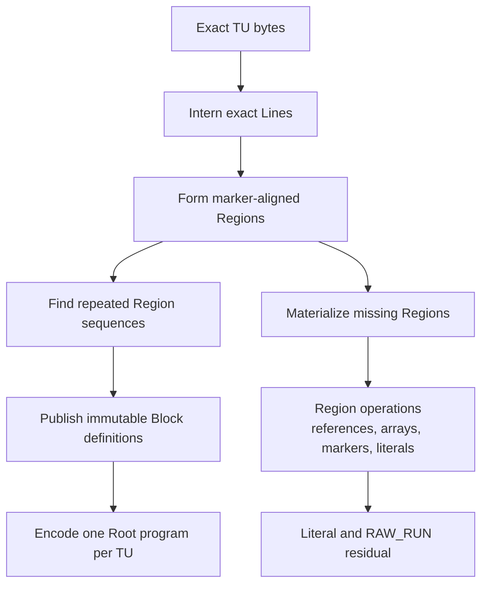

The complete P29 candidate contains more than its residual:

```text
P29_complete = generation and group manifest
             + new Block definitions
             + Roots
             + NEED and FILL traffic
             + missing Region/public-Line definitions
             + path definitions
             + Region control program
             + array/blob control and values
             + literal residual group frames
             + selectors and all framing
```

The fixed-112 result changes only the literal residual grouping and entropy choice. Ordinary P29
still supplies object identity, cache reuse, Region programs, Root expansion, and exact TU closure.

## Stage 2 — F decides what is missing

For the semantic path, F is authoritative about its own cache contents:

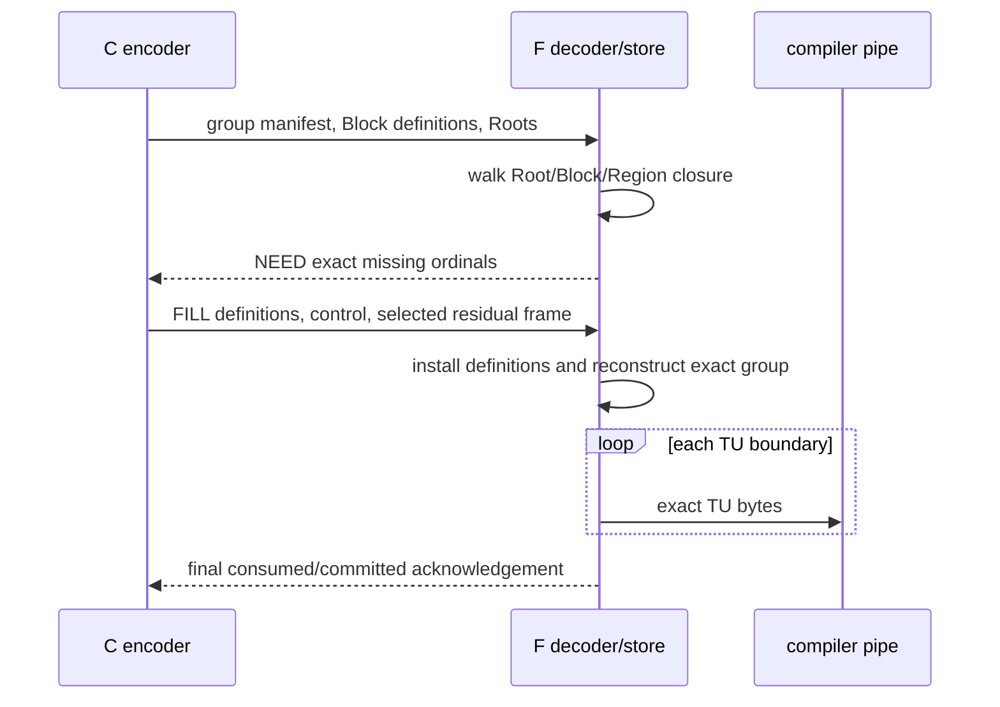

A GROUP-RLZ whole-byte candidate can bypass semantic object installation for that group. If that
fallback wins, F reconstructs exact bytes but does not pretend that P29 objects were published.
This keeps later cache state unambiguous.

## Stage 3 — form a bounded precompute group

The measured P29+BSC policy closes after at most 112 TUs. That number was an empirical compromise,
not a format constant. The bounded GROUP-RLZ experiment should close on the first reached limit:

```text
close_group when
       tu_count          >= MAX_GROUP_TUS
    or raw_or_residual   >= MAX_GROUP_BYTES
    or oldest_tu_wait    >= MAX_GROUP_WAIT
    or generation/F assignment changes
    or input ends
```

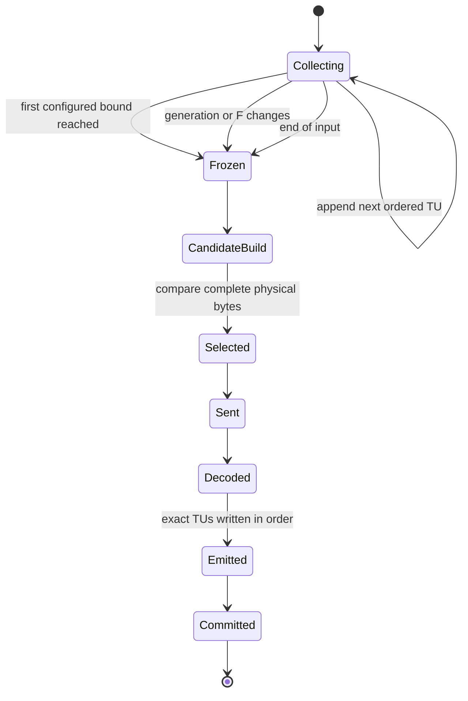

Every curve must expose the cost of this choice:

- maximum lookahead TUs;
- maximum lookahead raw and residual bytes;
- material available through TU;
- frame bytes charged at the first TU of the group;
- time from the first input byte to the first compiler-output byte.

For fixed 112, the group beginning at TU 1 may contain material through TU 112. Consequently, the
TU100 cumulative candidate includes some future material. That is permitted only when it is labeled
and compared consistently.

## Stage 4A — current bounded residual selector

The integrated fixed-112 path compresses P29's literal residual with an actual-byte choice:

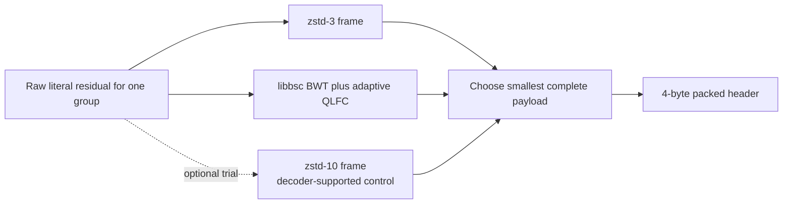

The existing residual frame is:

```text
31                         29 28                              0
+----------------------------+--------------------------------+
| codec kind, 3 bits         | payload length, 29 bits        |
+----------------------------+--------------------------------+
| payload bytes ...                                           |
+-------------------------------------------------------------+

codec 0 = zstd-3
codec 1 = libbsc BWT + adaptive QLFC
codec 2 = zstd-10
```

The header is exactly four bytes. Libbsc payloads carry their own 28-byte internal block headers;
the current implementation caps each raw BSC block at 64 MiB.

At fixed 112, all selected groups except four Catch2 groups chose BSC; those four chose zstd-3.
The full fixed-16 result is 9/16 on cold size and two-sided rate together.

## Stage 4B — GROUP-RLZ parser

GROUP-RLZ works directly on exact bytes. A rolling content anchor proposes a prior source position;
a byte comparison extends the match; the encoder emits literals up to that match followed by one
COPY. Bytes inside an accepted COPY are skipped rather than hashed again.

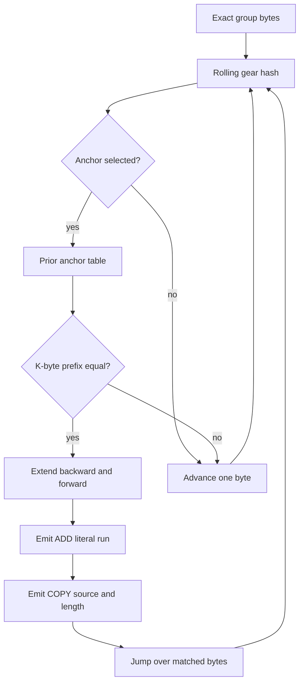

The prototype separates the program into four streams:

| Stream | Meaning | Prototype treatment |
|---|---|---|
| `ll` | literal length before each COPY | zstd token backend |
| `lit` | the exact ADD bytes | independent libbsc blocks or another selected backend |
| `sd` | source-position delta or offset delta | zstd token backend |
| `ml` | COPY match length | zstd token backend |

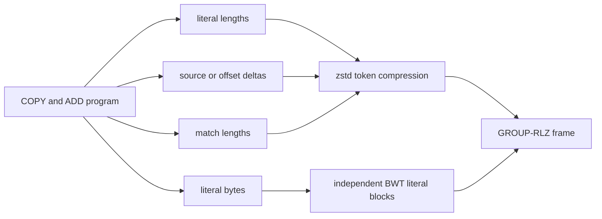

The current prototype permits references anywhere earlier in the whole input and stores positions as
`u32`, so it is limited to inputs below 4 GiB. The bounded form should instead permit COPY from:

1. bytes already reconstructed earlier in the current group; and
2. an explicitly bounded set of previously committed reference groups.

Using group-relative positions removes the whole-corpus 4-GiB limit. The allowed reference history
must be explicit so C and F release the same groups and so peak memory is measurable.

### Why the decoder can become faster

Literal blocks are already independently framed and have predetermined output offsets. They can be
decompressed in parallel before the serial COPY/ADD expansion:

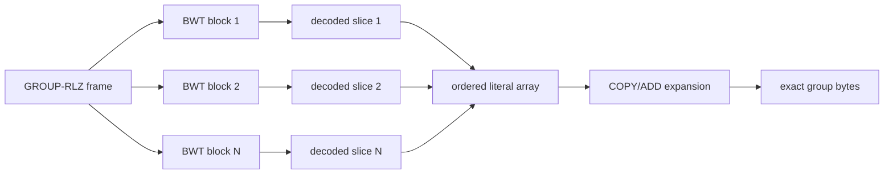

This is a current optimization opportunity, not a new coding idea. The retained 8-thread table
parallelizes literal compression, while its decoder still walks blocks sequentially. Under the
revised single-thread F >=500 MB/s gate, decoder parallelism is no longer required for these three
rows, but the runner must still require both configured endpoint bars and the implementation should
retain the independent-block option for higher concurrency targets.

## Stage 5 — where GROUP-RLZ composes with P29

There are two legitimate candidates to measure. They must not be conflated:

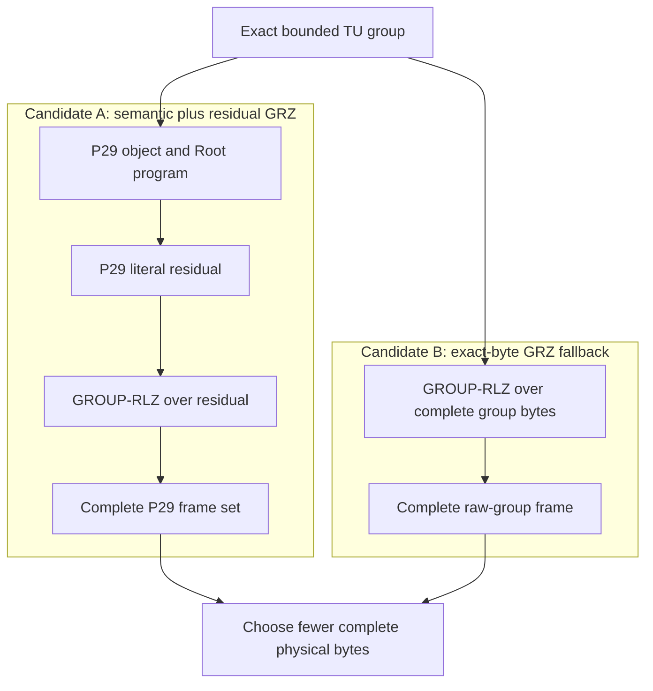

Candidate A preserves P29 object/cache benefits and attacks its dominant literal lane. Candidate B
preserves every cross-Line relationship in the raw group and provides a clean fallback when P29's
representation fragments those relationships. The initial integration should measure both. A later
cheap routing rule is justified only after it reproduces actual-byte selection broadly.

A program-level best-of computed after both complete programs are encoded is useful only as a
`PROGRAM_ORACLE` ceiling. It has full-program hindsight and assumes a build boundary. The binding
bounded row must either choose actual complete bytes per group or freeze a decision from an early
bounded probe and test it held out. Program-name selection and hindsight selection do not satisfy
the chronological TU100/TU200 row.

## Stage 6 — explicit unified group frame

The research GROUP-RLZ container currently serializes a packed native C++ header. The unified path
needs explicit little-endian fields and a protocol-versioned group mode. A conceptual layout is:

```text
+----------------------+-----------------------------------------+
| outer frame          | protocol type + exact byte length       |
+----------------------+-----------------------------------------+
| group identity       | generation, group sequence              |
+----------------------+-----------------------------------------+
| TU manifest          | TU count + ordered raw lengths          |
+----------------------+-----------------------------------------+
| mode                 | P29_RESIDUAL or RAW_GROUP_RLZ           |
+----------------------+-----------------------------------------+
| reference manifest   | prior committed group IDs, if any       |
+----------------------+-----------------------------------------+
| stream descriptors   | raw length, coded length, codec per lane|
+----------------------+-----------------------------------------+
| token streams        | literal lengths, source deltas, matches |
+----------------------+-----------------------------------------+
| literal blocks       | independent selected entropy frames     |
+----------------------+-----------------------------------------+
```

The exact field widths should be chosen with the existing protocol-50 typed-frame helpers. The key
properties are more important than a premature byte assignment:

- one unambiguous mode;
- explicit decoded lengths;
- explicit TU boundaries;
- explicit reference-group identities;
- independent literal-block descriptors;
- every byte included in the physical ledger;
- a decoder that rejects an incomplete group before compiler output.

## Stage 7 — F reconstruction and compiler streaming

Once the selected group frame is complete, F performs the inverse in this order:

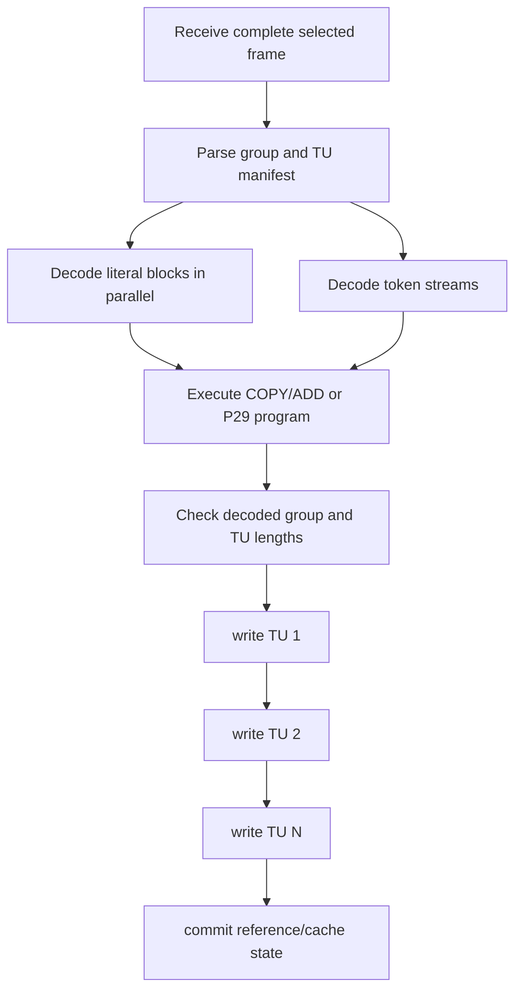

The compiler can consume TUs one by one after group decode. The current whole-corpus prototype hides
no network delay: it needs the complete compressed corpus before decode. Bounded groups turn that
startup cost into an explicit, controllable delay.

## State ownership and lifetime

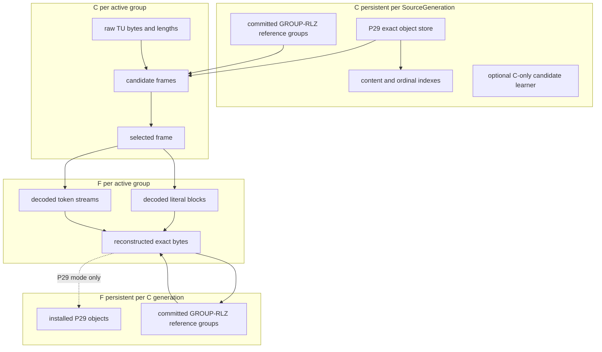

| State | Owner | Lifetime | Bound/release rule |
|---|---|---|---|
| exact P29 objects and ordinals | C | `SourceGeneration` | generation replacement policy |
| installed P29 objects | F | per-C `SourceGeneration` | measured LRU/ARC byte limits |
| C raw active-group bytes | C job/group | until selected frame is sent and retained for retry | group byte/wait limits |
| decoded literal/token streams | F group | until group reconstruction completes | selected group size |
| GROUP-RLZ reference groups | C and F | across committed groups only | explicit history-byte or group-count cap |
| candidate-search indexes | C | active group or bounded history | never part of wire state |

GROUP-RLZ reference state must be symmetric: if F may release a reference group, C must know not to
emit a COPY against it. The simplest first implementation uses a fixed number or fixed bytes of prior
committed groups and advances both ends only after final commit.

## Physical byte ledger

For group `g`, count:

```text
wire(g) = outer_frame_header
        + group_and_TU_manifest
        + generation/reference metadata
        + P29 definitions, Roots, NEED, and FILL when semantic mode wins
        + stream descriptors
        + compressed token streams
        + compressed literal blocks
        + selectors
        + acknowledgement/control frames attributable to the group
```

For a prefix ending at TU `t`, charge a group at the first TU it serves:

```text
prefix_wire(t) = sum wire(g)
                 for every group whose first_tu <= t
```

That rule deliberately exposes bounded lookahead. It also makes TU100/TU200 curves reproducible.

## Rate accounting

Compression acceptance has two separate throughput bars:

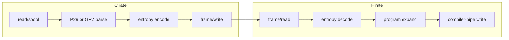

Report at least:

```text
C_rate = raw reconstructed bytes / complete C wall time
F_rate = raw reconstructed bytes / complete F wall time
PASS only if C_rate >= 1,000,000,000 bytes/s
          and single-thread F_rate >= 500,000,000 bytes/s
```

Also retain parse, entropy, copy/expand, and pipe subphases so a failure identifies a stage. Threaded
encode does not imply threaded decode. The GROUP-RLZ `final2.sh` result must therefore be read from
its separate encode and decode columns, not its current encode-only `speed_pass` expression.

Report exact bytes/second, decimal GB/s, and MiB/s. A runner may use conservative 1024/512 MiB/s
thresholds, but it must label them as stricter than the stated decimal 1 GB/s and 500 MB/s bars.

Peak RSS must be recorded independently at C and F. Whole-corpus research buffers are useful for a
ceiling, but the bounded target should scale with group size plus explicit reference history rather
than the entire build.

## Acceptance ladder

The unified path is complete only after all rows use one receiver and one ledger:

1. exact encode/decode for every selected mode;
2. explicit group and reference bounds;
3. C and F rates measured separately;
4. peak C/F memory retained;
5. cold fixed-16 table against whole-program zstd-19 `--long=31`;
6. TU100 and TU200 curves against whole-prefix zstd-6 `--long=31`;
7. explicit lookahead TUs/bytes and first-TU delay;
8. selector counts and complete component ledger;
9. reverse/shuffle/change/revert and restart/replay;
10. broader-corpus generalization after the fixed policy is frozen.

The three scorecards should remain separate:

| Scorecard | Condition |
|---|---|
| size-speed corner | complete cold wire at most `1.10 * whole-program z19-long`, plus both rates |
| original bake-off | beats the pinned z19 baseline and saves at least 20% versus matched cold control |
| absolute 400x | complete wire at most raw bytes divided by 400 |

The current owner gate also requires a raw-source-code cold row. `.ii` compression does not satisfy
that independent source-code measurement.

## Recommended next implementation sequence

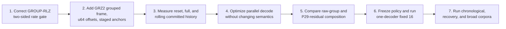

The design should remain a set of narrow blocks:

- P29 produces an exact semantic candidate;
- GROUP-RLZ produces an exact byte program;
- entropy backends compress independent streams;
- one selector compares complete framed bytes;
- one decoder mux reconstructs exact groups;
- one ledger and gate runner decide whether it wins.

No predictor should be added for the RocksDB/Abseil/fmt residue class until this bounded composition
is measured. The whole-corpus result says that long-range COPY plus the right residual treatment is
already the stronger and simpler contender there.

## Evidence pointers

- [`P29-BSC-GROUP-FIXED16.md`](P29-BSC-GROUP-FIXED16.md): complete fixed-16 bounded P29+BSC result.
- [`P29-BSC-GROUP-INTEGRATION.md`](P29-BSC-GROUP-INTEGRATION.md): frame contract and repeated DuckDB/Godot evidence.
- [`P25-P29-INCREMENTAL-PIPELINE.md`](P25-P29-INCREMENTAL-PIPELINE.md): full P25-P29 object and cache transaction.
- [`CODEC-PREDICTOR-ENTROPY-REFERENCE.md`](CODEC-PREDICTOR-ENTROPY-REFERENCE.md): broader representation/prediction/cache/entropy map.
- [`mickgvirtu/icecream@48267c7`](https://github.com/mickgvirtu/icecream/commit/48267c7): current whole-corpus GROUP-RLZ prototype and retained tables.
- [Issue #16 GROUP-RLZ review](https://github.com/mickg10/icecream/issues/16#issuecomment-5319700697): corrected two-sided rate interpretation and minimal integration plan.
- [Issue #16 revised endpoint gate](https://github.com/mickg10/icecream/issues/16#issuecomment-5319779783): C >=1 GB/s and single-thread F >=500 MB/s.
- [Issue #16 GRZ2 P0 ruling](https://github.com/mickg10/icecream/issues/16#issuecomment-5319790979): persistent match history across bounded entropy groups.
- [Issue #16 local-oracle ruling review](https://github.com/mickg10/icecream/issues/16#issuecomment-5319818052): rate, rolling-history, commit, and selector-boundary corrections.
