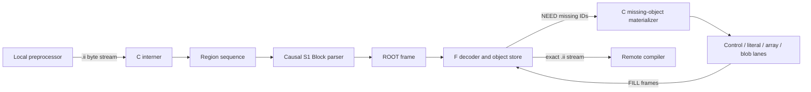

# P25--P29 incremental transfer pipeline and state contract

This document describes what the retained P25--P29 measurements actually run.
It separates three questions that were previously easy to conflate:

1. Does F contain material before the first measured TU?
2. Do C and F retain material learned from earlier TUs in the same run?
3. Are the compressed byte streams independently decodable per TU?

The answers for the published 80-row matrix are **no**, **yes**, and **not yet
for every material lane**, respectively.

## Short answer about shared state

Every `p25-cold` through `p29-cold` row begins with an empty dynamic F store at
TU 0. No installed definition set, trained predictor, source bundle, or
unmeasured priming pass supplies definitions to those rows.

After TU 0, however, every row is deliberately incremental. F retains each
successfully decoded Region, Block, path, material view, and relevant transform
state. Later TUs refer to that learned state instead of retransmitting it. The
same object state remains live through builds 2--4 in the retained-build
experiment.

The complementary `bit0` and `bit1` runs are different: before TU 0 they place
one deterministic half of the Region objects in F. Those runs measured a large
benefit from prior shared material, but they are acceptance evidence outside
the current 80-row cold-only table.

| run family | F before measured TU 1 | retained after a TU | shown in cold matrix |
|---|---|---|:---:|
| `p25-cold` ... `p29-cold` | empty | yes | yes |
| `p25-bit0/bit1` ... `p29-bit0/bit1` | one key-parity half of Regions | yes | no |
| older `--warm` modes | primed by an unmeasured first pass | yes | no; incompatible with this mixed-Region path |
| pre-trained predictor or installed definition experiments | experiment-specific initial state | experiment-specific | no |
| independent per-TU zstd control | empty again for every TU | no | no; still needs an explicit control row |

The fixed-16 preload measurements demonstrate the distinction:

| codec | empty start | half-cache bit 0 | half-cache bit 1 |
|---|---:|---:|---:|
| P25 | 113,834,804 B | 81,994,885 B | 49,359,310 B |
| P29 | 91,864,787 B | 60,040,447 B | 43,848,226 B |

The two halves have nearly equal Region counts but unequal bytes, so both are
reported rather than averaged.

## Learned and preloaded state tested outside P25--P29

The cold-only matrix must not erase the separate learned-state evidence. Those
experiments exist, but they cover the exact Region-program/structure layer
rather than the complete P29 material transfer.

| experiment | state available before TU 1 | decoder-visible model | retained result |
|---|---|---|---|
| cross-fit exact-phrase package + online learner | target-disjoint phrase package | yes | fixed-16 structural wire 63,085,685 B empty versus 59,497,403 B preloaded |
| C-only seed + online learner | target-disjoint phrase candidates at C | no; F receives only profitable definitions | fixed-16 structural wire 58,342,404 B; beats empty on 16/16 endpoints |
| pretrained sub-superblocks + top-K map | exact 2/4/8/16/32-Region phrases and rank map | yes | held-out DuckDB 31,028,370 B empty stream versus 11,890,069 B charged 256 KiB row |
| pretrained zstd dictionaries | trained dictionary | yes | strong on Root/superblock streams; only 0--2% on Line definitions |
| FTRL, GBDT, and neural rankers | encoder candidate-ranking state | no | encoder-only candidate ordering; F receives the chosen exact program |

The preferred result is therefore not “run the same ML model at C and F.” It
is “use a small learned seed or ranker at C, then publish ordinary immutable
definitions only when their current-TU byte saving pays for them.” F keeps the
same simple definition cache required by empty-start online learning.

These results independently reconstruct exact Region sequences, but they omit
parts of the full `.ii` transfer ledger such as first-use material, missing
dialogue, and final transaction framing. Integrating the winning learned
candidate into the complete M3/P29 representation remains part of the path to
M4; it cannot be counted as already completed product evidence.

## Names used below

- **C** is the side receiving a compiler preprocessor's `.ii` byte stream. In
  the research harness it is the encoder and the authoritative interner.
- **F** is the side that must recreate the exact `.ii` stream for the remote
  compiler. Its decoder store is constructed only from initial-state policy
  and decoded messages.
- A **Line** is a byte-exact line interned inside a Region.
- A **Region** is a byte-exact span ending at the next line-start `# ` marker
  boundary (or end of TU). Equal Regions have equal raw bytes and equal Line
  sequences.
- A **Block** is an S1 name for a repeated contiguous sequence of Region IDs.
- A **Root** is one TU's ordered sequence of literal Region IDs and Block IDs.
- A **generation** is the lifetime in which the Region and Block ordinal spaces
  remain stable. In the product design this is named by the C iceccd cache
  generation GUID. It is not a build identifier. The retained four-build
  experiment uses one generation.

## End-to-end dataflow

```text
local preprocessor
      |
      | exact .ii bytes
      v
+------------------------------ C -------------------------------+
| 1. split/intern Lines and marker-aligned Regions                |
| 2. map the TU to a Region-ID sequence                           |
| 3. causal S1 parse: literals + repeated Region-sequence Blocks  |
| 4. encode the TU Root                                            |
+------------------------------+----------------------------------+
                               |
                               | ROOT
                               v
+------------------------------ F -------------------------------+
| 5. decode Root; expand known Blocks; determine required objects |
+------------------------------+----------------------------------+
                               |
                               | NEED(missing Region/Block IDs)
                               v
+------------------------------ C -------------------------------+
| 6. materialize only missing definitions                         |
| 7. split material into control/literal/array/blob lanes          |
| 8. compress and frame definitions                                |
+------------------------------+----------------------------------+
                               |
                               | FILL(paths, material, Regions, Blocks)
                               v
+------------------------------ F -------------------------------+
| 9. decode into F-owned append-only stores                        |
| 10. expand Root -> Blocks -> Regions -> exact bytes              |
+------------------------------+----------------------------------+
                               |
                               | exact .ii byte stream
                               v
                        remote compiler stdin
```

The harness then compares F's output with the original `.ii` bytes. That final
comparison is measurement-only; a real F does not need the original input.



## Chronological transaction for one TU

### 1. C interns the incoming bytes

`Interner::process()` scans the TU in order. A Region ends immediately before
the next line-start `# ` marker. A new Region stores both its exact raw bytes
and its Line-ID sequence. Equality is confirmed by byte comparison; hashes are
only lookup accelerators.

The harness loads a corpus before the measured encoding pass, but the S1 parse
and definition visibility remain chronological: a match source must precede
the current occurrence, and a definition is sent only on or after its first
required TU. Product M4 must preserve this observable ordering while moving
the work back into actual processes and pipes.

### 2. C creates the S1 Root

S1 performs longest-previous-factor parsing over the Region-ID occurrence
stream. A Root token is either:

- a literal Region ID, or
- a Block ID naming an exact flat Region sequence.

P25--P27 search at most 64 prior candidates for a match. P28--P29 search at
most 1,024. The parser never uses a later occurrence as a source.

### 3. C sends ROOT; P25 and P26+ identify Regions differently

All variants send a compressed Root message. The identity plane then differs:

- **P25 key map:** on first use in the conversation, C sends
  `(dense_region_id, stable_u64_key)`. F uses the key to bind any object already
  present in its per-generation cache. This association traffic is charged.
- **P26--P29 direct ordinals:** C and F use the same generation-local Region
  and Block ordinal vectors. No separate `u64 -> dense` association frame is
  sent. Newly required Block manifests are decoded before F constructs NEED,
  so F can walk each Block's Region closure itself.

The P25-to-P26 matrix delta therefore bundles two changes: removal of P25's
association plane and addition of P26's compressed-blob representation. It
must not be attributed wholly to either change without the isolated control.

### 4. F produces NEED from its own state

F decodes ROOT, walks the required Block/Region closure, tests its own stores,
and returns the exact missing IDs. C builds FILL from the decoded reply. In the
P25 key-map form, even an all-hit association batch receives an acknowledgement.

This is a pull transaction. It does not assume that C's estimate of F's cache
contents is authoritative.

### 5. C encodes missing material

For every requested Region, the mixed materializer emits an exact program over
these operations:

| operation | reconstructed material |
|---|---|
| literal run | bytes carried in the literal lane |
| publish/copy | a span from an earlier known Region, optionally publishing a reusable view |
| public reference | a previously published exact view |
| byte array | formatting style plus binary values |
| preprocessor marker | path ID, line number, and flags |

The P25--P29 matrix does **not** enable the optional project-source package
operations. Its common active material lanes are:

1. Region control and raw lengths;
2. literal bytes;
3. generated-byte-array control and styles;
4. generated-byte-array values;
5. separate paths, Block definitions, Root, and NEED messages.

Each message contributes its compressed payload plus its explicit framing
bytes to the ledger.

### 6. Optional generated-blob transforms

P26--P29 recognize complete zlib members embedded in generated byte arrays.
For a selected member:

1. C parses and inflates the member.
2. C compares the transformed candidate with carrying the ordinary original
   bytes and selects the smaller exact path.
3. F decodes the transformed payload and recreates the original member with
   the specified canonical zlib process.
4. If F's recreated bytes do not match the member digest, F requests the exact
   original member bytes. That reply is charged.

P27 adds a canonical GNU MO factor inside eligible inflated payloads. It
separates repeated original strings from translations and other content using
append-only generation-local IDs, then performs the exact inverse at F.

P29 changes only the selected expanded-blob entropy step: it uses zstd-9 with
long-distance matching, four C workers, 5 MiB jobs, and overlap log 3. Ordinary
material lanes remain zstd-3.

### 7. F installs and expands

F owns independent append-only byte arenas and vectors for:

- Region views;
- published material spans;
- paths;
- Block-to-Region sequences;
- MO factor state where used;
- material entropy-decoder state.

F decodes FILL, installs complete definitions, expands Root tokens to Regions,
and appends each Region's exact bytes to the compiler stream. The measured TU
commits only after reconstruction succeeds.

## Compression and framing that the current matrix really measures

The common flags are `--z 3 --mixed-regions --byte-array-lines`. ROOT, NEED,
association, path, and Block messages use ordinary zstd messages with explicit
4-byte framing in the ledger.

The mixed material component lanes are different: each lane uses a stateful
zstd stream and flushes at each TU. The **research runner** also passes
`--build-tus N`, where `N` is the length of the manifest before it is repeated,
and the harness ends those streams after every N TUs. No product component
discovers that boundary; the runner supplies it solely to group the synthetic
four-build measurement.

In that experiment:

```text
object-store lifetime:  repetition 1 ---------------------------> repetition 4
material zstd stream:   [segment 1] [segment 2] [segment 3] [segment 4]
                         end/restart ^        ^         ^
```

Thus object knowledge survives all four repeated manifests, while material
entropy history is artificially restarted at the runner's N-TU reporting
boundary. A TU flush makes bytes available, but a later TU within one such
segment still depends on earlier stream state. A real iceccd does not know when
a user-level build begins or ends, and the protocol must not require it to.
Replacing this harness-only segmentation with independently decodable TU
transaction frames is M4 work; the current matrix must not be described as
already proving it.

Selected P26--P29 blob payloads are encoded as their own standard frames. P29's
multithreaded zstd-9/LDM setting applies only to that selected blob path.

## State and lifetime map

| state | lives at C | lives at F | lifetime in retained matrix |
|---|:---:|:---:|---|
| exact Region/Line interner truth | yes | reconstructed Regions only | one generation |
| stable `u64` Region key | P25 | P25 preload index | one generation/cache set |
| direct Region/Block ordinals | P26--P29 | P26--P29 | one generation |
| S1 Block definitions | yes | after first required FILL/manifest | retained for the GUID generation |
| material Region bytes/views | yes | after preload or FILL | retained for the GUID generation |
| path table | yes | after FILL | retained for the GUID generation |
| MO factor dictionary | P27--P29 | P27--P29 | retained in chronological order |
| mixed-lane zstd history | encoder | decoder | harness: N-TU segment; product target: one TU transaction |
| P29 blob-frame history | only inside one selected frame | only inside one selected frame | one frame |

The current harness uses one C/F pair and one generation for the complete
four-manifest run. In the product, the C iceccd GUID names this generation and
F keeps the corresponding per-C object store; the GUID does not name or reveal
a build. Cache rotation, multiple concurrent F workers, eviction, and
reconnection are product scenarios, not properties established by this table.

## Exact P25--P29 configurations and measured deltas

| stage | configuration relative to common flags | fixed-16 build-1 wire | delta from previous |
|---|---|---:|---:|
| P25 | key map; S1 chain 64 | 113,834,804 B | base of this series |
| P26 | direct ordinals; compressed zlib members; 8 blob workers; lazy exact fallback; S1 chain 64 | 97,015,268 B | -16,819,536 B (-14.775%) |
| P27 | P26 + canonical MO factor | 93,980,202 B | -3,035,066 B (-3.128%) |
| P28 | P27 + S1 chain 1,024 | 93,968,728 B | -11,474 B (-0.012%) |
| P29 | P28 + selected blob zstd-9/LDM, 4 workers, 5 MiB jobs, overlap log 3 | 91,864,787 B | -2,103,941 B (-2.239%) |

P25 to P29 saves 21,970,017 B, or 19.300%, from the same empty initial object
state. On fixed-16, P27--P29 alter only Godot because only Godot exercises the
selected generated-blob/MO path. P28's larger S1 search has a small suite-wide
effect.

Retaining online object state produces the following aggregate build ledger:

| codec | build 1 | build 2 | build 3 | build 4 | cumulative four builds |
|---|---:|---:|---:|---:|---:|
| P25 | 113,834,804 | 449,765 | 148,292 | 148,292 | 114,581,153 |
| P26 | 97,015,268 | 450,906 | 148,292 | 148,292 | 97,762,758 |
| P27 | 93,980,202 | 450,906 | 148,292 | 148,292 | 94,727,692 |
| P28 | 93,968,728 | 450,778 | 148,200 | 148,200 | 94,715,906 |
| P29 | 91,864,787 | 450,778 | 148,200 | 148,200 | 92,611,965 |

Those later-build numbers are evidence for online retained state, not evidence
for an installed package. The repeated manifest is in the same order, so they
also are not a reordered or edited-build claim.

### Memory-efficient replay equivalence

The original four-repetition runner wrote every manifest entry four times, so
`codec50` loaded the raw `.ii` bytes four times. The logical replay path now
loads one physical manifest once and repeats only the much smaller Region-ID
occurrence sequence. It uses `--replay-repetitions 4`; any experimental entropy
segmentation remains a separate explicit `--entropy-restart-tus N` option.

On the 84-TU Cereal corpus, old physical repetition and logical replay produced
byte-identical 336-row curves for both identity modes:

| configuration | curve SHA-256 | physical peak RSS | logical peak RSS | wire |
|---|---|---:|---:|---:|
| P25 key map | `6b9e6be2429f29b037e478cfd37772bc3f499089b84fc3e0f0d83f5dd539665a` | 1,363 MiB | 428 MiB | 534,084 B |
| P29/direct ordinal flags | `8dcbba0bc404c5f7106025a08aa3859383c22218cac96afe8f9205839d53a448` | 1,364 MiB | 428 MiB | 516,746 B |

This is a harness memory correction, not a new codec result. It preserves every
per-TU byte decision and makes the native-25 replay practical without teaching
the protocol about builds.

The first-repetition RBASE-P29 rows are published as
[`ml-artifacts/rbase-p29-fixed16-per-tu.tsv`](ml-artifacts/rbase-p29-fixed16-per-tu.tsv),
with coverage, state semantics, flags, source-curve hashes, and endpoints in
[`ml-artifacts/rbase-p29-fixed16-per-tu-summary.json`](ml-artifacts/rbase-p29-fixed16-per-tu-summary.json).
The TSV contains all 9,292 exact fixed-16 TUs and closes at 28,554,671,510 raw
bytes and 91,864,787 wire bytes. It is suitable as the retained P29 comparison
for `material_lab`, with the stated caveat that its mixed-material entropy
streams are not yet M4 independent transaction frames.

## What P25 is and is not

P25 is the **base incremental codec of the P25--P29 series**. It is not a raw
`.ii -> zstd` baseline. Before its measured wire it already performs:

- exact Line and Region interning;
- online Region retention at F;
- causal S1 repeated-sequence Blocks;
- mixed Region material programs;
- generated-byte-array extraction;
- zstd-3 material streams;
- an explicit stable-key association and missing-object exchange.

Consequently, the current matrix still lacks a clean control family for:

1. independent per-TU `.ii -> zstd-1` and `.ii -> zstd-3` frames;
2. a minimal empty-start incremental representation before S1/mixed-material
   refinements;
3. the same exact representation with a genuinely pre-trained initial model;
4. the same exact representation with only online learning.

Those controls belong in the `material_lab` ledger and must use the same TU
order, exact reconstruction check, byte accounting, and checkpoints as the
candidate representations.

## Boundary between current evidence and M4/M5

P25--P29 prove exact encode/decode decisions in a single research process with
an independent F-owned decode store. They do not yet prove the complete product
pipeline.

M4 must turn the winning representation into actual independently decodable
transaction frames under an iceccd cache-generation GUID, with no build signal
or build-boundary assumption. It must execute C and F in their intended
processes, retain the same byte ledger, and prove commit/rollback across every
message and cache mutation. M5 must then run the scenario launcher over cold,
retained, edited, reordered, restarted, concurrent, eviction, and large-corpus
cases while checking exact compiler input and the required throughput gates.

Until those gates pass, P29 is a measured representation candidate rather than
the completed Protocol-50 product path.
